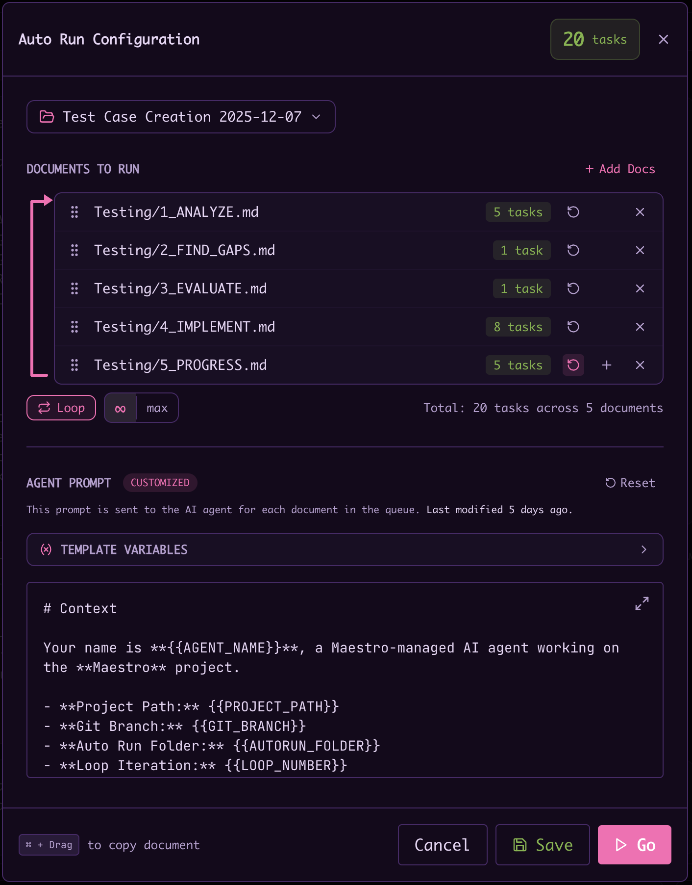
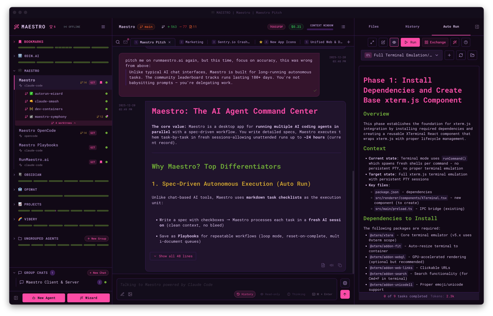
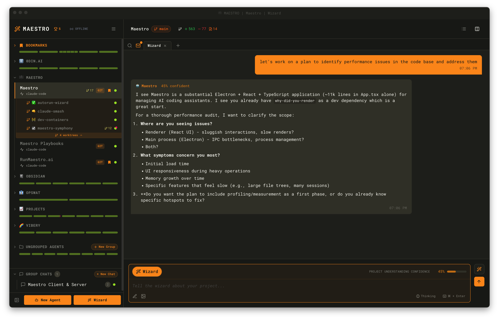
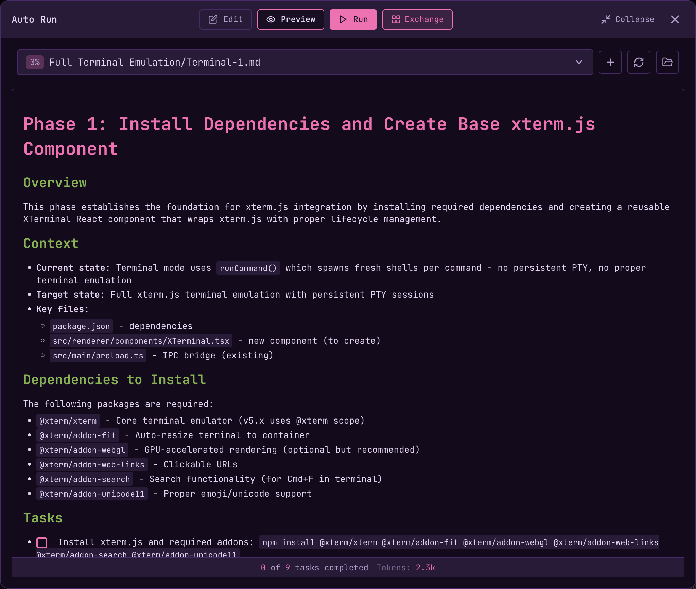
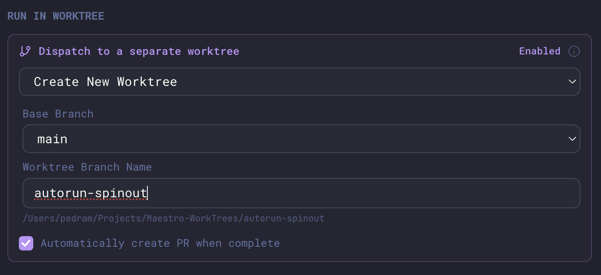

Auto Run is a file-system-based document runner that lets you process tasks using AI agents. Select a folder containing markdown documents with task checkboxes, and Maestro will work through them one by one, spawning a fresh AI session for each task.



## Setting Up Auto Run

1. Navigate to the **Auto Run** tab in the right panel (`Cmd+Shift+1`)
2. Select a folder containing your markdown task documents
3. Each `.md` file becomes a selectable document

## Creating Tasks

Use markdown checkboxes in your documents:

```markdown
# Feature Implementation Plan

- [ ] Implement user authentication
- [ ] Add unit tests for the login flow
- [ ] Update API documentation
```

**Tip**: Press `Cmd+L` (Mac) or `Ctrl+L` (Windows/Linux) to quickly insert a new checkbox at your cursor position.

**Ticking a box by hand**: in the Auto Run panel's rendered preview, click a checkbox to toggle it and the document is rewritten on disk - useful for marking something you finished yourself, or for re-arming a task by unticking it. The boxes are read-only while an Auto Run is actively driving that document, matching its disabled editor. A **paused** run is the exception: when the engine parks on an agent error or a human-in-the-loop gate it is waiting on you rather than working, so the checkboxes and the editor both open back up until you click Resume.

### Task Granularity: Two Approaches

There are two viable ways to structure work across Auto Run documents. Pick the one that fits your project - they can also coexist.

**1. Many tasks per document (classic approach)**

One document holds a long list of checkboxes; the runner walks through them serially, each in a fresh session.

- Good when tasks are small, independent, and share a common framing that's cheap to restate in the document body.
- Each task gets a clean context, so the agent doesn't drift across them.
- Tradeoff: the agent has to re-derive shared context for every task from whatever lives in the document.

**2. One task (or a few) per document (recommended for richer work)**

Each document is a focused brief - heavy on context, light on checkboxes. Often just a single `- [ ]` "execute the plan" task at the bottom.

- Good when each unit of work needs substantial setup, references, constraints, or prior decisions to do well.
- Modern agents have large context windows, so loading a richer document per task is cheap and usually produces better results than splintering it into many small checkboxes that each lose the shared framing.
- Compose multi-step workflows by chaining several of these focused documents inside a Playbook instead of stuffing them into one file.
- Tradeoff: more files to manage; the dropdown list grows.

**Rule of thumb:** if you find yourself repeating the same context paragraph above several checkboxes in one document, that's a signal to split into multiple focused documents and let the Playbook handle ordering.

## Running Single Documents

1. Select a document from the dropdown
2. Click the **Run** button (or the ▶ icon)
3. Customize the agent prompt if needed, then click **Go**

## Running Multiple Auto Run Documents

Auto Run supports running multiple documents in sequence:

1. Click **Run** to open the Auto Run configuration modal
2. Click **+ Add Docs** to add more documents to the queue
3. Drag to reorder documents as needed
4. Configure options per document:
   - **Reset on Completion** - Creates a working copy in `runs/` subfolder instead of modifying the original. The original document is never touched, and working copies (e.g., `TASK-1735192800000-loop-1.md`) serve as audit logs.
   - **Duplicate** - Add the same document multiple times
5. Enable **Loop Mode** to cycle back to the first document after completing the last
6. Click **Go** to start running documents

### Staging Documents from the Files Tab

The Auto Run folder shows up in the **Files** tab like any other directory, so a
run list is one right-click away. Right-click anything inside the agent's Auto
Run folder and choose **Stage Documents for Auto Run**:

- **A folder** stages every document beneath it, nested subfolders included.
- **A single markdown file** stages just that document.
- **A multi-selection** stages every document in it. Select the files
  (`Cmd`/`Ctrl`-click or `Shift`-click), then right-click one of them.
  Right-clicking a row _outside_ the selection stages only that row instead.

The run configuration modal opens with those documents already queued, in the
same order the Auto Run dropdown lists them - not the order you selected them.
From there it is the ordinary modal: reorder, duplicate, set per-document
options, then **Go**.

The entry only appears when something under the cursor actually resolves to an
Auto Run document, and it counts what it will stage ("Stage 6 Documents for Auto
Run"). An empty folder, a non-markdown file, or anything outside the Auto Run
folder offers nothing.

## Fresh Context: Task vs Document

The run configuration modal has a **Fresh context per** toggle that controls how context is scoped as the runner works through a document. This is distinct from [task granularity](#task-granularity-two-approaches) above - granularity is how you _structure_ a document, while this is how Maestro _executes_ it.

**Task** - A new agent is spawned for each unchecked task, with a clean context every time.

- Maximum isolation; the agent never drifts across tasks.
- Each task must be fully self-contained, since the agent sees nothing from previous tasks except what's written in the document.
- The right choice for most agents.

**Document** - A single agent walks every unchecked task in the document in one continuous session, carrying context forward between tasks.

- Best for agents with very large context windows, and for work where later tasks build on earlier ones.
- Requires enough context window to hold a whole document's worth of work in one session.

**Auto-selection:** Maestro picks the mode by combining the running agent's context window with the average task count across the documents you've selected. The tasks-per-doc threshold scales with the window - **5** at 256K or less, **10** at 512K, **20** at 1M - and below the threshold Maestro recommends **Document**, at/above it **Task**. Selecting different documents recomputes the recommendation. If you toggle to the non-recommended mode, the modal surfaces a small note explaining what it would have picked and why, but respects your choice. A loaded Playbook's saved mode always takes precedence, and once you've manually toggled, future document-selection changes don't yank the mode back.

> **Tip:** Author tasks to be self-contained regardless of mode. Document mode is an optimization, not a license to write tasks that depend on chat memory.

## Playbooks

Save your Auto Run configurations as Playbooks for reuse:

1. Configure your documents, order, and options
2. Click **Save as Playbook** and enter a name
3. Load saved playbooks from the **Load Playbook** dropdown
4. Update or discard changes to loaded playbooks



### Inline Wizard

Generate new playbooks from within an existing session using the **Inline Wizard**:

1. Type `/wizard` in any AI tab (or click the Wizard button in the Auto Run panel)
2. Have a conversation with the AI about your project goals
3. Watch the confidence gauge build as the AI understands your requirements
4. At 80%+ confidence, the AI generates detailed Auto Run documents



The wizard names its own tab as soon as it knows what you are planning: the tab opens as `Wizard` and becomes `wizard: <topic>` once you say what you want, so several wizards running side by side stay tellable apart. Rename it yourself at any point and the wizard leaves your name alone.

The Inline Wizard creates documents in a unique subfolder under your Auto Run folder, keeping generated playbooks organized. When complete, your tab is renamed to reflect the project and you can immediately start running the generated tasks.

### Playbook Exchange

Looking for pre-built playbooks? The [Playbook Exchange](./playbook-exchange) offers community-contributed playbooks for common workflows like security audits, code reviews, and documentation generation. Open it via Quick Actions (`Cmd+K`) or click the Exchange button in the Auto Run panel.

## Progress Tracking

The runner will:

- Process tasks serially from top to bottom
- Skip documents with no unchecked tasks
- Show progress: "Document X of Y" and "Task X of Y"
- Mark tasks as complete (`- [x]`) when done
- Log each completion to the **History** panel

## Steering a Run in Flight

You do not have to stop a run to change its direction. Type into the composer while the run is going and press Enter: the message becomes a **steering note** and is delivered at the start of the next task.

A steering note is not a conversation turn. It spawns no agent of its own and costs no extra run time - it rides in front of a task prompt that was going to be sent anyway, in a block the agent is told to treat as newer than the document and newer than its instructions. The agent is asked to begin its synopsis with `[steered]` when it acts on one.

Use it for the things you notice while watching:

- `Important notice: Maestro error - stop touching the Cue engine and fix the build first.`
- `The API changed. Use the v3 endpoint for the rest of these tasks.`
- `Do not commit anything else until I say so.`

**Where to see it.** A steering note appears in the transcript as your message with a compass badge: amber while it is waiting, green once a task has picked it up. The Auto Run pill above the composer shows how many notes are still waiting. Click the amber badge to take a note back before any task sees it.

**What it applies to.** The note goes to the next task and stays in force for the rest of the run wherever it still makes sense. It is delivered once - a later task does not get a repeat - so if the change is permanent, also edit the document.

**When Enter does something else instead.** Steering is what a plain write-mode message does during a run. These keep their own meaning:

| You do this                                | What happens                                                                                         |
| ------------------------------------------ | ---------------------------------------------------------------------------------------------------- |
| Read-only mode is on                       | The message runs right now as a parallel read-only turn. Asking a question does not steer.           |
| Force Send (`Cmd+Shift+Enter`)             | Bypasses the run entirely and sends now.                                                             |
| The message has staged images              | Queued instead. A task prompt is text, so an image has nowhere to ride along, and queueing keeps it. |
| The agent's provider is in an outage retry | Queued behind the retry. A note cannot talk past a quota wall.                                       |
| A slash command                            | Queued for after the run, as before.                                                                 |

Notes belong to the run they were typed during. Anything still waiting when the run ends is discarded rather than ambushing a later run.

## Session Isolation

Each task executes in a completely fresh AI session with its own unique session ID. This provides:

- **Clean context** - No conversation history bleeding between tasks
- **Predictable behavior** - Tasks in looping playbooks execute identically each iteration
- **Independent execution** - The agent approaches each task without memory of previous work

This isolation is critical for playbooks with `Reset on Completion` documents that loop indefinitely. Each loop creates a fresh working copy from the original document, and the AI approaches it without memory of previous iterations.

> **Note:** [Nudge messages](./general-usage#creating-agents) configured on an agent do not apply to Auto Run tasks. Nudge messages are only appended to interactive AI messages typed by the user. If you need persistent instructions for Auto Run tasks, include them directly in your task document or use environment variables.

## Environment Variables

### Where a Run's Environment Comes From

An Auto Run inherits the environment of **the agent it executes against**. There is no run-scoped environment: a run does not get its own variables, and the document being run cannot set any.

That matters because of where the variables actually live:

| To change...             | Set it here                                                                                                   |
| ------------------------ | ------------------------------------------------------------------------------------------------------------- |
| Every agent and terminal | **Settings → Environment** (see [Global Environment Variables](./configuration#global-environment-variables)) |
| One agent only           | That agent's **Environment Variables (optional)** panel, in **Edit Agent** or the Create New Agent dialog     |

Both are documented in [Configuration → Per-Agent Environment Variables](./configuration#per-agent-environment-variables), including the precedence between them and how to inspect the merged result.

Two things Auto Run specifically does **not** give you:

- **A playbook or task document cannot set environment variables.** Frontmatter in an Auto Run document is rendered as a table for you to read, never interpreted. The only in-document directives Maestro acts on are the [HITL gate](#human-in-the-loop-gates), the [halt marker](#halt-marker-agent-early-exit), and the [model and effort markers](#model-tier-and-effort) - there is no `MAESTRO:ENV` equivalent.
- **The CLI has no per-run environment flag.** `maestro-cli playbook`, `run-doc`, `auto-run`, and `goal-run` take `--model` and `--effort` as run-scoped overrides, but no `--env`. The `--env` flag exists only on `create-agent` and `update-agent`, where it edits the agent record itself and therefore affects every later run on that agent.

So if a run needs different variables, change the agent it runs against, or point the run at a different agent.

### Which Agent a Run Executes Against

By default an Auto Run executes against the **currently active agent**, so it picks up that agent's variables.

The run configuration modal can redirect it. Under [Dispatch to a separate worktree](#run-in-worktree), the dropdown chooses a worktree target, and each option has different consequences for your environment:

| Option                  | Environment the run gets                                                                                                                             |
| ----------------------- | ---------------------------------------------------------------------------------------------------------------------------------------------------- |
| **Open in Maestro**     | An agent already open in Maestro. It runs with **that agent's own variables**, so this is the way to run one document under a different environment. |
| **Available Worktrees** | A new agent, which **inherits the current agent's variables** verbatim                                                                               |
| **Create New Worktree** | A new agent, which **inherits the current agent's variables** verbatim                                                                               |

The distinction is easy to miss: creating a worktree does not give you a blank agent to configure. Maestro copies the parent agent's variables (along with its provider, model, and custom arguments) onto the new one, and the worktree dialog has no environment field. If you need a worktree run under a different environment, create the worktree agent first, edit its variables in **Edit Agent**, then dispatch to it with **Open in Maestro**.

### Variables Maestro Sets For You

Maestro sets environment variables that your agent hooks can use to customize behavior:

| Variable                  | Value | Description                                                      |
| ------------------------- | ----- | ---------------------------------------------------------------- |
| `MAESTRO_SESSION_RESUMED` | `1`   | Set when resuming an existing session (not set for new sessions) |

**Example: Conditional Hook Execution**

Since Maestro spawns a new agent process for each message (batch mode), agent "session start" hooks will run on every turn. Use `MAESTRO_SESSION_RESUMED` to skip hooks on resumed sessions:

```bash
# In your agent's session start hook
[ "$MAESTRO_SESSION_RESUMED" = "1" ] && exit 0
# ... rest of your hook logic for new sessions only
```

This works with any agent provider (Claude Code, Codex, OpenCode) since the environment variable is set by Maestro before spawning the agent process.

## History & Tracking

Each completed task is logged to the History panel with:

- **AUTO** label indicating automated execution
- **Session ID** pill (clickable to jump to that AI conversation)
- **Summary** of what the agent accomplished
- **Full response** viewable by clicking the entry

**Keyboard navigation in History**:

- `Up/Down Arrow` - Navigate entries
- `Enter` - View full response
- `Esc` - Close detail view and return to list

## Expanded Editor View

For editing complex Auto Run documents, use the **Expanded Editor** - a fullscreen modal that provides more screen real-estate.

**To open the Expanded Editor:**

- Click the **expand icon** (↗️) in the top-right corner of the Auto Run panel
- Or press `Cmd+Shift+3` (Mac) / `Ctrl+Shift+3` (Windows/Linux) to toggle - works from anywhere in the interface, even when the Auto Run panel is closed
- Or open the Command Palette (`Cmd+K`) and pick **Auto Run Expanded Preview**



The Expanded Editor provides:

- **Edit/Preview toggle** - Switch between editing markdown and previewing rendered output
- **Document selector** - Switch between documents without closing the modal
- **Run controls** - Start, stop, and monitor Auto Run progress from the expanded view
- **Task progress** - See "X of Y tasks completed" and token count at the bottom
- **Full toolbar** - Create new documents, refresh, and open folder

Click **Collapse** or press `Esc` to return to the sidebar panel view.

> **Maestro Pro Tip - a scratch pad from anywhere:** Because `Cmd+Shift+3` and the Command Palette open the Expanded Editor from anywhere (the Auto Run panel doesn't need to be open), it doubles as an always-available scratch pad. Keep a throwaway document in your Auto Run folder and, as ideas surface mid-session, pop open the editor and jot down tasks you want to kick off later. When you wrap up your interactive work, run that document to dispatch the whole batch at once.

## Saving Documents

Save your changes with `Cmd+S` (Mac) or `Ctrl+S` (Windows/Linux), or click the **Save** button in the editor footer. The editor shows "Unsaved changes" and a **Revert** button when you have pending edits. Full undo/redo support with `Cmd+Z` / `Cmd+Shift+Z`.

**Note**: Switching documents discards unsaved changes. Save before switching if you want to preserve your edits.

## Image Support

Paste images directly into your documents. Images are saved to an `images/` subfolder with relative paths for portability.

## Model Tier and Effort

Most playbooks change gears partway through. Surveying an existing codebase is cheap, mechanical work; designing the migration that follows is not. Rather than running everything at one setting, a marker sets the model tier and effort level:

```markdown
<!-- MAESTRO:MODEL tier="low" effort="low" -->

- [ ] Catalogue every call site of the auth middleware
- [ ] Summarize the current request flow
- [ ] Design the migration <!-- MAESTRO:MODEL tier="high" effort="high" -->
- [ ] Apply the mechanical renames
```

That document runs three tasks cheaply, one expensively, and the fourth back at the cheap setting. Both attributes take `low`, `medium`, or `high`, and both are optional:

| Attribute | Controls                   | Values                             |
| --------- | -------------------------- | ---------------------------------- |
| `tier`    | Which model runs the task  | `low`, `medium`, `high`, `default` |
| `effort`  | How hard that model thinks | `low`, `medium`, `high`, `default` |

### Placement is the scope

| Where you put the marker  | What it covers                                        |
| ------------------------- | ----------------------------------------------------- |
| On its own line           | Everything below it, until the next standalone marker |
| At the end of a task line | That one task; the next task reverts                  |

So there are three useful scopes from two placements:

- **Whole document** - one standalone marker above the first task.
- **A phase** - a standalone marker under each section heading. Each one takes over where the previous left off.
- **A single task** - an inline marker on that task's line. When the task finishes, whatever was in effect before takes back over.

Markers render as nothing in the Auto Run panel (they are HTML comments), so a task with an inline hint still reads as plain task text.

### The two layer per axis

An inline marker only overrides the axes it names. Given a document-wide `tier="low" effort="high"`, a task marked `<!-- MAESTRO:MODEL tier="high" -->` runs at high tier **and** high effort - it inherits the effort rather than resetting it. Use `default` to push one axis explicitly back to the agent's own configuration:

```markdown
<!-- MAESTRO:MODEL tier="high" effort="high" -->

- [ ] Design the caching layer
- [ ] Rename the config keys <!-- MAESTRO:MODEL tier="default" effort="default" -->
```

### Markers in per-document mode

In per-task mode each dispatch is one task, so a marker is honored on the task it names and nothing special happens.

Per-document mode hands the agent the whole file in one run, and a run has one model. When the document changes settings partway down, Auto Run stops the dispatch at that boundary instead: the agent is told to complete only the tasks that share the current settings, and the runner comes straight back around with the next set resolved fresh. A document with a `low` header and one inline `high` task therefore runs as two dispatches, at two different models, without you splitting the file.

A document that names no markers - which is every playbook written before this feature - is unaffected. It is still a single whole-document dispatch, with the same prompt text it has always had.

The boundary is measured on the resolved model and effort, not on the words. On a provider with no tier table (Codex, Copilot-CLI, OpenCode), `tier="low"` and `tier="high"` both fall back to the agent's own model, so they resolve to the same settings and the run is not split. Ending one dispatch to start another at an identical configuration would cost a turn and buy nothing.

### `low`, `medium`, and `high` are positions, not literal values

The three levels mean the floor, the middle, and the ceiling of whatever that provider offers. They are deliberately not passed through as-is, because providers do not agree on the words. Claude Code's effort ladder runs `low, medium, high, xhigh, max`, so:

| You write         | Claude Code sends | Codex sends |
| ----------------- | ----------------- | ----------- |
| `effort="low"`    | `low`             | `minimal`   |
| `effort="medium"` | `high`            | `medium`    |
| `effort="high"`   | `max`             | `xhigh`     |

Write the Maestro level, not the provider's word. A playbook that says `effort="high"` asks for the most that provider offers, whatever it happens to be called, and keeps working when a provider adds a rung.

### Provider support

| Provider      | Model tier              | Effort |
| ------------- | ----------------------- | ------ |
| Claude Code   | Yes (haiku/sonnet/opus) | Yes    |
| Factory Droid | Yes                     | Yes    |
| Codex         | Agent default           | Yes    |
| Copilot-CLI   | Agent default           | Yes    |
| OpenCode      | Agent default           | None   |

Model tiers ship only where the model identifiers are stable enough that a playbook written today still resolves correctly later. Codex and Copilot-CLI discover their catalogues at runtime and their IDs change per release; OpenCode runs whatever models you configured, which may be local. For those, a `tier` hint falls back to the agent's configured model **and says so** - a warning in the History entry, and a `model_resolution` event on the JSONL stream when run through `maestro-cli`. It never silently substitutes a different model.

### Recording why

A marker can carry a `reason` explaining the choice:

```html
<!-- MAESTRO:MODEL tier="high" effort="high" reason="Redesigns lock ordering across three services. A wrong ordering corrupts data rather than failing loudly, so this is worth the strongest model thinking hard." -->
```

The reason changes nothing about how the task runs. It appears behind an **ⓘ** on the marker's pill: hover it in any document preview and the justification appears in an overlay. Wizard-generated playbooks include one on every marker they write.

The point is auditing. A tier and an effort tell you what was chosen but not why, so a playbook you come back to a week later gives you no way to judge whether the choice was right or to tune it. Reading the reasoning is also how you decide which prompts to adjust. Keep it to a couple of sentences - it is a peek, not a document, and anything past 400 characters is truncated.

Two things to know when writing one by hand:

- The value cannot contain a double quote, because `"` delimits it. An inner quote truncates the reason. Levels are matched separately, so the task still runs on the model it asked for.
- A reason with no `tier` or `effort` beside it does nothing. The marker draws a spent pill, because it sets nothing.

### When to reach for it

Use a hint when a task's cost and its difficulty are genuinely mismatched. The common useful shape is a document-wide `low` with one or two inline `high` tasks, which usually costs **less** than running the whole playbook at the default.

Do not decorate every task. A document with a marker on all ten says nothing about which two actually matter, and omitting markers entirely is the right default - every task then uses the agent's own configured model and effort.

Hints are re-read before every task, so editing a marker while a playbook is running takes effect on the next task. There is no cached state to reset. Markers inside fenced code blocks are ignored, so a playbook can document this syntax without changing its own behavior.

### Synopses always run cheap

The per-task synopsis is pinned to the cheapest model and lowest effort regardless of what the task itself ran at, and the same applies to the synopsis after a regular AI chat turn. A synopsis summarizes work that already happened, so paying premium rates for a few sentences of prose is waste - on a long playbook that is one expensive turn per task. There is nothing to configure.

## Provider Outages During a Run

A run does not die because the provider had a bad minute. If a task fails on `529 Overloaded` or a spent plan quota, [Agent Resilience](/agent-resilience) parks the loop, waits out the backoff (for a quota failure, until the real reset time), and resumes the run from where it stopped. You get a **Auto Run: retrying** toast and a History entry recording the outage, rather than a run that quietly stalled overnight.

Cancel the auto-retry from the status card in the transcript and the usual resume, skip, and abort controls come back. Resilience is on by default per agent; batches launched from `maestro-cli` do not auto-retry.

## Stopping the Runner

Click the **Stop** button at any time. The runner will:

- Complete the current task before stopping
- Preserve all completed work
- Allow you to resume later by clicking Run again

## Marker Pills

Every Maestro marker is an HTML comment, which means it renders as nothing. That is right for the file - other markdown tools ignore it, and an agent editing the document leaves it alone - but it is wrong for you. Two of the three markers do not merely change how a run behaves, they stop it:

- A leftover **HITL gate** pauses every re-run until the box below it is ticked.
- A leftover **halt marker** makes Auto Run refuse to start at all.

Both present the same way: you press **Run** and nothing happens, with the cause sitting in text the panel does not draw.

So Maestro renders each marker as a small pill wherever the document is previewed - the Auto Run panel, the file preview, the wizard's document editor, and the Playbook Exchange preview. The pill says what the marker **does**, not what it is called:

| Pill                          | Meaning                                                                                                |
| ----------------------------- | ------------------------------------------------------------------------------------------------------ |
| ⏸ **Pauses here**             | A live HITL gate. The run stops here until you tick the box.                                           |
| ✓ **Approved**                | A gate you already passed. Inert, shown dimmed.                                                        |
| ■ **Halted**                  | A halt marker. Auto Run will refuse to start until you delete it.                                      |
| ◆ **high model, high effort** | A model hint. Full strength when it governs the next task, slightly muted when it governs a later one. |
| ◆ **Unknown setting**         | A misspelled value. It will be ignored at run time.                                                    |

A pill carries the marker's reason text alongside it, so a gate reads as "Pauses here - Add STRIPE_SECRET_KEY to .env" rather than making you go find out why. A model hint carrying a `reason` gets an **ⓘ** instead; hover it to read the justification without it taking up a line in the document.

Pills reflect **state, not just presence**. A gate above an unchecked task and a gate above a checked one are nearly identical in the source, but only the first will stop your run, so only the first is drawn as live. The same applies to model hints, in three states rather than two:

| Drawn as              | Meaning                                                                    |
| --------------------- | -------------------------------------------------------------------------- |
| Accent, full strength | Governs the next task Auto Run will dispatch                               |
| Accent, muted         | Governs a phase further down that the run has not reached yet              |
| Dimmed                | Every task below it is done, or a nearer marker replaced it. Doing nothing |

So a document-wide `low` with a `high` phase halfway down shows the `low` at full strength and the `high` muted, and they swap as the run moves past the boundary. Markers inside fenced code blocks draw no pill at all, which is why the examples throughout this page render as plain text.

Marker pills appear only on document surfaces. An agent that mentions the marker syntax in a chat message is describing a marker, not configuring one, so that text keeps rendering as ordinary prose.

## Human-in-the-Loop Gates

When a task needs a person - manual testing, visual judgment, sign-off, or a credential only a human can obtain - the agent writes a gate marker on its own line above that task:

```html
<!-- MAESTRO:HITL reason="Add SENDGRID_API_KEY to .env before the mailer tasks run" artifact="https://staging.example.com/checkout" -->
```

In the desktop app the run **pauses** there, surfaces the reason (and the optional `artifact` to look at) in the Auto Run panel and a toast, and waits. You resume by ticking the box above the marker or clicking Resume. That is a deliberate, visible pause, the opposite of a stall.

A headless CLI run has no human to wait for, so `maestro run-playbook` reports the gate as a `document_gated` event naming the reason and the line, then moves to the next document. The marker means the same thing on both surfaces; only the response differs.

A gate is the right answer whenever the blocker is a person. Reaching for the halt marker instead throws away every remaining task in every remaining document because one task needed a signature.

## Stalled Documents

A task the agent cannot finish stays unchecked, and an unchecked task is a task the engine will dispatch again. Left unbounded that is an infinite loop, so both engines count consecutive runs that moved no checkbox and give up on the document after **three** of them.

Progress is measured by checkbox, never by document bytes. An agent that cannot do the work usually writes an explanation into the file instead, and a byte comparison would read that as progress and let the loop run forever. Ticking a box counts; adding or removing tasks counts; a thousand words of apology does not.

When a document stalls, the playbook **continues to the next document** - only that document is abandoned. The desktop app records a History entry and raises a warning toast; the CLI emits a `document_stalled` event naming the reason and how many tasks were left. On the desktop a watchdog failure (the agent hung or blew its time budget) trips the threshold immediately rather than spending two more dispatches to reach the same conclusion.

This is why an agent almost never needs the halt marker. A stuck task resolves itself.

## Halt Marker (Agent Early Exit)

Sometimes the agent itself discovers that the rest of the playbook cannot meaningfully proceed - a missing dependency, a broken precondition, an ambiguous spec it cannot resolve, or a destructive change it refuses to make. In that case the agent can abort the entire run by writing a halt marker into the current document:

```html
<!-- maestro:halt: brief reason here -->
```

When the engine re-reads the document after the task and finds this marker, it stops dispatch immediately:

- No further tasks in the current document
- No further documents in the playbook
- The reason text is recorded in the History panel
- A `halt` event is emitted to the JSONL stream, followed by a `complete` event with `success: false` and the same reason

The bare form `<!-- maestro:halt -->` works without a reason, but agents are instructed to always include one. The agent should leave the unfinishable task **unchecked** so you can see exactly where execution stopped.

This is distinct from clicking **Stop** (a manual user action) or a single task simply failing (which by default does **not** halt the playbook - Auto Run is designed to run independent tasks, so one failure doesn't invalidate the rest).

Halting should be **rare**. Agents are told to reserve it for the case where continuing would actively waste work or cause harm, and to reach for other mechanisms first:

| Situation                                                              | Right mechanism                                        |
| ---------------------------------------------------------------------- | ------------------------------------------------------ |
| A task needs a person                                                  | HITL gate - pauses, then resumes on a tick             |
| A task the agent cannot do                                             | Leave it unchecked; the stall guard skips the document |
| One task failed, others are independent                                | Nothing; the run continues                             |
| Everything downstream is now invalid, or continuing would cause damage | Halt                                                   |

A stale halt marker left in a document will block re-runs with an error naming the file and line - Auto Run refuses to start so previously-halted work isn't silently replayed. Remove the marker before launching the playbook again.

### The marker has to stand alone

A halt marker is a statement that the run **has** stopped, not a conditional that says when it should. To keep a playbook from halting itself just by describing the feature, three positions are read as quotation and ignored:

| Position                              | Read as     |
| ------------------------------------- | ----------- |
| Inside a fenced code block            | Example     |
| Inside inline backticks               | Example     |
| On a `- [ ]` or `- [x]` checkbox line | Example     |
| Alone on a line in the document body  | A real halt |

That is why the code blocks on this page do not brick this document, and why a playbook can safely contain a task like "Run the test suite. If it fails in a way that invalidates later tasks, halt the run." Write halt conditions in words; leave the literal marker to the agent that actually hits one.

## Parallel Auto Runs

Auto Run can execute in parallel across different agents without conflicts - each agent works in its own project directory, so there's no risk of clobbering each other's work.

**Same project, parallel work:** To run multiple Auto Runs in the same repository simultaneously, create worktree sub-agents from the git branch menu (see [Git Worktrees](./git-worktrees)). Each worktree operates in an isolated directory with its own branch, enabling true parallel task execution on the same codebase.

### Run in Worktree

You can dispatch an Auto Run directly into a new git worktree from the run configuration modal. This spins up an isolated branch and directory for the entire run, keeping your main working tree clean.



| Option                              | Description                                                                                |
| ----------------------------------- | ------------------------------------------------------------------------------------------ |
| **Dispatch to a separate worktree** | Toggle to enable worktree isolation for this run                                           |
| **Worktree selection**              | Create a new worktree or select an existing one                                            |
| **Base Branch**                     | The branch to base the new worktree on (e.g., `main`)                                      |
| **Worktree Branch Name**            | Name for the new branch - also used as the worktree directory name                         |
| **Automatically create PR**         | When checked, Maestro opens a pull request from the worktree branch when the run completes |

This is the recommended workflow for longer Auto Runs - your main branch stays untouched, all changes land on a dedicated branch, and you get a PR at the end ready for review.
