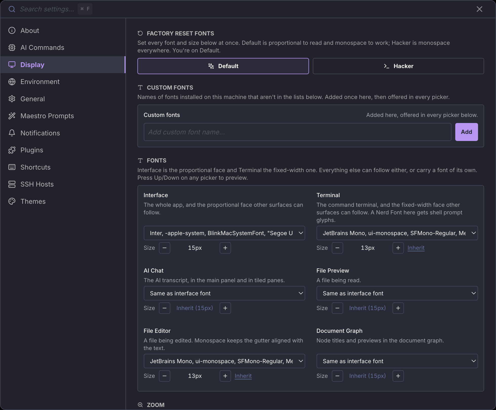
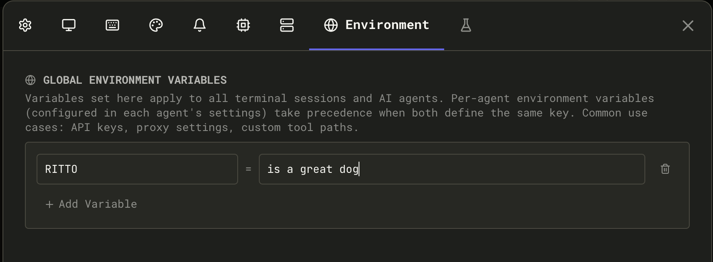

## Settings Overview

Open Settings with `Cmd+,` / `Ctrl+,` or via **Quick Actions** (`Cmd+K` / `Ctrl+K`) → "Open Settings".

Settings are organized into tabs:

| Tab                             | Contents                                                                                                                                                                                                                                                                                             |
| ------------------------------- | ---------------------------------------------------------------------------------------------------------------------------------------------------------------------------------------------------------------------------------------------------------------------------------------------------- |
| **General**                     | About Me (conductor profile), [system-wide hotkey to summon Maestro](./keyboard-shortcuts#system-wide-hotkey-summon-maestro), shell configuration, input send behavior, default toggles (history, thinking), automatic tab naming, power management, updates, privacy, usage stats, storage location |
| **Display**                     | [Typography](#typography) (a font and size per surface, presets, custom fonts, zoom), terminal width, log level and buffer, max output lines per response, document graph settings, context window warnings, [Accessibility](#accessibility) (Color Blind Mode, Bionify reading emphasis)            |
| **Shortcuts**                   | Customize keyboard shortcuts (see [Keyboard Shortcuts](./keyboard-shortcuts))                                                                                                                                                                                                                        |
| **Themes**                      | Dark, light, and vibe mode themes, custom theme builder with import/export                                                                                                                                                                                                                           |
| **Notifications**               | OS notifications, custom command notifications, toast notification duration and width                                                                                                                                                                                                                |
| **AI Commands**                 | View and edit slash commands, [Spec-Kit](./speckit-commands), [OpenSpec](./openspec-commands), and [BMAD](./bmad-commands) prompts                                                                                                                                                                   |
| **Maestro Prompts**             | Browse and edit the 23 core system prompts (wizard, Auto Run, group chat, context, etc.). Changes take effect immediately; reset to bundled defaults at any time                                                                                                                                     |
| **SSH Hosts**                   | Configure remote hosts for [SSH agent execution](./ssh-remote-execution)                                                                                                                                                                                                                             |
| **Environment**                 | Global environment variables that cascade to all agents and terminal sessions                                                                                                                                                                                                                        |
| **WakaTime** _(in General tab)_ | WakaTime integration toggle, API key, detailed file tracking                                                                                                                                                                                                                                         |

## Typography

**Settings → Display → Fonts.** Maestro does not have one font: it has a font per surface, so the places you read and the places you work can use different faces.



Two surfaces are the roots that everything else can follow:

- **Interface** - the whole app, and the proportional face other surfaces inherit.
- **Terminal** - the command terminal, and the fixed-width face other surfaces inherit. A Nerd Font here gets you shell prompt glyphs.

Four more surfaces each pick their own face, or inherit:

| Surface            | What it covers                                                     |
| ------------------ | ------------------------------------------------------------------ |
| **AI Chat**        | The AI transcript, in the main panel and in tiled panes            |
| **File Preview**   | A file being read                                                  |
| **File Editor**    | A file being edited                                                |
| **Document Graph** | Node titles and previews in the [Document Graph](./document-graph) |

Each surface has its own size, which can also inherit. Press **Up** / **Down** on any picker to step through the installed faces and preview them live.

### Presets

**Factory Reset Fonts** sets every font and size at once:

- **Default** - proportional to read, monospace to work. The interface, AI chat, and file preview are proportional; the terminal and file editor are monospace.
- **Hacker** - monospace everywhere. The original Maestro look.

Maestro tells you which preset is active, or that you have customized away from both.

### Save and restore your own setup

A preset overwrites every font and size, so **Save & Restore Customizations** keeps yours. Click **Save Customizations** once you like what you have, then try a preset or keep tinkering, and **Restore Customizations** puts your fonts back in one click.

There is one slot, and saving again replaces it (Maestro asks first). Zoom is not part of a saved setup, so restoring one never changes how big everything is.

### Custom fonts

The pickers list fonts Maestro knows about. If you have a font installed that is not in the list, add its name once under **Manage Custom Fonts** and it becomes available in every picker.

<Warning>
Type the family name exactly as the system reports it. A name that is not installed cannot be resolved, and the surface falls back to the browser default rather than telling you it failed.
</Warning>

### Zoom

**Zoom** scales every surface by the same amount, so the sizes you set relative to each other are preserved. `Cmd+=` / `Cmd+-` adjusts it and `Cmd+Shift+0` resets it.

<Tip>
You are offered the Default and Hacker presets once, on first run, so you do not have to find this screen to make Maestro readable. Nothing there is permanent - every choice is a setting you can change here later. See [First run](./getting-started#first-run).
</Tip>

## Maestro Prompts

Maestro ships with 23 core system prompts that control wizard conversations, Auto Run behavior, group chat moderation, context management, and more. You can customize any of them via the **Maestro Prompts** tab in Settings.

**To edit a prompt:**

1. Open **Settings** (`Cmd+,` / `Ctrl+,`) → **Maestro Prompts** tab
2. Select a prompt from the category list on the left
3. Edit the content in the editor
4. Click **Save** - changes take effect immediately (no restart needed)

**To reset a prompt:**

Click **Reset to Default** to restore the bundled version. This also takes effect immediately.

Customizations are stored separately from bundled prompts and survive app updates. You can also access the four most common prompts directly from **Quick Actions** (`Cmd+K` / `Ctrl+K`): Maestro System Prompt, Auto Run Default, Commit Command, and Group Chat Moderator.

For template variables, the `{{INCLUDE:name}}` and `{{REF:name}}` directives, creating reusable prompt fragments, and more, see the full [Prompt Customization](/prompt-customization) guide.

## Accessibility

The **Display** tab includes an **Accessibility** section that groups visual aids for color vision deficiencies and long-form reading. Open it via **Settings** (`Cmd+,` / `Ctrl+,`) → **Display** → scroll to **Accessibility**.

### Color Blind Mode

Toggle **Color Blind Mode** to swap Maestro's default red / green / yellow semantics for [Wong's colorblind-safe palette](https://www.nature.com/articles/nmeth.1618) (_Nature Methods_, 2011). The palette uses distinct hue **and** luminance steps so the signal survives protanopia, deuteranopia, tritanopia, and grayscale displays.

The toggle applies across the desktop app:

| Surface                                     | Default                     | Color Blind Mode           |
| ------------------------------------------- | --------------------------- | -------------------------- |
| Agent status dot - Ready                    | Theme green                 | Teal (`#009988`)           |
| Agent status dot - Thinking                 | Theme yellow                | Orange (`#EE7733`)         |
| Agent status dot - Error                    | Theme red                   | Vermillion (`#CC3311`)     |
| Agent status dot - Connecting               | Orange `#ff8800`            | Strong Blue (`#0077BB`)    |
| Diff viewer add / remove rows               | Green / red tints           | Teal / vermillion tints    |
| Diff viewer add / remove counts             | `text-green-500/-red-500`   | Teal / vermillion          |
| File explorer git status icons              | Theme success/error/warning | Teal / vermillion / orange |
| History activity graph (Auto bar)           | Theme yellow                | Orange                     |
| [Usage Dashboard](./usage-dashboard) charts | Theme accents               | Wong agent / line palette  |
| File extension badges                       | Theme accent                | Per-language Wong colors   |

Surfaces that aren't recolored: theme accent itself, file extension labels in plain text, terminal ANSI output (controlled by your terminal theme), the "Waiting for input" pulsing dot (uses theme accent), and the Cue activity bar (already uses a colorblind-safe cyan).

### Bionify Emphasis (Reading Mode)

Bionify-style emphasis bolds the leading fixation portion of each word to make long-form reading easier. It is opt-in and applies **only** to dedicated readers - File Preview and Auto Run document panes. Terminals, logs, chat input, and AI output stay unchanged so they remain easy to copy/paste.

- **Intensity** - Soft / Default / Strong. Controls how aggressive the fixation emphasis is.
- **Algorithm** - Advanced override of the fixation formula. Format: `[+|-] N1 N2 N3 N4 frac` where `-` skips common English words (`a`, `and`, `the`) and `+` highlights every word. The four integers set how many characters are emphasized for words of length 1-4, and `frac` is the fraction of characters emphasized for longer words (e.g. `0.4` = first 40%). Default: `- 0 1 1 2 0.4`. Click the **info** icon next to the toggle for the in-app reference.

## Conductor Profile

The **Conductor Profile** (Settings → General → **About Me**) is a short description of yourself that gets injected into every AI agent's system prompt. This helps agents understand your background, preferences, and communication style so they can tailor responses accordingly.

**To configure:**

1. Open **Settings** (`Cmd+,` / `Ctrl+,`) → **General** tab
2. Find the **About Me** text area at the top
3. Write a brief profile describing yourself

### What to Include

A good conductor profile is concise (a few sentences to a short paragraph) and covers:

- **Your role/background**: Developer, researcher, team lead, etc.
- **Technical context**: Languages you work with, tools you prefer, platforms you use
- **Communication preferences**: Direct vs. detailed, level of explanation needed
- **Work style**: Preferences for how agents should approach tasks

### Example Profile

```
Security researcher. macOS desktop. TypeScript and Python for tools.
Direct communication, no fluff. Action over process. Push back on bad ideas.
Generate markdown for Obsidian. CST timezone.
```

### How Agents Use It

When you start a session, Maestro includes your conductor profile in the system prompt sent to the AI agent. This means:

- Agents adapt their response style to match your preferences
- Technical context helps agents make appropriate assumptions
- Communication preferences reduce back-and-forth clarification

### Using in Custom Commands

You can reference your conductor profile in [slash commands](./slash-commands) using the `{{CONDUCTOR_PROFILE}}` template variable. This is useful for commands that need to remind agents of your preferences mid-conversation.

## Global Environment Variables

Configure environment variables once in Settings and they automatically apply to all AI agent processes and terminal sessions. This is perfect for managing API keys, proxy settings, custom tool paths, and other shared configuration.

### How to Configure

1. Open **Settings** (`Cmd+,` / `Ctrl+,`) → **Environment** tab
2. Add your variables in `KEY=VALUE` format using the **Add Variable** button
3. Variables apply immediately to new agent sessions and terminals
4. Click the eye button on a row to switch that variable off without deleting it

A new row starts with no name, and the name field opens straight onto the suggestions. It offers each provider's own variables (`CLAUDE_CONFIG_DIR`, `CODEX_HOME`, `COPILOT_HOME`, and so on) plus every name you have already set elsewhere in Maestro, so a variable you configured once on one agent is one keystroke away on the next. Type to narrow the list, pick with the arrow keys and `Enter`, or ignore it and type any name you like.



### Example Configuration

```env
ANTHROPIC_API_KEY=sk-proj-xxxxx
HTTP_PROXY=http://proxy.company.com:8080
HTTPS_PROXY=http://proxy.company.com:8080
DEBUG=maestro:*
MY_TOOL_PATH=~/tools/custom
```

### Important Features

- **Switch a variable off**: The eye button parks a variable - the row stays in the list with its key and value intact and still editable, but the variable is no longer passed to anything Maestro runs. Use it to test without a proxy or an API key instead of deleting the value and retyping it later. Parked variables are stored separately and are never merged into an agent or terminal environment.
- **Path expansion**: Use `~/` for home directory (e.g., `~/workspace` expands to `/Users/username/workspace`)
- **Quotes for special characters**: Variables with spaces or special characters should be quoted
- **Applied to both agents and terminals**: Global vars are available to all agent processes (Claude, OpenCode, etc.) and all terminal sessions
- **Agent-specific overrides**: You can override global variables with agent-specific settings (in agent configuration)
- **Persist across sync**: Global environment variables are included when you export or sync settings to another device

### Environment Variable Precedence

When an agent or terminal is spawned, its environment is built in this order (lowest to highest priority). Each layer overrides the one before it:

1. **System environment** - System and parent process variables Maestro inherits
2. **Global environment variables** (Settings → Environment) - Applied to all agents and terminals
3. **The agent's own variables, or else the provider-level variables** - One set, never both

Layer 3 replaces; it does not merge. Provider-level variables are defaults stored for a particular provider (Claude Code, Codex, and so on), and they reach an agent only when that agent has no variables of its own. Once an agent carries any variable in its **Environment Variables (optional)** panel, the provider-level set is dropped for that agent entirely, including keys the agent never set.

So an agent that sets only `ANTHROPIC_API_KEY` does not receive a provider-level `CLAUDE_CONFIG_DIR`. If it needs both, set both on the agent.

Provider-level variables have no editor in the current UI, so unless you have older settings carrying them, the effective order is simply: per-agent beats global beats system.

### Use Cases

- **API keys**: Set `ANTHROPIC_API_KEY` once → all Claude sessions can access it
- **Proxy settings**: Set `HTTP_PROXY` and `HTTPS_PROXY` → all network requests respect the proxy
- **Custom tool paths**: Set `MY_TOOLS=/opt/mytools` → agents can find custom utilities
- **Debugging**: Set `DEBUG=maestro:*` → enable consistent logging across all sessions
- **Language settings**: Set `LANG=en_US.UTF-8` → consistent text encoding

### Per-Agent Environment Variables

Any one agent can carry its own variables, which override the global ones for that agent only. Use this when a single agent needs a different API key, a different base URL, or a tool path the rest of your agents should not see.

The panel is labeled **Environment Variables (optional)** and it appears in two places:

- **When creating the agent** - in the **Create New Agent** dialog, below Working Directory.
- **At any time afterwards** - open **Edit Agent** and scroll to the same panel. You do not have to recreate an agent to change its variables.

Three ways to reach Edit Agent:

| Route         | How                                                |
| ------------- | -------------------------------------------------- |
| Keyboard      | `Alt+Cmd+,` / `Alt+Ctrl+,` with the agent selected |
| Left Bar      | Right-click the agent → **Edit Agent**             |
| Quick Actions | `Cmd+K` / `Ctrl+K` → "Edit Agent"                  |

You can also set them from the CLI without opening the app:

```bash
maestro-cli update-agent <agent-id> --env MY_KEY=value
maestro-cli create-agent "Reviewer" --env ANTHROPIC_BASE_URL=https://proxy.internal
maestro-cli update-agent <agent-id> --clear-env   # remove all per-agent variables
```

The eye button parks a variable here too: the row keeps its key and value and stays editable, but the variable is not passed to the agent. Parked variables are stored separately and are never merged into a spawned process.

Here the name suggestions are narrowed to the agent's provider: a Claude agent leads with `CLAUDE_CONFIG_DIR` and the `ANTHROPIC_*` variables, a Codex agent with `CODEX_HOME`. Names you have set before are offered too, which matters most for the ones no catalog can know about, like a company proxy or an internal token.

### Seeing What an Agent Actually Runs With

Because the layers are edited in different places, no single screen shows the result. To see the merged environment for one agent, open **Quick Actions** (`Cmd+K` / `Ctrl+K`) and run **Re-authenticate Provider** for that agent, then expand the **Environment for &lt;agent&gt;** section. It lists one row per variable, badged with the layer whose value won.

This is the quickest way to catch the case where an agent behaves oddly because an `ANTHROPIC_BASE_URL` or API key from a layer you forgot about is overriding the one you just set. Values that look like credentials are masked until you click the eye on that row.

### Using a Different Token Backend

Maestro spawns each provider's own CLI, so it does not have a "model gateway" setting of its own. What an agent bills to, and which endpoint it talks to, is whatever its CLI reads from the environment. That makes per-agent variables the way to point one agent at a proxy, a gateway, or a company account while every other agent keeps its normal login.

Set these in **Edit Agent → Environment Variables (optional)** (`Alt+Cmd+,` / `Alt+Ctrl+,`) so they apply to that agent alone, or in **Settings → Environment** to apply them everywhere.

| Provider          | Variables that redirect it                                                                                                            | Notes                                                                            |
| ----------------- | ------------------------------------------------------------------------------------------------------------------------------------- | -------------------------------------------------------------------------------- |
| **Claude Code**   | `ANTHROPIC_BASE_URL` plus `ANTHROPIC_AUTH_TOKEN` (gateway token) or `ANTHROPIC_API_KEY`. `CLAUDE_CONFIG_DIR` picks a different login. | The endpoint must speak the Anthropic Messages API. See the warning below.       |
| **Codex**         | `OPENAI_API_KEY`, and `CODEX_HOME` to point at a config directory with its own `base_url`                                             | Codex reads a custom model provider from its own config file.                    |
| **OpenCode**      | `OPENCODE_CONFIG_DIR`, plus the provider key var for whichever backend you configure (`ANTHROPIC_API_KEY`, `GROQ_API_KEY`, and so on) | OpenCode recognizes roughly a hundred `*_API_KEY` vars and stores them together. |
| **Copilot CLI**   | `COPILOT_GITHUB_TOKEN`, `GH_TOKEN`, `GITHUB_TOKEN` (the CLI's own precedence order)                                                   | Selects which GitHub account is used. The backend itself is not redirectable.    |
| **Factory Droid** | Configured in Droid's own settings                                                                                                    | Maestro passes the environment through but does not define the vars.             |

Claude Code also honors `CLAUDE_CODE_USE_BEDROCK=1` and `CLAUDE_CODE_USE_VERTEX=1`, which route it to AWS Bedrock or Google Vertex AI. Those take credentials from the cloud SDK chain rather than from an Anthropic key, and they override the variables above.

To set one from the CLI instead:

```bash
maestro-cli update-agent <agent-id> --env ANTHROPIC_BASE_URL=https://gateway.internal/v1
maestro-cli update-agent <agent-id> --env ANTHROPIC_AUTH_TOKEN=sk-gateway-...
```

#### What Will Not Work

<Warning>
An OpenAI-compatible gateway cannot back Claude Code directly. OpenRouter, Requesty, Together, and similar routers expose an OpenAI-shaped `/chat/completions` endpoint, while Claude Code speaks the Anthropic Messages API. Pointing `ANTHROPIC_BASE_URL` straight at one of them produces request failures, not a working agent. Put a translating proxy (LiteLLM, `claude-code-router`, or the router's own Anthropic-compatible route if it publishes one) in between, and point `ANTHROPIC_BASE_URL` at that. Codex and OpenCode have no such problem, because they are OpenAI-shaped already.
</Warning>

Two more things that surprise people:

- **A per-agent variable replaces the provider-level set, it does not merge with it.** An agent that sets only `ANTHROPIC_BASE_URL` stops receiving a provider-level `CLAUDE_CONFIG_DIR`. Set both on the agent if it needs both.
- **Re-authenticating cannot fix a gateway.** When an agent runs against a base URL or an API key, a failure belongs to that operator or that key, so running the provider's login command produces a successful-looking flow that changes nothing. Maestro detects this and tells you which credential is actually in play instead of offering a login that would not help.

## Checking for Updates

Maestro checks for updates automatically on startup (configurable in Settings → General → **Check for updates on startup**).

**To manually check for updates:**

- **Quick Actions:** `Cmd+K` / `Ctrl+K` → "Check for Updates"
- **Menu:** Click the hamburger menu (☰) → "Check for Updates"

When an update is available, you'll see:

- Current version and new version number
- Release notes summary
- **Download** button to get the latest release from GitHub
- Option to enable/disable automatic update checks

### Anonymous Check-in

Alongside each update check, Maestro sends a small anonymous ping so we can count how many installs are active and which platforms and themes people actually use. It is the only usage data the app reports about itself.

**What it sends:**

| Field      | Example           | Notes                                                        |
| ---------- | ----------------- | ------------------------------------------------------------ |
| Install ID | `9f3a...` (UUID)  | Randomly generated once, stored locally. Not your machine ID |
| Version    | `0.17.3`          | The Maestro version you're running                           |
| Platform   | `darwin`, `win32` | Operating system                                             |
| Arch       | `arm64`, `x64`    | CPU architecture                                             |
| Theme      | `dracula`         | Active theme ID                                              |

**What it does not send:** your name, email, IP-derived location, file paths, project names, prompts, agent output, or anything you type. The install ID is a random UUID generated on first run and kept in your local app data - it is not derived from your hardware, and it cannot be traced back to you.

**Frequency:** once when Maestro launches, then once per day if you leave it running.

**To turn it off:** Settings → General → **Check for updates on startup**. The check-in rides along with the update check, so disabling that disables both. Development and test builds never check in.

### Pre-release Channel (Beta Opt-in)

By default, Maestro only notifies you about stable releases. If you want to try new features before they're officially released, you can opt into the pre-release channel.

**To enable beta updates:**

1. Open **Settings** (`Cmd+,` / `Ctrl+,`) → **General** tab
2. Toggle **Include beta and release candidate updates** on

**What changes:**

- Update checks will include pre-release versions (e.g., `v0.11.1-rc`, `v0.12.0-beta`)
- You'll receive notifications for beta, release candidate (rc), and alpha releases
- The Update dialog will show all available pre-release versions

**Pre-release version types:**

| Suffix    | Description                                |
| --------- | ------------------------------------------ |
| `-alpha`  | Early development, may be unstable         |
| `-beta`   | Feature-complete but still testing         |
| `-rc`     | Release candidate, nearly ready for stable |
| `-dev`    | Development builds                         |
| `-canary` | Cutting-edge nightly builds                |

**Reverting to stable:** Toggle the setting off and download the latest stable release from GitHub. Pre-releases won't auto-downgrade to stable versions.

<Warning>
Pre-release versions may contain experimental features and bugs. Use at your own risk. If you encounter issues, you can always download the latest stable release from [GitHub Releases](https://github.com/RunMaestro/Maestro/releases).
</Warning>

## Notifications & Sound

Configure audio and visual notifications in **Settings** (`Cmd+,` / `Ctrl+,`) → **Notifications** tab.

### OS Notifications

Enable desktop notifications to be alerted when:

- An AI task completes
- A long-running command finishes
- The agent requires attention

**To enable:**

1. Toggle **Enable OS Notifications** on
2. Click **Test Notification** to verify it works

### Custom Notification

Execute a custom command when AI tasks complete. Use any notification method that fits your workflow.

**To configure:**

1. Toggle **Enable Custom Notification** on
2. Set the **Command Chain** - the command(s) that accept text via stdin:
   - **macOS:** `say` (text-to-speech), `afplay /path/to/sound.wav` (audio file)
   - **Linux:** `notify-send "Maestro"`, `espeak`, `paplay /path/to/sound.wav`
   - **Windows:** PowerShell scripts or third-party tools
   - **Custom:** Any command or script that accepts stdin
3. Click **Test** to verify your command works
4. Click **Stop** to interrupt a running test

**Command chaining:** Chain multiple commands together using pipes to mix and match tools. Examples:

- `say` - speak aloud using macOS text-to-speech
- `tee ~/log.txt | say` - log to a file AND speak aloud
- `notify-send "Maestro" && espeak` - show desktop notification and speak (Linux)
- `afplay ~/sounds/done.wav` - play a sound file (macOS)

### Toast Notifications

In-app toast notifications appear in the corner when events occur. Configure how long they stay visible:

| Duration                 | Behavior                                  |
| ------------------------ | ----------------------------------------- |
| **Off**                  | Toasts are disabled entirely              |
| **5s / 10s / 20s / 30s** | Toast disappears after the specified time |
| **Never**                | Toast stays until manually dismissed      |

You can also set how wide toasts render:

| Width       | Behavior                                                                                  |
| ----------- | ----------------------------------------------------------------------------------------- |
| **Small**   | Default compact size                                                                      |
| **Medium**  | Roughly 1.4x wider than Small                                                             |
| **Large**   | Roughly 1.8x wider than Small, for longer content                                         |
| **Dynamic** | Matches the Right Bar width, filling that column and re-sizing live as you drag the panel |

#### Clicking a Toast

Most toasts are clickable, and where the click takes you depends on what the toast is about:

| The toast points at             | Clicking it                                      |
| ------------------------------- | ------------------------------------------------ |
| An agent, or one of its AI tabs | Switches to that agent and tab                   |
| A file                          | Opens the file in that agent's File Preview pane |
| A terminal tab                  | Switches to that agent and focuses the terminal  |
| An in-app browser tab           | Focuses that tab, or opens the URL in a new one  |
| An external link                | Opens it in your system browser                  |

If the target tab was closed since the toast appeared, the click still switches to the agent and tells you what was missing, so a click never silently does nothing. Scripts and agents choose the target with the `--open-*` flags on [`maestro-cli notify toast`](/cli#notifications). A toast can also carry a separate inline link button beneath its message (`--action-url`); that link is independent of the body click.

### When Notifications Trigger

Notifications are sent when:

- An AI task completes (OS notification + optional custom notification)
- A long-running command finishes (OS notification)

## Sleep Prevention

Maestro can prevent your computer from sleeping while AI agents are actively working, ensuring long-running tasks complete without interruption.

**To enable:**

1. Open **Settings** (`Cmd+,` / `Ctrl+,`) → **General** tab
2. Scroll to the **Power** section
3. Toggle **Prevent sleep while working** on

### When Sleep Prevention Activates

Sleep prevention automatically activates when:

- Any session is **busy** (agent processing a request)
- **Auto Run** is active (processing tasks)
- **Group Chat** is in progress (moderator or agents responding)

When all activity stops, sleep prevention deactivates automatically.

### Keep the Display Awake

By default Maestro keeps the machine running but lets the screen go dark, so the screen saver, the screen lock, and your normal power settings all behave as usual.

Turn on **Keep the display awake** (in the same **Power** section, off by default) when you want to watch a long run instead: the display stays lit, the screen saver and lock screen never arrive, and you are not logged out for being idle. It only takes effect while sleep prevention is holding the machine awake, so an idle Maestro still lets everything sleep.

<Warning>
On macOS, a lit display is how the OS decides someone is at the machine, and it parks discretionary background maintenance while that is true. Spotlight indexing, Photos analysis, XProtect scans, Time Machine thinning, and background updates all wait until the run finishes. That is the trade: an uninterrupted, still-signed-in session in exchange for deferred housekeeping.
</Warning>

### Platform Support

| Platform    | Support Level                 | Notes                                                                                                       |
| ----------- | ----------------------------- | ----------------------------------------------------------------------------------------------------------- |
| **macOS**   | Full support                  | Equivalent to running `caffeinate`. Check Activity Monitor → View → Columns → "Preventing Sleep" to verify. |
| **Windows** | Full support                  | Uses `SetThreadExecutionState`. Verify with `powercfg /requests` in admin CMD.                              |
| **Linux**   | Varies by desktop environment | Works on GNOME, KDE, XFCE via D-Bus. See notes below.                                                       |

### Linux Desktop Environment Notes

Sleep prevention on Linux uses standard freedesktop.org interfaces:

- **GNOME, KDE, XFCE**: Full support via D-Bus screen saver inhibition
- **Minimal window managers** (i3, sway, dwm, bspwm): May not work. These environments typically don't run a screen saver daemon.

**If sleep prevention doesn't work on Linux:**

1. Ensure `xdg-screensaver` is installed
2. Verify a D-Bus screen saver service is running
3. Some systems may need `gnome-screensaver`, `xscreensaver`, or equivalent

<Info>
On unsupported Linux configurations, the feature silently does nothing - your system will sleep normally according to its power settings.
</Info>

## WakaTime Integration

Maestro integrates with [WakaTime](https://wakatime.com) to track coding activity across your AI sessions. The WakaTime CLI is auto-installed when you enable the integration.

**To enable:**

1. Open **Settings** (`Cmd+,` / `Ctrl+,`) → **General** tab
2. Toggle **Enable WakaTime tracking** on
3. Enter your API key (get it from [wakatime.com/settings/api-key](https://wakatime.com/settings/api-key))

### What Gets Tracked

By default, Maestro sends **app-level heartbeats** - WakaTime sees time spent in Maestro as a single project entry with language detected from your project's manifest files (e.g., `tsconfig.json` → TypeScript).

### Detailed File Tracking

Enable **Detailed file tracking** to send per-file heartbeats for write operations. When an agent writes or edits a file, Maestro sends that file path to WakaTime with:

- The file's language (detected from extension)
- A write flag indicating the file was modified
- Project name and branch

File paths (not file content) are sent to WakaTime's servers. This setting defaults to off and requires two explicit opt-ins (WakaTime enabled + detailed tracking enabled).

### Supported Tools

File heartbeats are generated for write operations across all supported agents:

| Agent       | Tracked Tools                                           |
| ----------- | ------------------------------------------------------- |
| Claude Code | Write, Edit, NotebookEdit                               |
| Codex       | write_to_file, str_replace_based_edit_tool, create_file |
| OpenCode    | write, patch                                            |

Read operations and shell commands are excluded to avoid inflating tracked time.

### Activity Categories

Maestro assigns WakaTime categories based on how the session was initiated:

- **Interactive sessions** (user-driven) are tracked as `building`
- **Auto Run / batch sessions** are tracked as `ai coding`

This lets you distinguish time you spent actively directing agents from time the AI worked autonomously on your WakaTime dashboard.

## Storage Location

Settings are stored in:

- **macOS**: `~/Library/Application Support/maestro/`
- **Windows**: `%APPDATA%/maestro/`
- **Linux**: `~/.config/maestro/`

## Cross-Device Sync (Beta)

Maestro can sync settings, sessions, and groups across multiple devices by storing them in a cloud-synced folder like iCloud Drive, Dropbox, or OneDrive.

**Setup:**

1. Open **Settings** (`Cmd+,` / `Ctrl+,`) → **General** tab
2. Scroll to **Storage Location**
3. Click **Choose Folder...** and select a synced folder:
   - **iCloud Drive**: `~/Library/Mobile Documents/com~apple~CloudDocs/Maestro`
   - **Dropbox**: `~/Dropbox/Maestro`
   - **OneDrive**: `~/OneDrive/Maestro`
4. Maestro will migrate your existing settings to the new location
5. Restart Maestro for changes to take effect
6. Repeat on your other devices, selecting the same synced folder

**What syncs:**

- Settings and preferences
- Session configurations
- Groups and organization
- Agent configurations
- Session origins and metadata

**What stays local:**

- Window size and position (device-specific)
- The bootstrap file that points to your sync location

**Important limitations:**

- **Single-device usage**: Only run Maestro on one device at a time. Running simultaneously on multiple devices can cause sync conflicts where the last write wins.
- **No conflict resolution**: If settings are modified on two devices before syncing completes, one set of changes will be lost.
- **Restart required**: Changes to storage location require an app restart to take effect.

To reset to the default location, click **Use Default** in the Storage Location settings.
