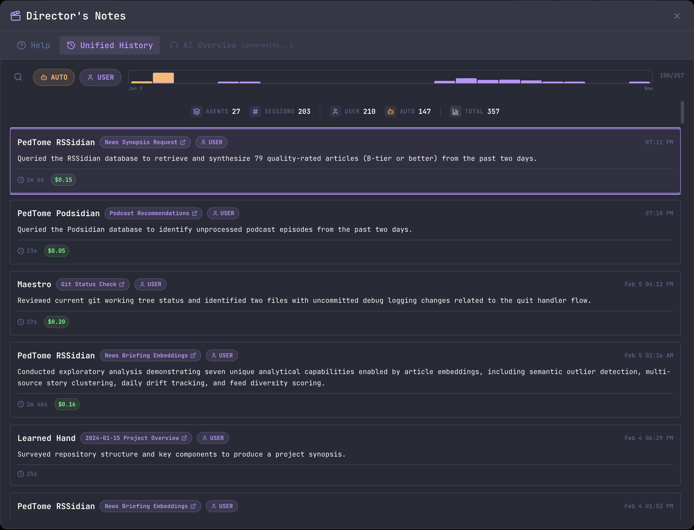
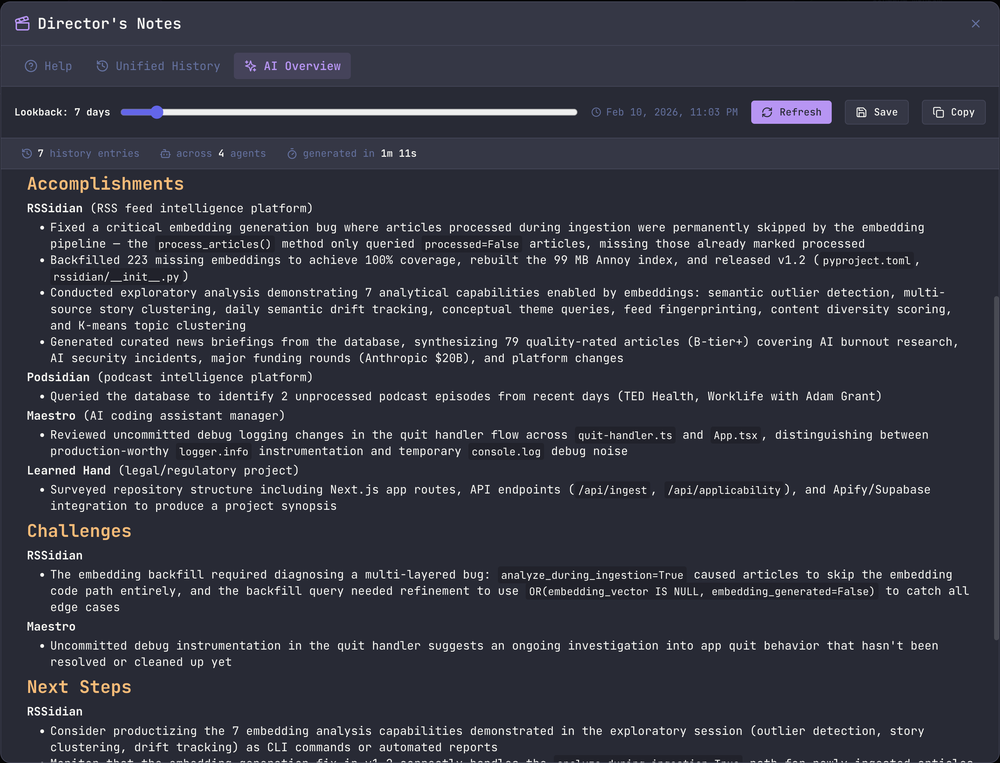

Director's Notes is your bird's-eye view of everything happening across all your AI agents. Instead of switching between tabs to check what each agent has been doing, Director's Notes aggregates all history entries into a single, searchable, filterable timeline - and can generate an AI-powered synopsis of recent activity.

<Note>
Director's Notes is an **Encore Feature** - it's on by default. Turn it off in **Settings > Encore Features** to hide the shortcut, menu entry, and command palette action.
</Note>


## Opening Director's Notes

**Keyboard shortcut:**

- macOS: `Cmd+Shift+O`
- Windows/Linux: `Ctrl+Shift+O`

**From Quick Actions:**

- Press `Cmd+K` / `Ctrl+K` and search for "Director's Notes"

## Tabs

Director's Notes has three tabs:

### Unified History

The primary view - a chronological list of all history entries from every agent, newest first.



**Filtering:**

- **AUTO / USER** toggle buttons filter by entry type
- **Search** (`Cmd+F` / `Ctrl+F`) filters by summary text or agent name
- **Activity Graph** shows entry distribution over time; right-click to change the lookback window (24 hours through all time)

**Stats Bar:**
A centered aggregate stats bar displays key metrics across the current dataset:

- Total queries, sessions, AUTO entries, USER entries, and total cost

**Entry Details:**
Each entry shows:

- **Agent name** - which Maestro agent produced the entry
- **Task name pill** - clickable link to the originating session
- **Type badge** (AUTO or USER)
- **Summary** of what was accomplished
- **Duration** and **cost** (when available)
- **Timestamp**

Click any entry to open the **Detail Modal** with full response text, token breakdown, and navigation controls (Prev/Next or arrow keys).

**Session Navigation:**
Click the session pill on any entry to jump directly to that agent's tab - Director's Notes closes and focuses the agent with the relevant session loaded.

**Infinite Scroll:**
Entries load progressively (100 at a time). Scroll to load more as needed.

**Work from other machines:**
Every tab reads two sources, and so does the AI synopsis:

- **This machine's agents**, including any whose process runs over SSH. A remote agent you drive from here is recorded here, so its runs are always covered.
- **Peer Maestro instances** that worked on the same project from a different machine, via [Cross-Host Shared History](/history#cross-host-shared-history). Their entries carry the originating hostname, and their agents appear in the list named `Agent (hostname)`.

The second source needs the sharing toggles turned on: **Sync history to remote** on the SSH agent here, and **This agent is remote-controlled** on the agent over there. Without them, Director's Notes sees only what this machine did.

### AI Overview

An AI-generated synopsis of recent activity across all agents. This tab uses a configurable AI provider to read history files and produce a structured report.



**Controls:**

- **Lookback slider** - Adjust from 1 to 90 days to control the analysis window
- **Refresh** - Regenerate the synopsis with current settings
- **Save** - Export the synopsis as a markdown file
- **Copy** - Copy the raw markdown to clipboard
- **Font zoom** - A circle in the top-right corner of the notes that expands to an **A- / A+** pill on hover or keyboard focus. It scales the reading text in both Rich Mode and Plain Mode, and Maestro remembers the size you picked. The stat cards and charts around the notes keep their own sizing: they are chrome, not reading text.

**Stats Bar:**
After generation, a stats bar shows:

- Number of history entries analyzed
- Number of agents with activity
- Generation time

**Synopsis Content:**
The AI produces a structured report organized by agent/project with sections for:

- **Accomplishments** - What was completed
- **Challenges** - Issues encountered or unresolved
- **Next Steps** - Recommended follow-up actions

The synopsis is rendered as rich markdown with full formatting support.

**Grouping:**
Inside each section the bullets are bucketed under a subheading so you are not re-deriving who did what on every line. An agent that belongs to a Left Bar group is filed under the group (emoji and all), and each bullet keeps a small pill naming which member did it. An agent with no group gets its own subheading, and the pill is dropped because it would only repeat the heading. A section whose bullets all share one owner stays a flat list.

The grouping comes from Maestro's own session and group state, not from the AI, so it always matches what the Left Bar shows. It applies to Rich Mode, Plain Mode, Copy, and Save alike.

**Provider Configuration:**
Configure which AI provider generates the synopsis in **Settings > Encore Features**. Any installed agent (Claude Code, Codex, OpenCode) can be used. The default lookback window is also configurable there.

#### Ideal End State

An optional free-form description of where you are trying to get the fleet to: the projects in flight, which agents belong to each, and what finished looks like. Set it in **Settings > Encore Features** under Director's Notes.

Leave it empty and the synopsis is generated exactly as described above. Fill it in and three things change:

- **Reading priority** - Sessions named in the end state are read first and in the most depth. Every session in the window is still covered; the detail budget just shifts toward what you said matters.
- **Framing** - Accomplishments, Challenges, and Next Steps favor items that bear on the end state, so Next Steps reads as "what moves us toward the target" rather than a generic backlog.
- **A fourth section** - **Progress Toward Ideal End State** is added after Next Steps, measuring how far the window moved you. It calls out what got closer, what saw no activity at all (flagged as a warning), what looks finished, and where current work appears to diverge from the target.

The field accepts up to 4,000 characters and applies to the CLI synopsis (`maestro-cli notes --ai`) as well as the desktop AI Overview.

<Note>
The AI Overview tab becomes available once the synopsis has finished generating. A spinning indicator on the tab shows generation is in progress. Results are cached for the session - switching tabs won't trigger a regeneration.
</Note>

### Help

A built-in reference guide explaining all Director's Notes features, entry types, keyboard shortcuts, and workflows.

## Keyboard Shortcuts

### Modal

| Shortcut                       | Action                                |
| ------------------------------ | ------------------------------------- |
| `Cmd+Shift+O` / `Ctrl+Shift+O` | Open Director's Notes                 |
| `Cmd+Shift+[` / `Ctrl+Shift+[` | Previous tab                          |
| `Cmd+Shift+]` / `Ctrl+Shift+]` | Next tab                              |
| `Esc`                          | Close modal (or close search if open) |

### Unified History

| Shortcut           | Action                              |
| ------------------ | ----------------------------------- |
| `Cmd+F` / `Ctrl+F` | Open search filter                  |
| `Up` / `Down`      | Navigate between entries            |
| `Enter`            | Open detail view for selected entry |
| `Esc`              | Close search or close detail view   |

### Detail View

| Shortcut         | Action                          |
| ---------------- | ------------------------------- |
| `Left` / `Right` | Navigate to previous/next entry |
| `Esc`            | Close detail view               |

## Settings

Access Director's Notes settings via **Settings > Encore Features**:

| Setting                              | Description                                                                                         |
| ------------------------------------ | --------------------------------------------------------------------------------------------------- |
| **Use the first available provider** | On by default. Picks an installed provider each time the synopsis runs, so you never have to choose |
| **AI Provider**                      | Which agent generates the AI Overview synopsis. Only used when the setting above is off             |
| **Default Lookback**                 | Default number of days for the AI Overview lookback slider                                          |
| **Custom Path**                      | Optional custom binary path for the synopsis provider                                               |
| **Custom Args**                      | Optional custom arguments for the synopsis provider                                                 |
| **Ideal End State**                  | Optional goal description that prioritizes named projects and adds a Progress section to the notes  |

Auto-selection resolves at generation time against the providers actually installed, in this order: Claude Code, Codex, OpenCode, Factory Droid, Copilot-CLI. Turn it off to pin the synopsis to one agent - the picker, Custom Path, and Custom Args only apply to a pinned provider.

## Tips

- **Use AI Overview after an Auto Run session** to get a quick summary of everything that was accomplished across all agents
- **Search by agent name** in Unified History to isolate work from a specific project
- **Right-click the activity graph** to quickly change the time window without scrolling
- **Save or copy the synopsis** to include in standup notes, PRs, or project documentation
- **Session navigation** lets you jump directly from a history entry to the agent that produced it - great for resuming or reviewing work

## Pulling Notes from the CLI

The same unified history and AI synopsis are available from [`maestro-cli`](./cli#directors-notes), so you can pipe Director's Notes into shell scripts, cron jobs, or your own reporting tools without opening the app.

```bash
# Plain-text recap of the last 3 days
maestro-cli director-notes history -d 3

# Markdown recap of the last day, ready to paste into a doc or PR
maestro-cli director-notes history -f markdown -d 1

# Only the work you initiated (skip AUTO entries from Auto Run)
maestro-cli director-notes history --filter user -l 50

# JSON for piping into jq, a dashboard, or your own tooling
maestro-cli director-notes history --json -d 7

# AI synopsis of the past day (requires the desktop app to be running)
maestro-cli director-notes synopsis -d 1
```

### Generating a weekly report

Combine `synopsis` with a redirect (or your favorite scheduler) to produce a self-serve weekly report:

```bash
# Write this week's synopsis to a dated markdown file
maestro-cli director-notes synopsis -d 7 -f markdown \
  > ~/Documents/maestro-weekly-$(date +%Y-%m-%d).md
```

Schedule it with `cron`, `launchd`, or [Maestro Cue](./maestro-cue) on a weekly interval to wake up to a fresh status report every Monday. Pair it with `maestro-cli notify toast --open-file <path>` if you want a clickable in-app reminder when the report lands.

<Note>
`history` reads directly from disk and works offline. `synopsis` needs the Maestro desktop app running because it dispatches the prompt through your configured AI provider.
</Note>
