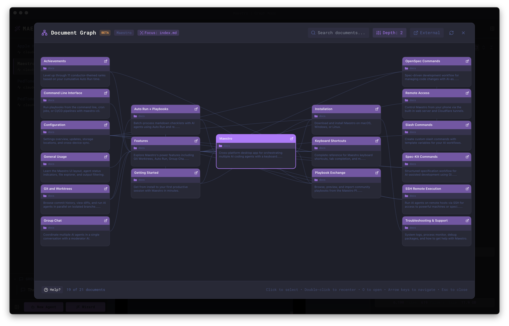
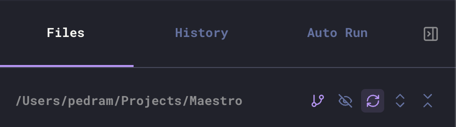

The Document Graph provides an interactive visualization of your markdown files and their connections. See how documents link to each other through wiki-links (`[[link]]`) and standard markdown links, making it easy to understand your documentation structure at a glance.



## Opening the Document Graph

There are several ways to access the Document Graph:

### From File Preview

When viewing a markdown file in File Preview, click the graph button in the preview toolbar to open the Document Graph focused on that file. Press `Esc` to return to the File Preview. This is the primary way to open the Document Graph.

### From Quick Actions

Press `Cmd+K` / `Ctrl+K` and search for "View in Document Graph" to focus the graph on the markdown file you are previewing, or "Open Last Document Graph" to re-open the most recently viewed graph.

<Note>
The "Open Last Document Graph" option only appears after you've opened a Document Graph at least once during your session.
</Note>

### From the File Explorer

After you've opened a Document Graph at least once, a **graph icon** (branch icon) appears in the Files tab header. Click it to re-open the last viewed graph.



### From File Context Menu

Right-click any markdown file in the File Explorer and select **Document Graph** to open the graph focused on that file.

### From a Folder or a Selection

Right-click a **folder** and choose **Open in Document Graph** to graph every
markdown file beneath it. Or select several markdown files (`Cmd`/`Ctrl+click`,
or `Shift+click` for a range), right-click, and choose **Open N in Document
Graph**.

These open a _scoped_ graph, which answers a different question from the
single-file graph. A single-file graph walks outward from one document and can
only ever show what that document reaches. A scoped graph shows exactly the
files you picked - including the ones that link to nothing, which is the only
way an unlinked document is visible at all. Links pointing outside the scope
stay broken rather than dragging their targets in.

The center is picked automatically: whichever document in the scope has the most
links. Right-click a specific file inside a selection to center on that one
instead.

### From the Command Line

```bash
maestro-cli open-graph docs/
maestro-cli open-graph docs/a.md docs/b.md --focus docs/a.md
```

See [open-graph](/cli-reference#maestro-cli-open-graph-paths) for the full
options.

### Using Go to File

Press `Cmd+G` / `Ctrl+G` to open the fuzzy file finder and navigate to any markdown file, then use the preview toolbar's graph button (or `Cmd+K` and "View in Document Graph") to jump to the Document Graph from there.

## Navigating the Graph

The Document Graph is designed for keyboard-first navigation:

| Action                        | Key                               |
| ----------------------------- | --------------------------------- |
| Navigate between nodes        | `Arrow Keys` (spatial detection)  |
| Preview document in-graph     | `Enter` (for document nodes)      |
| Open external URL             | `Enter` (for external link nodes) |
| Recenter view on node         | `Space`                           |
| Open document in File Preview | `O`                               |
| Cycle layout                  | `L`                               |
| Widen neighbor depth          | `D`                               |
| Cycle preview length          | `P`                               |
| Fit the whole graph on screen | `F`                               |
| Switch scroll to zoom or pan  | `S`                               |
| Snapshot the graph            | `C`                               |
| Adjust node spacing           | `+` / `-`                         |
| Focus search                  | `Cmd/Ctrl+F`                      |
| Step back / close graph       | `Esc`                             |

`L` steps through Mind Map, Radial, Hierarchical, Force, Lobes, and Timeline, in the same order as the layout dropdown. `D` widens the depth one level per press (1 through 5, then All, then back to 1). `P` steps the preview length through Off, 50, 100, 200, 350, and 500 characters. `F` re-frames the whole graph, and `S` switches what the scroll wheel does.

`Esc` steps back out one level at a time rather than closing outright. It closes the help panel first if that is open, then it takes you out of the search box **with your query intact**, which is the point: search, `Esc`, then arrow to a hit while the matches are still highlighted. Press it again to clear the search, and once more to close the graph.

Closing asks for confirmation first, since `Esc` would otherwise discard the layout, depth, and node positions you set up. Turn that prompt off in **Settings → Display → Document Graph**. A graph opened from the [Memories](./memories) viewer never asks either way: `Esc` hands you straight back to that viewer, so there is nothing to lose.

### Mouse Controls

- **Click** a node to select it
- **Double-click** a node to recenter the view on it
- **Drag** nodes to reposition them
- **Scroll** to zoom in and out, or to pan - see [Scroll Mode](#scroll-mode)
- **Shift+Scroll** to do whichever of those two the plain wheel is not doing
- **Pan** by dragging the background
- **Mini-map** in the bottom-left corner shows the whole graph; click or drag on it to jump the main view to that spot
- **Drag the left edge** of the in-graph document preview to make it wider or narrower; the width is remembered. Double-click that edge to restore the default.

## Graph Controls

The toolbar at the top of the Document Graph provides several options:

### Depth Control

Adjust the **Depth** slider to control how many levels of connections are shown from the focused document:

- **Depth: 0 (All)** - Show all connected documents regardless of distance
- **Depth: 1** - Show only direct connections
- **Depth: 2** - Show connections and their connections (default)
- **Depth: 3-5** - Show deeper relationship chains

Lower depth values keep the graph focused and improve performance; higher values reveal more of the document ecosystem. The depth can be adjusted from 0 (All) to 5. Press `D` to widen it one level per press without opening the slider.

### Layout

The **layout** dropdown switches how nodes are arranged. Press `L` to step
through them in the order below. Switching layouts clears any nodes you
dragged, since those positions belong to the layout they were set in.

| Layout           | Arrangement        | Answers                                          |
| ---------------- | ------------------ | ------------------------------------------------ |
| **Mind Map**     | Tree columns       | What branches off this document, left and right? |
| **Radial**       | Concentric rings   | How far is each document from the center?        |
| **Hierarchical** | Top-down rows      | What are the levels, read as a chart?            |
| **Force**        | Physics simulation | What is the overall shape of the link structure? |
| **Lobes**        | Clustered blobs    | Which documents form groups with each other?     |
| **Timeline**     | Columns by date    | When was each document last written?             |

#### Lobes

Lobes groups documents by which other documents they link to, using community
detection over the link structure rather than by folder or by name. Each group
is drawn as a coloured blob with the number of documents in it, and every node
takes its group's colour on its border so membership is readable without
tracing the outline.

This answers a question the ring layouts throw away. In a collection built
around one hub document, nearly everything sits one or two links from the
center, so Radial draws two enormous rings and Hierarchical draws two rows -
correct, but they say nothing about which documents belong together.

Documents that link to nothing else on screen are gathered into a single
dashed, muted **Ungrouped** blob rather than being scattered as one-node groups
of their own. They are the leftovers, not a finding, so they are drawn to stay
out of the way of the real groups.

Lobes needs more room than Force for the same documents, because separating
groups costs space. Press `F` to fit it on screen.

#### Timeline

Timeline puts one column per day that has documents, oldest on the left,
captioned with the date. Columns are evenly spaced by order rather than by real
elapsed time: a collection written in bursts would otherwise be two dense
clumps with a screen of empty canvas between them.

Documents whose modification time could not be read - which can happen over an
SSH remote - collect in a leading **Undated** column instead of being dated to
1970 and sorted first.

Unlike every other layout, Timeline places unlinked documents in the columns
alongside everything else rather than in a band below the graph. An unlinked
document still has a date, and when it was written is exactly the question this
layout answers.

### Scroll Mode

The **Scroll** pill switches what the mouse wheel does, as does pressing `S` or
the toggle inside the Help panel:

- **Zoom** (the default) - the wheel zooms toward the cursor, and `Shift`+wheel
  pans the canvas.
- **Pan** - the wheel pans in both directions, and `Shift`+wheel zooms.

Pan is what you want once you have found the right zoom level and are reading
across a wide graph. In Zoom mode every two-finger gesture changes the scale
you just set, so the framing you worked out is lost each time you try to move
sideways.

Whichever mode is on, `Shift` always reaches the other action, so neither is
ever more than a key away. The choice is remembered between visits.

### Preview Length

The **Preview** slider sets how much of each document's opening text is drawn inside its node, from 0 up to 500 characters. Press `P` to step through Off, 50, 100, 200, 350, and 500 without opening the slider.

At **Off** a document is drawn as a filename pill - no body box, no preview text, no folder path. That is the densest reading of a large graph: many more nodes fit on screen at once, and the shape of the link structure is what you see instead of the content. Raise the limit again when you want to read what a document is about without opening it.

### External Links

Toggle **External** to show or hide external URL links found in your documents:

- **Enabled** - External links appear as separate domain nodes (e.g., "github.com", "docs.example.com")
- **Disabled** - Only internal document relationships are shown

External link nodes help you see which external resources your documentation references.

### Unlinked Documents

In a scoped graph, an **Unlinked N** button appears whenever some of the scoped
documents connect to nothing else in the scope. They are drawn in a band below
the graph with a dashed amber border, and the button hides them.

They are shown by default: the reason to graph a hand-picked set is usually to
find out which of those documents stand alone, so hiding them would hide the
answer.

"Unlinked" covers two cases, both invisible from the center: a document with no
links at all, and a small cluster that links only within itself.

This button does not appear on a single-file graph, where an unreachable
document never becomes a node in the first place.

### Search

Use the search box to filter documents by name. Matching documents are highlighted in the graph.

### Snapshot

The **Snapshot** button in the center of the footer, or `C`, takes a picture of the
graph exactly as it is on screen, preview pane included, and offers two things
to do with it:

- **Copy to Clipboard** - paste the image straight into another app.
- **Save to Disk** - pick a location and write a PNG.

The shot covers the graph area only, so the toolbar and the footer stay out of
it. Pan and zoom to what you want first: what you see is what gets captured.

## Understanding the Graph

### Node Types

- **Document nodes** - Your markdown files, showing the filename and a preview of content
- **External link nodes** - Domains of external URLs referenced in your documents
- **Focused node** - The currently selected document (highlighted with a different border)
- **Grouped nodes** - In the Lobes layout, a node's border takes the colour of
  the group it belongs to. Selection, focus, and the unlinked warning all
  override it, since those describe the node itself rather than its group.

### Edge Types

Lines between nodes represent different types of connections:

- **Wiki-links** - `[[document-name]]` style links
- **Markdown links** - `[text](path/to/file.md)` style links
- **External links** - Links to URLs outside your project

### Node Information

Each document node displays:

- **Filename** - The document name
- **Folder indicator** - Shows the parent directory (e.g., "docs")
- **Content preview** - A snippet of the document's content

With the Preview slider at **Off** (or after pressing `P` around to Off), only the filename remains and each node is drawn as a compact pill.

## Tips for Effective Use

### Workflow Integration

1. Use `Cmd+G` to quickly find a file
2. Open it in File Preview to read or edit
3. Click the graph button in the preview toolbar to see its connections in the Document Graph
4. Press `O` to open a connected document
5. Press `Esc` to return to File Preview

### Large Documentation Sets

For projects with many markdown files:

- Start with **Depth: 1** to see immediate connections
- Increase depth gradually to explore relationships
- Press `P` around to **Off** so every document is a compact filename pill -
  many more fit on screen, and the link structure is what you see
- Press `F` at any time to fit the whole graph in the window. The graph also
  fits itself when it opens and whenever you change layout or preview length
- Press `S` for **Pan** once the zoom is right, so scrolling moves the view
  instead of changing the scale
- Use **Search** to find specific documents quickly
- Drag nodes to organize the view - positions persist

### Understanding Documentation Structure

The Document Graph is especially useful for:

- **Auditing links** - Find orphaned documents with no incoming links
- **Understanding navigation** - See how documents connect for readers
- **Planning restructuring** - Visualize the impact of moving or renaming files
- **Onboarding** - Help new team members understand documentation architecture
- **Finding the natural groupings** - Switch to **Lobes** to see which
  documents cluster with each other, which is often not how they are foldered
- **Seeing what is stale** - Switch to **Timeline** to read the collection by
  when each document was last written

## Keyboard Shortcut Summary

| Action                    | macOS            | Windows/Linux     |
| ------------------------- | ---------------- | ----------------- |
| Open from File Preview    | Toolbar button   | Toolbar button    |
| Re-open last graph        | Via `Cmd+K` menu | Via `Ctrl+K` menu |
| Go to File (fuzzy finder) | `Cmd+G`          | `Ctrl+G`          |
| Navigate nodes            | `Arrow Keys`     | `Arrow Keys`      |
| Preview document in-graph | `Enter`          | `Enter`           |
| Recenter on node          | `Space`          | `Space`           |
| Open document in preview  | `O`              | `O`               |
| Cycle layout              | `L`              | `L`               |
| Widen neighbor depth      | `D`              | `D`               |
| Cycle preview length      | `P`              | `P`               |
| Fit graph on screen       | `F`              | `F`               |
| Switch scroll zoom/pan    | `S`              | `S`               |
| Adjust node spacing       | `+` / `-`        | `+` / `-`         |
| Focus search              | `Cmd+F`          | `Ctrl+F`          |
| Close graph               | `Esc`            | `Esc`             |
