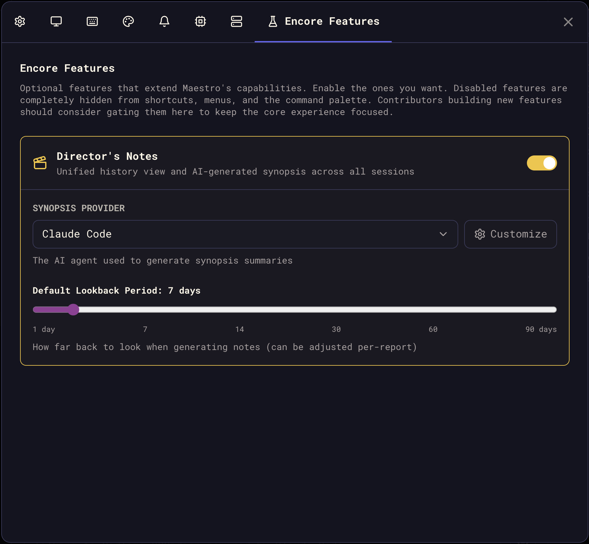

Encore Features are Maestro's system for shipping powerful capabilities behind a single toggle. A capability starts life as a plugin: gated, off, and opt-in. Once it has earned its place in the core experience it graduates to an Encore Feature and ships **on by default**.

Turning one off is still one click, and a disabled feature is completely invisible - no shortcuts, no menu items, no command palette entries.

## Turning Encore Features On and Off

Every Encore Feature is already on. To turn one off (or back on), open **Settings** (`Cmd+,` / `Ctrl+,`) and navigate to the **Encore Features** tab. Each feature may have its own configuration options that appear when enabled.

## Available Features

| Feature                              | Shortcut                       | Description                                                                                      |
| ------------------------------------ | ------------------------------ | ------------------------------------------------------------------------------------------------ |
| [Director's Notes](./director-notes) | `Cmd+Shift+O` / `Ctrl+Shift+O` | Unified timeline of all agent activity with AI-powered synopses                                  |
| [Usage Dashboard](./usage-dashboard) | `Opt+Cmd+U` / `Alt+Ctrl+U`     | Comprehensive analytics for tracking AI usage patterns                                           |
| [Maestro Symphony](./symphony)       | `Opt+Cmd+Y` / `Alt+Ctrl+Y`     | Contribute to open source by donating AI tokens                                                  |
| [Maestro Cue](./maestro-cue)         | `Opt+Q` / `Alt+Q`              | Event-driven automation: file changes, timers, agent chaining, GitHub polling, and task tracking |

## For Developers

Want to build a new Encore Feature? The architecture is designed for easy extension - add a flag, wire up the toggle, gate the access points, and your feature ships behind a clean opt-in. Ship it off by default while it proves itself; flip its entry in `DEFAULT_ENCORE_FEATURES` (`src/shared/encoreFeatures.ts`) when it graduates.

See the [Encore Features contributor guide](https://github.com/RunMaestro/Maestro/blob/main/CONTRIBUTING.md#encore-features-feature-gating) for the full implementation checklist, architecture details, and the canonical reference implementation (Director's Notes).
