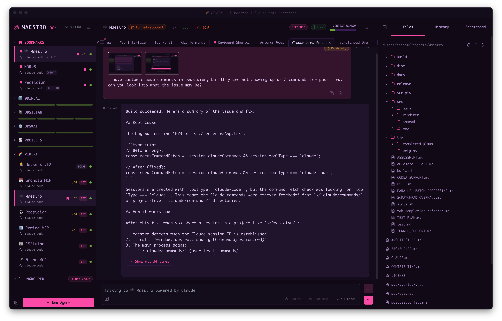
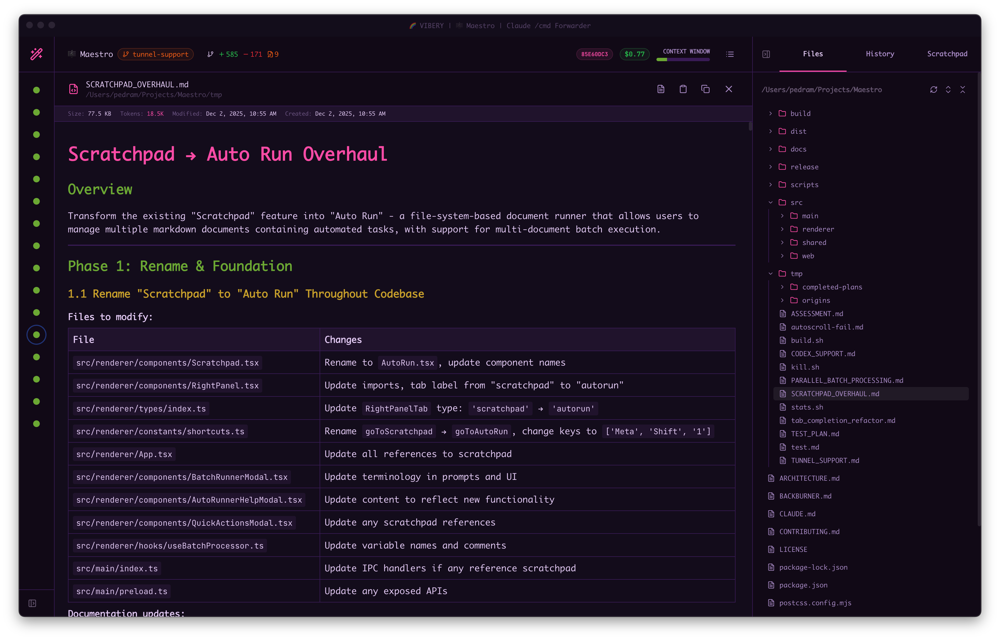
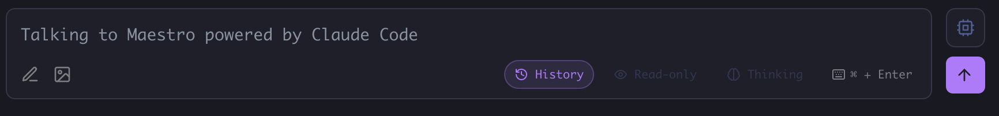
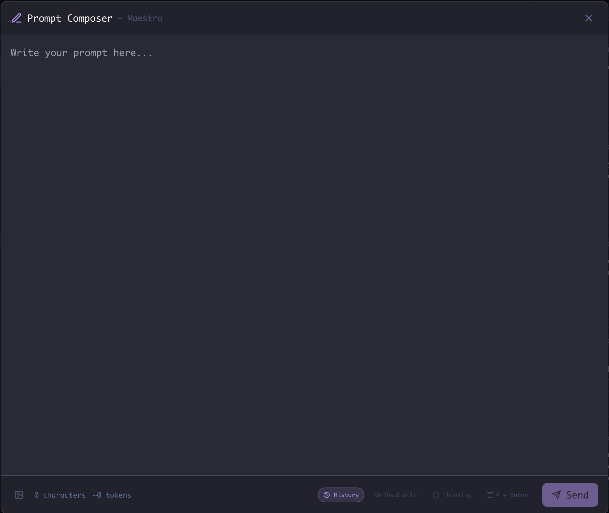
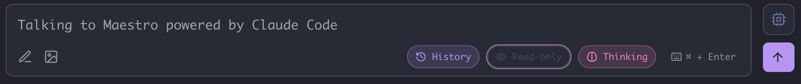
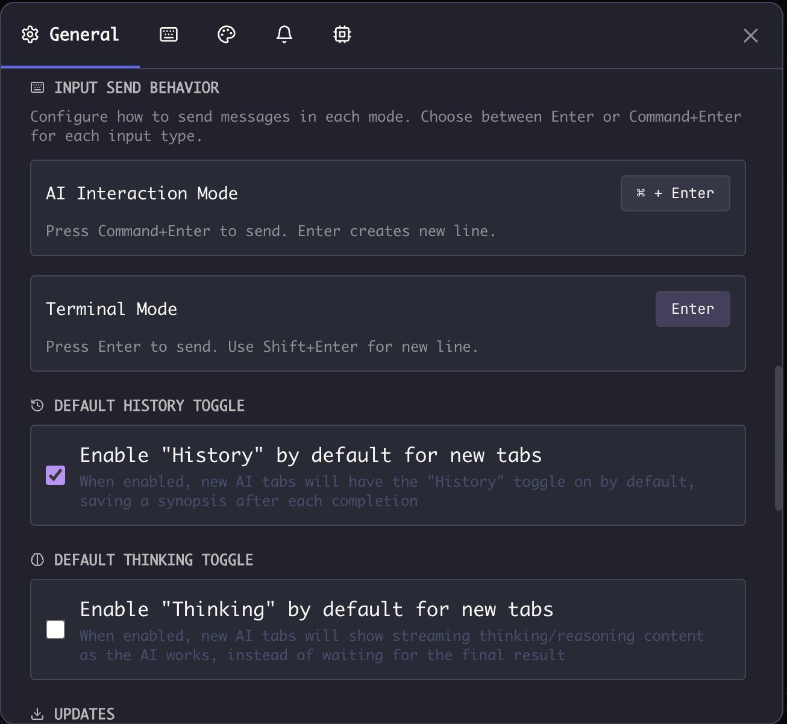
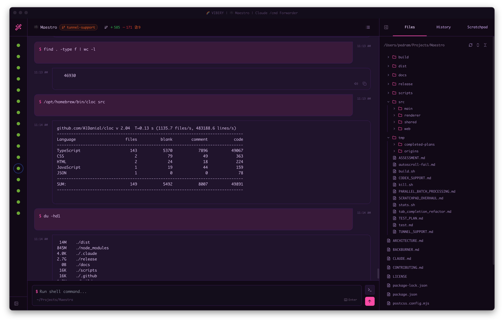
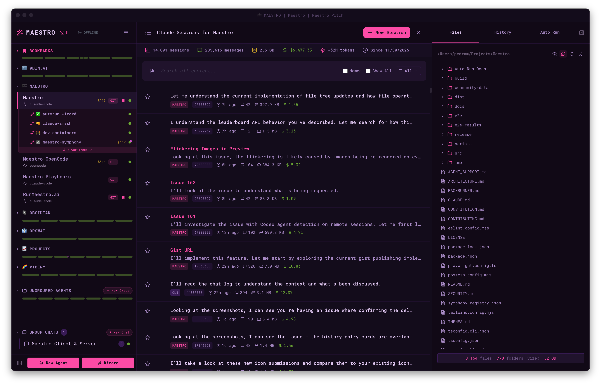

## UI Overview

Maestro features a three-panel layout:

- **Left Panel** - Agent list with grouping, filtering, search, bookmarks, and drag-and-drop organization
- **Main Panel** - Center workspace with two modes per agent:
  - **AI Terminal** - Converse with your AI provider (Claude Code, Codex, or OpenCode). Supports multiple tabs (each tab is a session), `@` file mentions, image attachments, slash commands, and draft auto-save.
  - **Command Terminal** - PTY shell with tab completion for files, branches, tags, and command history.
  - **Views**: Session Explorer, File Preview, Git Diffs, Git Logs
- **Right Panel** - Three tabs: File Explorer, History Viewer, and Auto Run



## Agent Status Indicators

Each agent shows a color-coded status indicator:

- 🟢 **Green** - Ready and waiting
- 🟡 **Yellow** - Agent is thinking or waiting for user input
- 🔴 **Red** - No connection with agent
- 🟠 **Pulsing Orange** - Attempting to establish connection
- 🔴 **Red Badge** - Unread messages (small red dot overlapping top-right of status indicator, iPhone-style)

## Git Actions

For agents whose working directory is a git repository, the same set of git actions is reachable three ways:

- **Header branch pill** - hover the pill showing the current branch name (clicking works too).
- **Left Bar right-click** - right-click the agent in the agent list.
- **Command palette** (`Cmd+K` / `Ctrl+K`) - search for the action by name, no mouse required.

| Action                  | What it does                                                                                                  |
| ----------------------- | ------------------------------------------------------------------------------------------------------------- |
| **View Git Log**        | Opens the commit history viewer.                                                                              |
| **View Git Diff**       | Opens the working-tree diff. Flashes "No diff to examine" when the tree is clean.                             |
| **Git Pull**            | Runs `git pull` and shows the live command output in a dismissible modal. Badged with how far behind you are. |
| **Git Push**            | Runs `git push` the same way. Badged with how many commits you're ahead.                                      |
| **Change Branch**       | Opens a fuzzy branch picker. Type to filter, Enter to check out.                                              |
| **Create Pull Request** | Opens the PR composer for the current branch (needs the GitHub CLI).                                          |

The header menu also shows the current **branch** and **origin** at the top. Each has a copy button, and clicking the origin opens the repository in your browser. Below the actions it offers **Configure Worktrees**.

The header pill and the command palette act on the agent you're looking at. The right-click menu acts on the agent you right-clicked, so you can pull or check the log of a background agent without switching to it first.

Pull and push stream their output as it happens, so you can watch the transfer and read git's error message if it fails. Dismissing the modal leaves the command running; **Cancel** stops it. When a push fails because the branch has no upstream, the modal offers a one-click **Push and Set Upstream** retry.

Working-tree changes are shown by the **git status widget** beside the pill (`+` additions, `−` deletions, `~` modified). Hover it for a list of changed files with diff bars, plus shortcuts to the full diff and the log.

## File Explorer and Preview

The **File Explorer** (Right Panel → Files tab) lets you browse project files. Click any file to open it in the **File Preview** view.



**File Preview features:**

- **Syntax highlighting** for code files
- **Markdown rendering** with toggle between raw/preview (`Cmd+E` / `Ctrl+E`)
- **Heading navigation** in markdown: a Table of Contents overlay (`Cmd+\` / `Ctrl+\`) and a searchable jump list (`#`) - see below
- **Clickable task checkboxes** in rendered markdown - tick a `- [ ]` in the preview and the file is rewritten on disk
- **Image viewing** for common image formats
- **Audio and video playback** with a speed control that sticks (see below)
- **CSV and TSV tables** with sortable columns and a per-row detail view (see below)
- **JSON and JSONL records** with jq filtering
- **Parquet tables** with a typed query language, on files far larger than memory
- **Line numbers** for easy reference
- **Search within file** (`Cmd+F` / `Ctrl+F`)

Several formats come with a filtering language built for that format rather than
a plain search box. **[File Formats](./file-formats)** is the full map: what
opens as what, and what you can type at each one.

### Jumping Between Sections in Markdown

A long markdown file is faster to move around by section than by scrolling.
There are two doors onto the same list of headings, and which one you want
depends on whether you are browsing or aiming:

- **Table of Contents** (`Cmd+\` / `Ctrl+\`, or the list button in the
  bottom-right of the preview) opens an outline of the document, indented by
  heading level. Click any heading to jump there; the overlay stays open so you
  can keep moving. `Top` and `Bottom` sit at either end for the whole document.
  The section you are currently reading is highlighted, and the highlight
  follows the document as you scroll, so an open outline always shows where you
  are standing. Use it to see the shape of a file you do not know yet.
- **Jump to Heading** (`#`) opens a search box over the same list. Type a few
  characters of a section name, move with `Up`/`Down` (`PgUp`/`PgDn` to skip
  further), and press `Enter` to land there. The matched characters are
  highlighted as you type, and matching is fuzzy - `oec` finds
  "**O**PSWAT **E**quity **C**ase". Use it when you already know the section you
  want and do not want to hunt for it.

Results stay in the order they appear in the document rather than being
re-ranked by how well they matched, so the list keeps reading as a map of the
file no matter what you type.

`#` is a bare keypress, so it works while you are reading and stays out of your
way while you are typing: it does nothing in the find bar, in the markdown
editor, or on a file with no headings. The same command is in the command
palette (`Cmd+K` / `Ctrl+K`) as **Jump to Heading**, which appears only while a
markdown file is open in preview.

### CSV and TSV Tables

`.csv` and `.tsv` files render as a real table instead of raw text. Click any
column header to sort by it (click again to reverse, a third time to clear), and
`Cmd+F` / `Ctrl+F` filters the table down to matching rows with the hits
highlighted.

Wide rows get cut off at the edge of the screen, which is the wrong shape for
reading one record closely. **Double-click a row** to flip it into a vertical
view: a modal listing every column as a field/value pair, one per line. Long and
multi-line values wrap and keep their line breaks instead of being truncated,
and each value has a copy button on hover.

Inside that view:

- **Left and Right arrows**, or the chevrons in the header, step through rows
  without closing the modal. Navigation follows whatever the table is currently
  showing, so it respects your active sort and search.
- **Up and Down arrows** scroll the field list, with `PageUp` / `PageDown` for
  whole screens and `Home` / `End` to jump to the top or bottom. Handy when a
  row has more fields than fit at once.
- `/` jumps to the **filter box**, which narrows to fields whose name or value
  matches what you type. `Enter` hands focus back to the field list so the
  arrows resume stepping through rows.
- Drag any edge or corner to resize. The size is remembered for next time.
- `Esc` closes the row view and leaves the file open.

The field list takes focus the moment the view opens, so every one of those
keys works without clicking first.

### Audio and Video Playback

Click an audio or video file and it opens in a player right inside the File
Preview. Supported formats are the ones Chromium can decode: `mp3`, `wav`,
`m4a`, `aac`, `flac`, `ogg`, `oga`, `opus`, `weba` for audio, and `mp4`, `m4v`,
`webm`, `mov`, `ogv` for video. Anything else (`mkv`, `avi`) still gets the
"Open in Default App" fallback.

Playback starts as soon as you open the file, and **keeps going when you switch
tabs or agents**. Start a podcast, go work somewhere else, and it follows you.

### The Floating Player

When you browse away from the tab, the player detaches into a small floating
widget that stays on top of whatever you are doing:

- **Drag the title bar** to move it anywhere, and **drag the bottom-right corner**
  to resize it. It remembers where you left it, across restarts. Double-click the
  corner to reset the size.
- **Minimize** it to a slim pill with just the title and a play/pause button.
- **Double-click the title bar** (or click the filename) to jump back to the
  file's tab, which re-docks the player into it.
- **Close** it to get it out of the way. This hides the controls only - the audio
  keeps playing. Bring it back by opening a media file again, or with
  **Show Floating Media Player** in the command palette (`Cmd+K` / `Ctrl+K`).

Audio-only files get just the controls, since there is no picture to show.

### One Player at a Time

Only one file plays at a time, so you never end up with two podcasts talking over
each other. You can still have several media files open: the **prev/next buttons**
in the transport step between them, and each one remembers its position, so you
can jump back and forth without losing your place.

Files stream from disk with range requests, so scrubbing a multi-gigabyte
screen recording is instant and does not load the file into memory.

**Playback speed persists.** Whatever rate you pick (anywhere from 0.25x to 4x)
carries over to the next file you open and survives a restart. Pitch is
preserved, so a 2x podcast still sounds like a person.

| Shortcut               | Action                         |
| ---------------------- | ------------------------------ |
| `Space` or `K`         | Play / pause                   |
| `Left` / `Right`       | Skip back / forward 10 seconds |
| `Shift+Left` / `Right` | Skip back / forward 5 seconds  |
| `Up` / `Down`          | Volume up / down               |
| `,` / `.`              | Step playback speed down / up  |
| `M`                    | Mute                           |
| `L`                    | Loop                           |
| `F`                    | Fullscreen (video only)        |

You can also set the speed outside the app with
`maestro-cli settings set mediaPlaybackRate 1.5`.

### Compressing a Folder

Right-click any folder in the Files tab and choose **Compress**. Maestro zips the
folder into a `.zip` that lands beside it in the parent directory, named after
the folder itself. Unzipping gives you back the folder, not its loose contents
sprayed into the current directory.

If `name.zip` already exists, the next free name is used - `name-1.zip`, then
`name-2.zip`, and so on. Compressing the same folder twice never overwrites the
archive you made the first time. A toast tells you the name of the file that was
actually written, and the file tree refreshes so you can see it right away.

This works on remote agents too. The remote host needs the `zip` command
installed; without it, Maestro says so rather than failing quietly.

### File Icon Themes

The Files pane draws each file and folder with one of two icon sets, chosen in
**Settings > Display > Files Pane Icon Theme**:

- **Rich** (the default) uses Material Icon Theme style SVGs: colorful,
  language-specific icons for 70+ file types plus folder categories such as
  tests, docs, assets, and config.
- **Flat** uses Maestro's simpler monochrome icons, which read as less busy on a
  large tree.

The choice applies to every agent's Files pane and takes effect right away.

### File Explorer Keyboard Shortcuts

With the Files tab focused, navigate the file list without touching the mouse:

| Shortcut                    | Action                                                                             |
| --------------------------- | ---------------------------------------------------------------------------------- |
| `Up` / `Down`               | Move the focused file up or down by one                                            |
| `Option+Up` / `Option+Down` | Jump ten files at a time (page up / page down)                                     |
| `Shift+Up` / `Shift+Down`   | **Peek scroll** - slide the file list up or down without changing the focused file |
| `Cmd+Up` / `Cmd+Down`       | Jump to the top or bottom of the list (`Ctrl+Up` / `Ctrl+Down` on Windows/Linux)   |
| `Left` / `Right`            | Collapse / expand the focused folder (`Left` on a file jumps to its parent folder) |
| `Enter`                     | Open the focused file (or toggle the folder if a folder is focused)                |

Use `Shift+Up` / `Shift+Down` when you want to glance further down the tree without losing your place - the focused file stays put while the viewport slides.

### Breadcrumb Navigation

When you open a file, a **breadcrumb trail** appears showing your navigation history. Click any breadcrumb to jump back to a previously viewed file. This makes it easy to compare files or return to where you were.

### File Editing

Files can be edited directly in the preview. Press `Cmd+S` / `Ctrl+S` to save changes. If you navigate away or close the preview with unsaved changes, a confirmation dialog will ask whether to discard them.

### Drag and Drop Files Into the Tree

Drag files or folders from your OS file manager (Finder on macOS, Explorer on Windows, your file manager on Linux) straight into the **Files tab** to copy them into the project:

- **Drop onto a folder row** to copy the items inside that folder. The folder highlights as you hover it.
- **Drop on empty space or a file row** to copy into the project root. The panel border highlights to show the root is the target.
- **Folders are copied recursively**, with all of their contents.
- If a name already exists at the destination, a prompt lets you **Overwrite**, **Auto-rename** (adds a numeric suffix), or **Skip** the conflicting items.

Where you drop decides what happens:

| Drop target                                      | Result                                                                                              |
| ------------------------------------------------ | --------------------------------------------------------------------------------------------------- |
| **Main panel** (the AI conversation)             | Attaches the file to your message - images become thumbnails, anything else becomes an `@reference` |
| **Files tab**                                    | Copies the file or folder into the tree, at the folder or root you dropped on                       |
| **Left bar**, or the **History / Auto Run** tabs | Nothing - those regions ignore dropped files                                                        |

<Note>
Importing into the tree copies from your local machine, so it is not available for agents running on an SSH remote. Attaching files to the chat still works on remotes.
</Note>

### Drag Files Out of Maestro

Hold **Option** (**Alt** on Windows and Linux) while dragging a row out of the **Files tab** to hand the real file to anything that accepts a file drop: your Desktop, Finder or Explorer, a Mail or iMessage message, a browser upload field.

- **Select several rows first** to drag the whole group out at once.
- **Folders drag out too**, with all of their contents.
- The original stays in the project. Dragging out copies, it never moves or removes anything.

A hint appears at the bottom of the panel as soon as you start dragging, to remind you which key to hold.

Hold the key **before** you begin the drag. A plain drag is reserved for Maestro's own targets, so the app has to decide which kind of drag it is the moment you start one, and pressing Option partway through has no effect. If that happens the hint tells you so: drop the file, then drag again with the key already held.

Where a plain drag lands still decides what happens inside the app:

| Drag                               | Result                                                        |
| ---------------------------------- | ------------------------------------------------------------- |
| **Plain drag** onto a folder row   | Moves the file to that folder inside the project              |
| **Plain drag** onto the main panel | Attaches the file to your message, or inserts an `@reference` |
| **Option-drag** anywhere outside   | Copies the real file out to the app or folder you drop on     |

<Note>
For agents running on an SSH remote, drag-out covers files but not folders, and the first Option-drag of a file downloads it before it can leave the app. Maestro flashes "drag again" when the file is ready, and the second drag carries it. This is deliberate, so a half-downloaded file is never handed to another app.
</Note>

### Publish as GitHub Gist

Share files directly as GitHub Gists from the File Preview:

**Prerequisites:**

- [GitHub CLI](https://cli.github.com/) (`gh`) must be installed
- You must be authenticated (`gh auth login`)

**To publish a file:**

1. Open a file in File Preview
2. Click the **Share icon** (↗) in the header toolbar, or
3. Use `Cmd+K` / `Ctrl+K` → "Publish Document as GitHub Gist"

**Visibility options:**

| Option                       | Description                                                                |
| ---------------------------- | -------------------------------------------------------------------------- |
| **Publish Secret** (default) | Creates an unlisted gist - not searchable, only accessible via direct link |
| **Publish Public**           | Creates a public gist - visible on your profile and searchable             |

The confirmation modal focuses "Publish Secret" by default, so you can press `Enter` to quickly publish. Press `Esc` to cancel.

**After publishing:**

- The gist URL is automatically copied to your clipboard
- A toast notification appears with a link to open the gist in your browser

<Note>
The share button only appears when viewing files (not in edit mode) and when GitHub CLI is available and authenticated.
</Note>

### @ File Mentions

Reference files in your AI prompts using `@` mentions:

1. Type `@` followed by a filename
2. Select from the autocomplete dropdown
3. The file path is inserted, giving the AI context about that file

## Command Mode (`!`)

Press `!` in an empty chat composer and it turns into a command line: what you type next runs as a shell command in the agent's working directory instead of being sent to the agent. It is a way to check something without leaving the chat.

The `!` is a gesture, not part of the command - it disappears the moment it switches modes, and you just type the command:

```
$ git status
```

You will know you are in command mode: a `$` appears at the left of the input, the text switches to the fixed-width font your terminals use, and a **COMMAND MODE** strip above it names the directory the command will run in. The font follows the command all the way through - what you type, what the AI proposes, and the output on the card are all set the way a terminal sets them, so paths and columns line up.

**Getting back to the agent:** press `Esc` on an empty command line (or `Backspace`, same thing). The composer keeps focus, so you can carry straight on typing your message. Command mode sticks around between commands, so you can run several in a row without retyping `!`, and you leave deliberately when you are done.

`!` is a rung, not a toggle. Press it again on an empty command line and you climb to [AI Command Mode](#ai-command-mode), where you describe what you want instead of typing the command yourself. `Esc` steps back down one rung at a time, so AI Command Mode returns you to command mode and command mode returns you to the agent.

**How it behaves:**

- **The agent is bypassed entirely.** It is never spawned, never written to, and never sees the command or its output. Nothing you run this way enters the agent's context - if you want the agent to see the result, copy it into a message.
- **It runs immediately, even while the agent is working.** Command mode does not queue and does not interrupt the turn in progress, so you can check `git log` while the agent is mid-edit.
- **It runs in the agent's working directory** (on the agent's SSH remote, if it has one). Each command is independent - there is no persistent shell, so `cd src` on its own does nothing. Chain instead: `cd src && ls`.
- **Every command gets its own card**, never merged into the surrounding conversation. The card shows the command, where it ran, and a live spinner while it works; when it finishes, the exit code and how long it took.
- **The transcript jumps to the card**, even if you had scrolled up to read history. You pressed Enter to see this output, so it is not left offscreen behind the unread badge. Scroll up while it is still running and it stops following, the same as anywhere else.
- **A finished card can be deleted.** Its header has a trash icon with the same inline **Delete?** confirmation your own messages use. Only the card goes; the agent never saw the command, so there is nothing on its side to remove. The icon is hidden while the command is still running - press **Stop** first, otherwise the output would keep streaming into a card that no longer exists.
- **Colour is preserved.** Output keeps the colours the command produced (`git status`, `eza`, `rg`), rendered properly rather than shown as raw escape codes. The copy button gives you clean, uncoloured text.
- **The draft survives a tab switch**, mode and all. Leave a half-typed command, go read another tab, come back, and it is still a command.

### Tab Completion in Command Mode

Command mode gets the same `Tab` completion the [Command Terminal](#command-terminal) has, so you are not typing paths from memory:

| Press `Tab` after... | You get                                                      |
| -------------------- | ------------------------------------------------------------ |
| nothing              | The commands you have run before in this agent               |
| `cat pack`           | Matching files - `cat package.json`                          |
| `ls sr`              | Matching directories, with a trailing slash - `ls src/`      |
| `cat src/comp`       | Files inside that directory, one level at a time             |
| `git checkout ma`    | Matching git branches - `git checkout main` (git repos only) |
| `git checkout v2`    | Matching git tags (git repos only)                           |

One match completes in place. Several open a picker: `↑` / `↓` to move, `Enter` to accept, `Esc` to dismiss. In a git repo, `Tab` inside the picker cycles the category filter (All, History, Branches, Tags, Files) and `Shift+Tab` cycles back.

Completion resolves from the **agent's working directory**, which is where the command will actually run. This is deliberately not the Command Terminal's directory - `cd`-ing in a terminal tab does not move where your commands run, so it must not move where completion looks either.

Chat affordances stand down in command mode, because a shell line means different things by the same characters:

- **`@` file mentions** - an `@` here is an `scp` target or an email in a commit message, not a file reference for the agent.
- **Slash commands** - a leading `/` here is an absolute path (`/usr/bin/env`), not `/history`.
- **Image attachments** - pasting or dropping an image is ignored, and the attach button is hidden. A shell command has nothing to do with an image, and the agent (which is the thing that reads them) never sees this input.

**Stopping a command:** a running command's card has a **Stop** button. Reach for it if you start something long or something that waits for input.

<Note>
Command mode has no keyboard - nothing is connected to the command's stdin. Programs that prompt for input (`sudo`, an editor opened by `git commit`, an interactive installer) will hang until you press **Stop**. Run those in a [Command Terminal](#command-terminal) tab instead.
</Note>

Very large output is capped so a runaway command cannot bloat your transcript; the card says so when it truncates.

**Sending a message that starts with `!`:** typing `!` first only enters command mode when the composer is empty, so a bang inside a sentence is safe. To start a message with one, prefix it with a backslash: `\!important` reaches the agent as `!important`.

Command mode is AI-chat only. In a terminal tab or the legacy terminal mode you are already at a shell, so `!` is an ordinary character.

### AI Command Mode

Press `!` a second time, on an empty command line, and the composer climbs one more rung. The strip above it now reads **AI Command**, the `$` and the fixed-width font go away (you are writing a sentence again, not a command line), and what you type is a plain-English description of what you want done:

```
delete every node_modules folder under this project
```

Press `Enter` and Maestro asks **this tab's own model**, at the model and effort the tab is set to, for a single command line. Nothing runs yet. The answer appears as a card above the composer showing the command it proposes, with **Run** and **Cancel**:

| Key       | Does                                                         |
| --------- | ------------------------------------------------------------ |
| `Y`       | Runs the command                                             |
| `N`       | Declines it                                                  |
| `←` / `→` | Moves between **Run** and **Cancel**                         |
| `Enter`   | Takes whichever is selected (**Run** is selected by default) |
| `Esc`     | Declines it                                                  |

Declining hands your original request back to the composer so you can reword it and ask again, which is nearly always what you want - a wrong answer usually means a vague question. The card owns the keyboard until you answer it, so `Enter` can never run something you have not looked at.

A command you accept runs through exactly the same path as one you typed yourself: same working directory, same SSH remote, same card in the transcript, and it joins your `↑` recall history the same way. The one thing it keeps is what you asked for, shown above the command on its card - so a transcript you read back weeks later says why those flags were there, not just what ran.

That request travels with the command. When you ask for a follow-up, the model sees both the earlier ask and the command it produced, so "actually just give me a count" is refined against what you originally wanted rather than reverse-engineered from the flags.

**How the suggestion is made:**

- **The model only names the command; it never runs anything.** The request is answered with tools disabled and in read-only mode, so a task-shaped request ("clean up the build output") comes back as a command to look at rather than as work already done.
- **It is the tab's own provider**, billed and configured like any other turn on that tab. The mode strip shows the model and effort it will use.
- **The agent's conversation is untouched.** The request and the suggestion never enter the agent's context, the same as any other command-mode activity.
- **The prompt is yours to change.** It is a core prompt (`ai-command`), editable under **Settings → Maestro Prompts → Commands**, like every other Maestro prompt. See [Prompt Customization](/prompt-customization).

There is no rung above AI Command Mode, so a `!` typed here is an ordinary character - your request is prose, and prose contains bangs.

## Prompt Composer

For complex prompts that need more editing space, use the **Prompt Composer** - a fullscreen editing modal.

**To open the Prompt Composer:**

- Press `Cmd+Shift+P` / `Ctrl+Shift+P`, or
- Click the **pencil icon** (✏️) in the bottom-left corner of the AI input box



The Prompt Composer provides:

- **Full-screen editing space** for complex, multi-paragraph prompts
- **Character and token count** displayed in the footer
- **All input controls** - History toggle, Read-only mode, Thinking toggle, and send shortcut indicator
- **Image attachment support** via the image icon in the footer



When you're done editing, click **Send** or press the displayed shortcut to send your message. The composer closes automatically and your prompt is sent to the AI.

## Message Queue

You never have to wait for an agent to finish before lining up your next thought. Any message (or slash command) you send while an agent is busy is added to that tab's **queue** instead of being dropped, and dispatched automatically, in order, the moment the agent becomes ready. A **QUEUED (n)** separator appears in the transcript listing everything waiting to go.

Each queued item has a row of controls (hover reveals them, and they stay visible while you work):

| Control           | Icon  | What it does                                                                                            |
| ----------------- | ----- | ------------------------------------------------------------------------------------------------------- |
| **Edit**          | ✏️    | Reopen the message to change its text or add, annotate, and remove image attachments before it's sent   |
| **Copy**          | ⧉     | Copy the message text (or the command) to the clipboard                                                 |
| **Hold / Resume** | ⏸ / ▶ | Hold a message so the queue skips over it, then resume it later. Held items show a **HELD** badge       |
| **Reorder**       | ⠿     | Drag any item by its handle to change the order they'll be sent (available once two or more are queued) |
| **Remove**        | ✕     | Delete a message from the queue so it's never sent (asks for confirmation)                              |

**Editing** is only offered for messages, not slash commands. Only genuinely long messages are truncated behind a **Show all** toggle (short ones render in full, since collapsing them would save nothing), and attached images collapse behind a click-to-expand thumbnail strip (click a thumbnail to open it full-size in the carousel).

### Force Send

A queued item carries a **Force Send** button that dispatches that message immediately instead of waiting its turn in the cross-tab queue. On a quiet agent it just sends. When another tab in the same agent is already working, it runs the message in parallel and a confirmation lists which other tabs are busy first - which needs [Forced Parallel Execution](./features) enabled, so with that setting off the button is visible but dimmed and says so. The button is hidden when there is nothing to force: the item's own tab is mid-turn, so the item is next in line regardless, or the tab it was queued for is gone. This is the same rule the **Send Now** button in the Execution Queue view follows.

`Cmd+Shift+Enter` / `Ctrl+Shift+Enter` does the same thing from the keyboard, and it works wherever you are in the app - you do not have to click into the input box first. With text in the input, it sends what you typed in parallel; with the input empty, it force-sends the newest eligible queued item.

### Execution Queue view

Press `Cmd+Shift+X` / `Ctrl+Shift+X` (or click the queue indicator) to open the **Execution Queue** - a single view of everything queued across all of your agents. It offers the same per-item controls (edit, copy, hold/resume, reorder, remove) plus a jump-to-agent shortcut, so you can manage a busy fleet from one place. Items are processed sequentially per agent to keep concurrent file edits from colliding.

The view is fully keyboard-driven. `Up` / `Down` move a highlight through the queued messages, walking across agent boundaries in the All Agents view, and `Enter` opens an action menu for the highlighted message with everything that card offers - Send Now, Edit, Delete, Hold/Resume, Copy. `Up` / `Down` pick an action in that menu, `Enter` runs it, and `Esc` closes it. Clicking a card also moves the highlight to it. The menu only lists actions the message actually supports, so a queued slash command has no Edit entry.

Every card here also carries a **Send Now** button, which runs that one item immediately instead of waiting for its turn. Use it to jump an item ahead of the rest of the queue or to release a held message on the spot. The button dims with an explanation when the item cannot run yet because another tab in that agent is working and Forced Parallel Execution is off - a state you can fix from Settings. It is hidden entirely when there is nothing to force: the item's own tab is already mid-turn, so the item is next in line anyway, or the tab it was queued for is gone. When another tab is working, Send Now confirms first and lists which tabs are busy.

## Input Toggles

The AI input box includes three toggle buttons that control session behavior:



| Toggle        | Shortcut                       | Description                                                          |
| ------------- | ------------------------------ | -------------------------------------------------------------------- |
| **History**   | `Cmd+S` / `Ctrl+S`             | Save a synopsis of each completion to the [History panel](./history) |
| **Read-only** | `Cmd+R` / `Ctrl+R`             | Enable plan/read-only mode - AI can read but not modify files        |
| **Thinking**  | `Cmd+Shift+K` / `Ctrl+Shift+K` | Show streaming thinking/reasoning as the AI works                    |

**Per-tab persistence:** Each toggle state is saved per tab. If you enable Thinking on one tab, it stays enabled for that tab even when you switch away and back.

### Configuring Defaults

Set the default state for new tabs in **Settings** (`Cmd+,` / `Ctrl+,`) → **General**:



| Setting                          | Description                                         |
| -------------------------------- | --------------------------------------------------- |
| **Enable "History" by default**  | New tabs save synopses to History automatically     |
| **Enable "Thinking" by default** | New tabs show thinking/reasoning content by default |

### Send Key Configuration

Configure how messages are sent in each mode:

| Mode                    | Options                | Description                                         |
| ----------------------- | ---------------------- | --------------------------------------------------- |
| **AI Interaction Mode** | `Enter` or `Cmd+Enter` | Choose your preferred send key for AI conversations |
| **Terminal Mode**       | `Enter` or `Cmd+Enter` | Choose your preferred send key for shell commands   |

- When set to `Cmd+Enter` / `Ctrl+Enter`, pressing `Enter` alone creates a new line (for multi-line input)
- When set to `Enter`, use `Shift+Enter` for new lines
- The current send key is displayed in the input box (e.g., "⌘ + Enter")
- **Per-tab override:** Click the send key indicator in the input box to toggle between modes for that tab

## Image Carousel

When working with image attachments, use the **Image Carousel** to view, manage, and remove images.

**To open the Image Carousel:**

- Press `Cmd+Y` / `Ctrl+Y`, or
- Click the image icon in the input box when images are attached

**Carousel controls:**

- **Arrow keys** - Navigate between images
- **Delete** or **Backspace** - Remove the currently selected image
- **Click the X** - Remove an image by clicking its remove button
- **Esc** - Close the carousel

Images can be attached via drag-and-drop, paste, or the attachment button. The carousel shows all images queued for the current message.

## Staged Images

Attached images wait in a thumbnail strip directly above the input box until you send. Their **order in that strip is the order the agent receives them**, so the first thumbnail is Screenshot 1, the second is Screenshot 2, and so on. That is what lets you write "compare Screenshot 1 and Screenshot 3" and have the agent look at the right pictures. With more than one image staged, each thumbnail carries its number so you can read it off the strip instead of counting. A single image needs no label and does not get one.

### Reordering

Drag a thumbnail sideways to move it. The slot numbers follow the drag, so with six or seven screenshots staged you can aim at a number instead of counting positions. A lone thumbnail picks up a number for the length of the drag too.

### The Staged Images organizer

With two or more images staged, an expand button (⤢) appears to the left of the strip, or press `Cmd+Shift+Y` / `Ctrl+Shift+Y`. Either opens the **Staged Images** organizer: the same set of images at a size you can actually tell apart, always numbered, with the same drag-to-reorder.

- **Zoom** with the magnifier buttons in the header, or with the bare `+` and `-` keys (`=` and `_` work too, so you never have to think about Shift). `0` snaps back to 100%, as does clicking the percentage. The size you pick is remembered across sessions.
- **Annotate** or **remove** any image from its thumbnail, exactly as in the strip.
- **Esc** or the ESC pill closes it.

With a single image staged the button is hidden, since there is nothing to compare and nothing to reorder.

### Referring to an image by number

Drag a thumbnail from the strip into the conversation and Maestro types its reference into your message for you, as `Screenshot 1`, `Screenshot 2`, and so on. Drop it anywhere in the chat area, not just on the input box itself.

**References follow the pictures.** If you write `Screenshot 1` and then reorder the strip so that image becomes the third one, Maestro rewrites the reference in your draft to `Screenshot 3`. Swapping two images swaps both references rather than collapsing them onto one number, and numbers you typed for images that did not move are left alone.

<Note>
Reordering rewrites references in the message you are currently composing. Messages you have already sent are unchanged, since the agent has already seen those images in the order they were sent.
</Note>

## Output Filtering

Filter and search through AI output to find specific content or hide noise.

### Global Filter

The global filter applies to all AI output in the current session.

**To open the global filter:**

- Click the filter icon in the output toolbar
- The filter bar appears at the top of the output area

### Per-Response Filters

Each AI response has its own local filter. Hover over a response to reveal the filter icon, then click to open the filter bar for that specific response.

### Filter Modes

| Mode        | Icon       | Description                        |
| ----------- | ---------- | ---------------------------------- |
| **Include** | ➕ (green) | Show only lines matching the query |
| **Exclude** | ➖ (red)   | Hide lines matching the query      |

Click the mode icon to toggle between Include and Exclude.

### Text vs Regex Matching

| Mode           | Indicator | Description                         |
| -------------- | --------- | ----------------------------------- |
| **Plain text** | `Aa`      | Case-insensitive substring matching |
| **Regex**      | `.*`      | Regular expression pattern matching |

Click the indicator to toggle between plain text and regex mode.

### Filter Controls

- **Query input** - Type your search term or regex pattern
- **Esc** - Clear the filter and close the filter bar
- **Click outside** - If the query is empty, the filter bar closes

### Placeholders

The placeholder text updates to reflect the current mode:

- "Include by keyword" / "Exclude by keyword" for plain text
- "Include by RegEx" / "Exclude by RegEx" for regex mode

### Use Cases

**Finding specific content:**

- Set to **Include** mode with plain text
- Type a keyword like "error" or "function"
- Only matching lines are shown

**Hiding verbose output:**

- Set to **Exclude** mode with plain text
- Type patterns like "debug" or "verbose"
- Matching lines are hidden from view

**Complex pattern matching:**

- Enable **Regex** mode
- Use patterns like `\berror\b` for word boundaries
- Or `^\s*#` to match comment lines

## Searching Message History

Two searches share the magnifying-glass menu in the tab bar, and both accept
plain text or a regular expression (toggle the `Aa` / `.*` chip).

### In the current tab

`Cmd+F` / `Ctrl+F` opens the Find bar over the conversation you're looking at.
Every match is highlighted inline; `Enter` and `Shift+Enter` step forward and
backward through them.

### Across every open tab

`Opt+Cmd+F` / `Alt+Ctrl+F` opens a modal that searches the message history of
**all** open tabs in the current agent at once. It's also in the command palette
as "Search: Messages (All Agent Tabs)".

Results are grouped by tab, each row showing who said it, when, a preview of the
hit with the match highlighted, and a pill when that message contains several
matches. The tab you're currently on is labeled "current".

Pick a result with `Enter` or a click and Maestro:

1. Switches to that tab
2. Scrolls to the message and flashes it so you can see where you landed
3. Seeds that tab's Find bar with the same query, positioned on the match you
   picked, so `Enter` / `Shift+Enter` continues from there

Navigate the list with the arrow keys, `PageUp` / `PageDown`, and `Home` / `End`.

Very broad queries are capped so a single character can't stall the UI: 100 matches
per tab and 500 overall. When a search hits either limit the modal says so, and
narrowing the query brings the rest into view.

<Note>
	This search covers the AI tabs of the agent you're currently on, not your whole
	fleet. Group chats have no AI tabs to search, so the menu entry is hidden there.
</Note>

## Command Interpreter

The command interpreter can be focused for a clean, terminal-only experience when you collapse the left panel.



## Command Terminal

Each agent has a Command Terminal alongside its AI Terminal - a real PTY shell scoped to the agent's working directory. Switch between them with `Cmd+J` / `Ctrl+J`. Open a new terminal tab with `Ctrl+Shift+` + `` ` ``; close, rename, and reorder it just like an AI tab. Right-click (or hover) a terminal tab to open its action menu.

### Startup Command

Configure a command to run automatically every time a terminal tab's shell is started - including after you quit and reopen Maestro. This is the simplest way to keep something like `npm run dev`, a watcher, or a long-running log tail attached to a specific tab.

**To configure:**

1. Hover the terminal tab and open its action menu.
2. Click **Startup Command…** (right under **Rename**).
3. Enter the command and, optionally, a working directory. The working directory defaults to the agent's working directory if left blank.
4. Click **Save**.

**Behavior:**

- The command runs each time the PTY for that tab is spawned. The most common trigger is launching Maestro after a quit - any open terminal tab is restored, its shell respawned, and the configured command executes.
- Configuring a command on an already-running shell does **not** retroactively run it. The next spawn (app restart, or close-and-reopen the tab) picks it up.
- The configured working directory becomes the shell's spawn directory, so the command starts in the right place even if the tab's last `cd` was somewhere else.
- Leave the command field empty and save to disable the feature for that tab.
- Each terminal tab has its own startup command - one tab can run a dev server while another runs a log tail.

> **SSH agents**: when the agent is configured to run on a remote host, the terminal tab also runs on that host, and the startup command executes remotely (the working directory must be a path on the remote machine).

## Agent Management

Agents are the core of Maestro - each agent represents an AI coding assistant running in its own workspace.

### Creating Agents

**To create a new agent:**

1. Press `Cmd+N` / `Ctrl+N`, or click the **New Agent** button in the bottom-left sidebar
2. Choose **Manual Setup** or **Guided Setup** (Wizard) - see [Getting Started](./getting-started) for details on each path
3. For Manual Setup: select an available AI provider (Claude Code, Codex, OpenCode, or Factory Droid), choose a working directory, and optionally name the agent

**Advanced configuration options:**

- **New Session Message** - A hidden message prefixed to the first message whenever a new session (tab) is created. Use this for initial context, setup instructions, or persona definitions that should apply at the start of every conversation. Not visible in chat.
- **Nudge Message** - A hidden message appended to every interactive user message sent to the agent. This is useful for persistent instructions or reminders that guide the agent's behavior across all conversations. **Note:** Nudge messages only apply to interactive AI messages - they are not included in Auto Run tasks.
- **Custom Path** - Override the default executable path
- **Custom Arguments** - Additional command-line arguments
- **Environment Variables** - Custom environment variables for the agent process
- **Model Selection** - Choose a specific model and (where supported) reasoning/effort level. This sets the default for new tabs in this agent. You can override the model or effort on any individual tab using the model/effort pill in the input bar - per-tab overrides only affect that tab and don't change the agent default or any other tab.

  Each response in the transcript is stamped underneath with the model and effort it was actually sent with (alongside the Claude [token source](/provider-notes#token-source-max-plan-vs-api) pill, where that applies). The stamp is taken when you press Enter, so changing the model while a turn is streaming labels your next message, never the one already running. A pill is omitted when no override was set and the agent's own default applied.

### Editing Agents

Right-click any agent in the left panel and select **Edit Agent...** to modify its configuration. You can change the name, new session message, nudge message, custom paths, arguments, environment variables, model, and effort. Model and effort set here apply as the default to new tabs; existing tabs that haven't been overridden also follow this default. To override on a single tab without changing the agent-wide default, use the model/effort pill in that tab's input bar.

### Deleting Agents

Right-click an agent and select **Remove Agent** to delete it. This removes the agent from Maestro but does not delete any files or AI session data.

### Agent Configuration via Quick Actions

Use `Cmd+K` / `Ctrl+K` → "Edit Agent" to quickly access agent configuration for the current session.

## Left Panel Operations

The left panel (sidebar) contains your agent list, groups, and navigation controls.

### Filtering and Search

Press `Cmd+F` / `Ctrl+F` while the sidebar is focused to open the session filter. The filter:

- Searches agent names and AI tab names
- Automatically expands groups containing matches
- Shows matching bookmarked agents
- Searches worktree branch names

### Bookmarks

Pin important agents to the top of the list:

- Right-click an agent → **Add Bookmark**
- Or use the context menu to toggle bookmark status

Bookmarked agents appear in a collapsible "Bookmarks" section at the top of the left panel.

### Groups

Organize agents into groups for better project management:

**Creating groups:**

- `Cmd+K` / `Ctrl+K` → "Create Group"
- Groups have a name and emoji for visual identification

**Moving agents to groups:**

- Right-click an agent → **Move to Group** → Select target group
- Or drag-and-drop agents between groups

**Collapsing/Expanding:**

- Click the group header to collapse or expand
- Groups remember their collapsed state

### Drag and Drop

Rearrange agents by dragging them:

- Drag agents between groups
- Drag to reorder within a group
- Drag to the "Ungrouped" section to remove from a group

### Context Menu

Right-click any agent for quick actions. The menu is headed by the name of the agent you right-clicked, so you can tell at a glance which agent an action will hit - the menu often pops away from the row it was opened on.

- **Rename** - Change the agent's display name
- **Edit Agent...** - Open configuration modal
- **Add/Remove Bookmark** - Toggle bookmark status
- **Move to Group** - Organize into groups
- **Move to Window** - Send the agent to another Maestro window
- **View Git Log / View Git Diff / Git Pull / Git Push / Change Branch / Create Pull Request** - the full [git menu](#git-actions), for git repositories only
- **Create Worktree** - Create a git worktree sub-agent (if configured)
- **Configure Worktrees** - Set up worktree configuration
- **Configure Maestro Cue** - Set up event-driven automation for this agent
- **Copy Agent GUID to Clipboard** - Copy the agent's unique identifier
- **Remove Agent** - Delete the agent from Maestro

The git actions here act on the agent you right-clicked, so you can pull or inspect the log of a background agent without switching to it first.

### Sidebar Width

Drag the right edge of the sidebar to resize it. The width is persisted across sessions.

### Collapsed Mode

Click the sidebar toggle (`Opt+Cmd+Left` / `Alt+Ctrl+Left`) to collapse the sidebar to icon-only mode. In collapsed mode:

- Agents show as icons with status indicators
- Hover for agent name tooltip
- Click to select an agent

## Tab Management

Each agent session can have multiple tabs, allowing you to work on different tasks within the same project workspace.

### Automatic Tab Naming

When you send your first message to a new tab, Maestro automatically generates a descriptive name based on your request. This helps you identify tabs at a glance without manual renaming.

**How it works:**

1. When you start a new conversation in a tab, your first message is analyzed
2. An AI generates a concise, relevant name (2-5 words)
3. The tab name updates automatically once the name is generated
4. If you've already renamed the tab, automatic naming is skipped

**Examples of generated tab names:**

| Your message                                     | Generated name          |
| ------------------------------------------------ | ----------------------- |
| "Help me implement user authentication with JWT" | JWT Auth Implementation |
| "Fix the bug in the checkout flow"               | Checkout Bug Fix        |
| "Add dark mode support to the app"               | Dark Mode Support       |
| "Refactor the database queries"                  | Database Query Refactor |

**Configuring automatic tab naming:**

- Go to **Settings** (`Cmd+,` / `Ctrl+,`) → **General**
- Toggle **Automatic Tab Naming** on or off
- Default: Enabled

**Wizard tabs:** a tab started with `/wizard` opens as `Wizard`, because it exists before anyone knows what you are planning. It renames itself to `wizard: <topic>` as soon as you say what you want (from the `/wizard <topic>` argument, or from your first message), and to the generated playbook folder once the wizard finishes. Rename it yourself at any point and Maestro leaves your name alone.

<Note>
Automatic tab naming uses the same AI agent as your session, including SSH remote configurations. The naming request runs in parallel with your main prompt, so there's no delay to your workflow.
</Note>

### Manual Tab Renaming

You can always rename tabs manually:

- Right-click a tab → **Rename Tab**
- Or double-click the tab name to edit it directly
- Manual names take precedence over automatic naming

### Snoozing Tabs

Snooze hides an AI tab until a moment you choose, then brings it back with a notification you have to dismiss. It's the email-snooze idea applied to conversations: park work you can't act on yet without closing it or letting it clutter the tab bar.

Hover a tab and choose **Snooze Tab**, press `Opt+Cmd+S` / `Alt+Ctrl+S`, or run **Snooze Tab** from Quick Actions (`Cmd+K` / `Ctrl+K`). Snoozing is available on AI tabs only.

**Choosing when it comes back**

The snooze dialog gives you three ways to pick a time, and always previews the exact moment it resolved to before you commit:

- **Presets** - Later today, This evening, Tomorrow, This weekend, Next week, Next month. Presets that have already passed for the day drop off the list.
- **Free-form text** - type it the way you'd say it:

| What you type                         | When it comes back                            |
| ------------------------------------- | --------------------------------------------- |
| `1d`, `10h`, `45m`                    | That far from now                             |
| `2 weeks`, `3 days`, `1d 4h`          | Compound durations work too                   |
| `tomorrow`, `next week`, `next month` | 9:00 AM on that day                           |
| `tonight`                             | 6:00 PM today                                 |
| `friday`                              | The upcoming Friday                           |
| `next friday`                         | Friday of the following week                  |
| `3pm`, `15:45`                        | Today if it's still ahead, otherwise tomorrow |
| `friday 3pm`, `tomorrow at 9am`       | A day plus a time                             |
| `aug 5`, `2026-08-05`, `12/25 6pm`    | A specific date                               |

- **Calendar** - pick a date from the month grid and set a time of day.

**Note to self**

Every snooze takes an optional note, and that note becomes the body of the notification when the tab returns. This is what turns snooze into a reminder system: leave yourself the reason you're coming back ("check if the migration finished", "review this before standup") instead of rediscovering it later.

**What happens while a tab is snoozed**

The tab disappears from the tab bar and from tab navigation. The conversation is preserved exactly as you left it, and the tab returns to its original position when it wakes. If you snooze an agent's only tab, a fresh empty tab takes its place so you're never left staring at an empty workspace.

When the time arrives, the tab reappears and Maestro raises a notification that stays until you dismiss it, so a reminder can't scroll past unseen. Click it to jump straight to the tab.

The returning tab also gets a **Back from snooze** card at the end of its conversation, showing how long it was away, when it was due, and the note you left yourself. The notification is momentary, but this card stays in the transcript, so weeks later the tab still explains why it came back.

<Note>
Wakes are delivered by the running app. If Maestro is closed when a snooze comes due, the tab returns the next time you launch - overdue reminders are never silently dropped.
</Note>

**Long snoozes are safe.** Your AI provider owns the conversation transcript and eventually ages old ones out, which would leave a tab snoozed for months coming back empty. Maestro keeps its own copy for the length of every snooze, exactly as it does for [starred sessions](#session-management), and restores it when the tab wakes. That copy is held until the snooze ends, so unstarring a snoozed session does not discard it either.

**Managing snoozed tabs**

Open the list from the search icon in the tab bar → **See All Snoozed Tabs**, or run **See All Snoozed Tabs** from Quick Actions. It shows every snoozed tab across all agents, soonest first, with its note and a countdown. Each row offers:

- **Unsnooze** - bring the tab back right now
- **Reschedule** - pick a new time or edit the note
- **Dismiss** - drop the snooze and the tab, for when you no longer care

**Snooze history**

Click **View History** in the Snoozed Tabs header to see snoozes that have already finished. It is one chronological list across every agent, newest first, and each entry keeps the note you left yourself along with when it was due and when it actually came back. Entries are marked by how they ended: came back on schedule, brought back early, or dismissed.

Click any entry to jump back to it. If the tab is still open you land directly on it; if only the agent is still around you land there instead. Entries whose agent has since been deleted are shown but not clickable.

The log keeps the most recent 100 entries; older ones drop off as new ones arrive.

<Note>
Dismissing only discards Maestro's tab. The underlying conversation is still on disk and can be reopened from the Session Explorer.
</Note>

## Session Management

Browse, star, rename, and resume past sessions. The Session Explorer (`Cmd+Shift+L` / `Ctrl+Shift+L`) shows all conversations for an agent with search, filtering, and quick actions.


