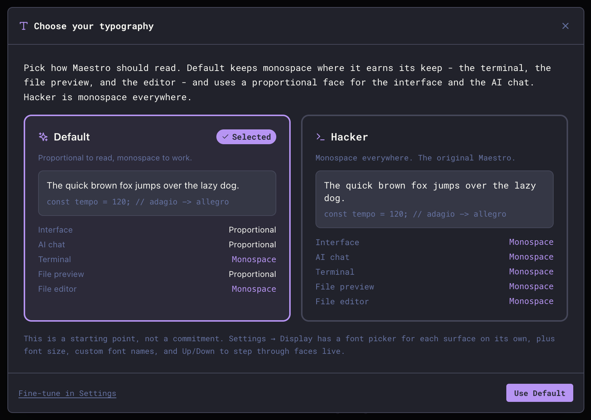
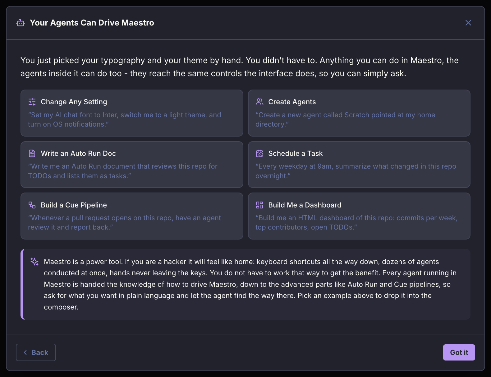
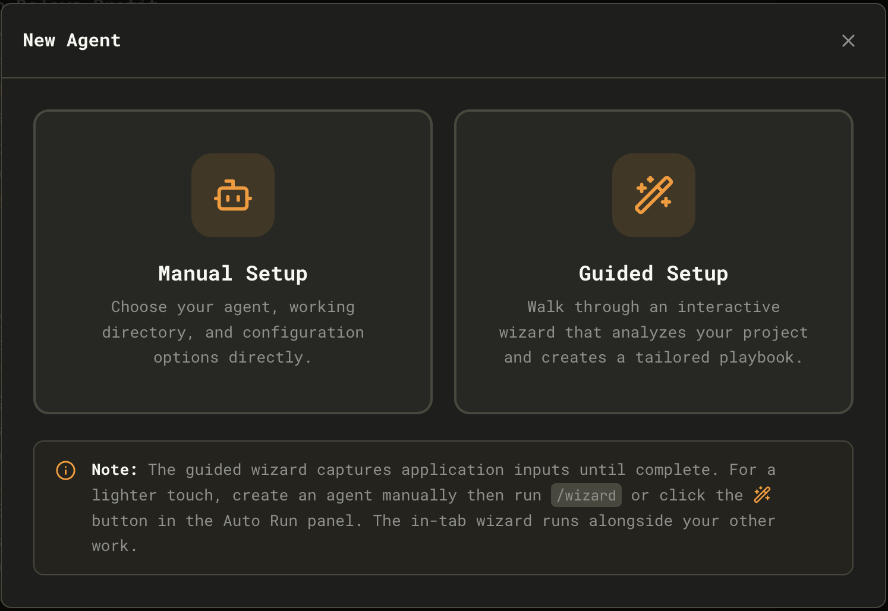
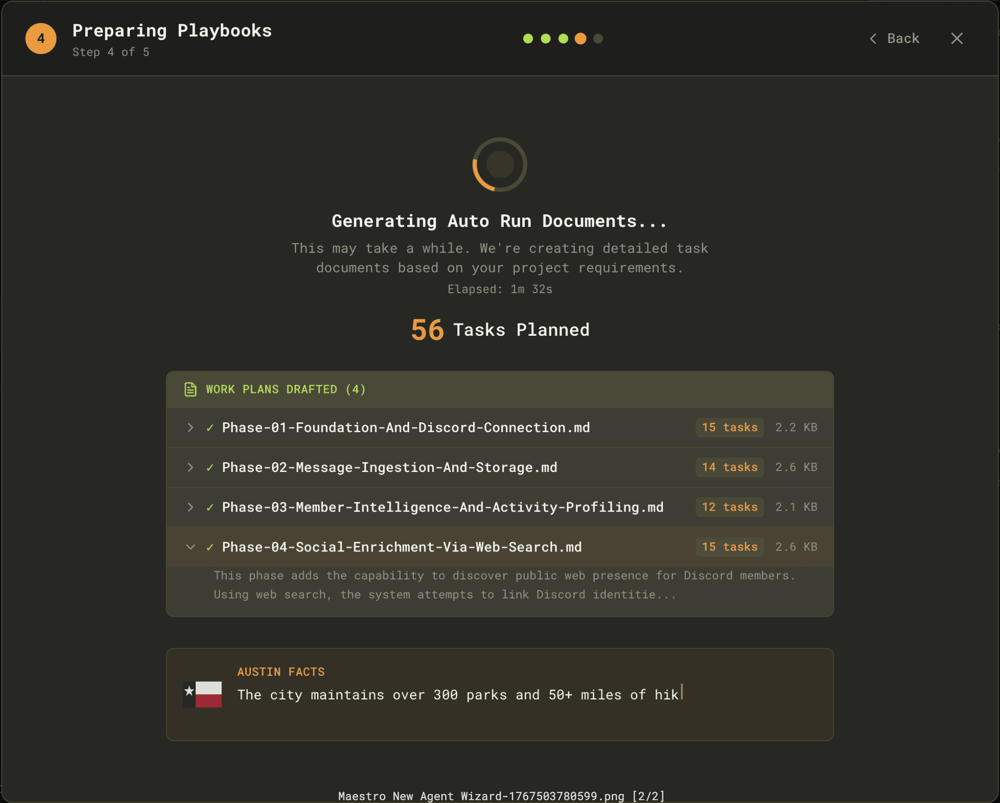

This guide gets you from install to a first productive session with Maestro.

## 1. Install and launch

Follow the [Installation](./installation) instructions for your platform, then launch Maestro.

### First run

The first time Maestro opens, it asks four short questions before getting out of the way. Every answer is an ordinary setting you can change later, and **Back** steps you through the series in either direction.

**Choose your typography.** Two presets, previewed side by side on real sample text:

- **Default** - proportional to read, monospace to work. The interface, AI chat, and file preview use a proportional face; the terminal and file editor stay monospace.
- **Hacker** - monospace everywhere.

Pick either, or **Fine-tune in Settings** to set a font per surface right away. See [Typography](./configuration#typography).

**Pick a theme.** Click any theme to try it on - the whole app changes as you browse, and nothing is saved until you keep it. Dark and light sets are offered separately. See [Themes](./configuration).

**Stay on the Bleeding Edge.** Three switches and one button, each showing your current setting:

- **Check for updates automatically** - on by default.
- **Include beta and release candidate updates** - off by default. If you want new features as soon as they ship, turn this on.
- **Send anonymous crash reports** - on by default. Leave it on: crash reports let problems get fixed as soon as they are discovered.
- **Install the Maestro CLI** - one click. Humans can use [`maestro-cli`](./cli), but it is built for your agents, so they can automate everything Maestro can do.

Existing users see this screen once, after the update that adds it, with whatever they had already set. All of it also lives in **Settings > General**.

**Your Agents Can Drive Maestro.** The closing screen makes a point worth reading, because it is the part people miss: you just set your typography and theme by hand, and you did not have to. Agents running inside Maestro reach the same controls the interface does, so you can ask for what you want in plain language instead of finding the screen.

Examples it offers, all of which work:

- "Set my AI chat font to Inter, switch me to a light theme, and turn on OS notifications."
- "Create a new agent called Scratch pointed at my home directory."
- "Every weekday at 9am, summarize what changed in this repo overnight."
- "Whenever a pull request opens on this repo, have an agent review it and report back."

Maestro is a keyboard-first power tool, and it rewards learning the shortcuts. It does not require it.

## 2. Create an agent

Maestro supports **Claude Code**, **Codex** (OpenAI), **OpenCode**, and **Factory Droid** as providers. Make sure at least one is installed and authenticated.

<Note>
Maestro is a pass-through to your provider. Your MCP tools, custom skills, permissions, and authentication all work in Maestro exactly as they do when running the provider directly. The only difference is batch mode execution - Maestro sends a prompt and receives a response rather than running an interactive session.
</Note>

Click the **New Agent** button in the bottom-left sidebar (or press `Cmd+N` / `Ctrl+N`). You'll see the **New Agent** selector:

**Manual Setup** - Choose your agent, working directory, and configuration options directly. Best for power users who want full control.

**Guided Setup** (Recommended for new users) - Launches the **Onboarding Wizard**, which walks you through:

1. Selecting an AI provider. Naming the agent is optional: leave it blank and the wizard uses your project's folder name, which you can change later
2. Choosing your project directory
3. Having a discovery conversation where the AI learns about your project. If the folder already holds a project, the agent opens the conversation by reading it and telling you what it found, so you never have to describe code it can read for itself. Only an empty folder asks you to describe what you want to build
4. Generating an initial Auto Run Playbook with tasks

The conversation and the generated Playbook both name the model they are running on, and you can switch to your provider's top-tier model for the planning without changing what the agent uses afterwards.

Don't want a Playbook? On the directory step, choose **Skip that, just create the agent** and the wizard creates the agent and gets out of the way.

The Wizard creates a fully configured agent with an Auto Run document folder ready to go. Generated documents are saved to an `Initiation/` subfolder within `.maestro/playbooks/` to keep them organized separately from documents you create later.

<Note>
The guided wizard captures application input until it completes. For a lighter touch, create an agent manually, then run the `/wizard` slash command or click the wand button in the Auto Run panel. The in-tab wizard runs alongside your other work.
</Note>

### Introductory Tour

After completing the Wizard, you'll be offered an **Introductory Tour** that highlights key UI elements:

- The AI Terminal and how to interact with it
- The Auto Run panel and how document processing works
- File Explorer and preview features
- Keyboard shortcuts for power users

You can skip the tour and access it later via **Quick Actions** (`Cmd+K` / `Ctrl+K`) → "Start Tour".

## 3. Open a project

Point your new agent at a project directory. Maestro will detect git repos automatically and enable git-aware features like diffs, logs, and worktrees.

## 4. Start a conversation

Use the **AI Terminal** to talk with your AI provider, and the **Command Terminal** for shell commands. Toggle between them with `Cmd+J` / `Ctrl+J`. Each tab in the AI Terminal is a separate session.

## 5. Try Auto Run

Create a markdown checklist, then run it through Auto Run to see the spec-driven workflow in action. See [Auto Run + Playbooks](./autorun-playbooks) for a full walkthrough.
