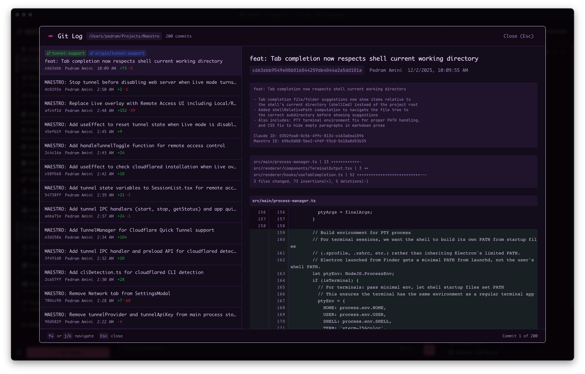
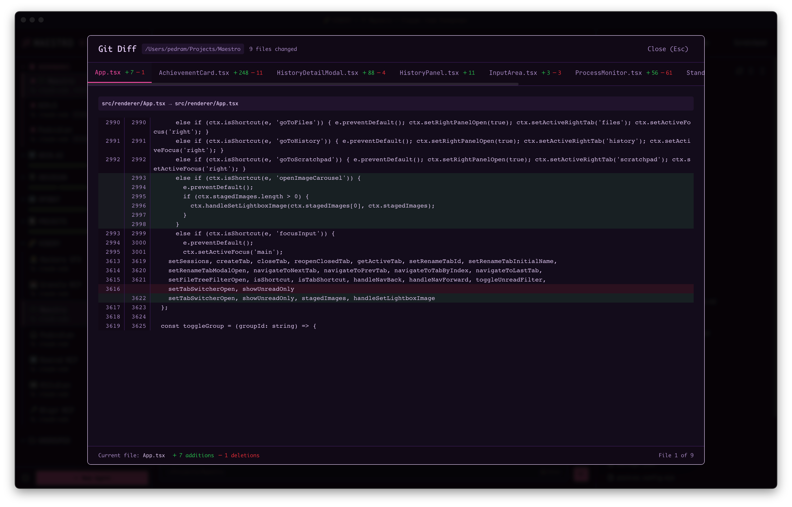
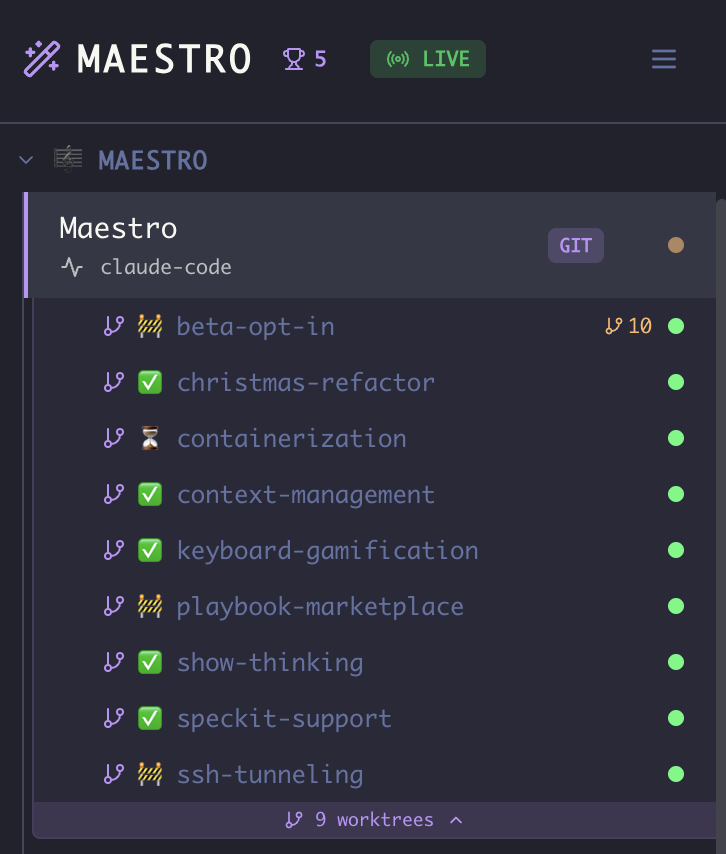
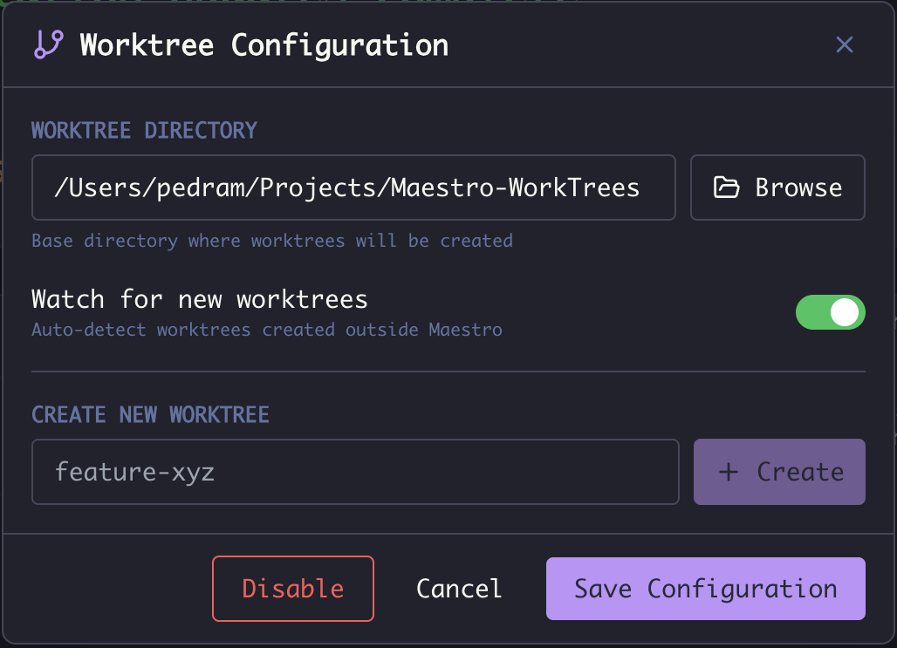
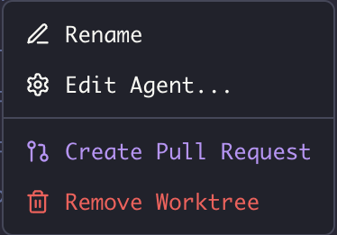
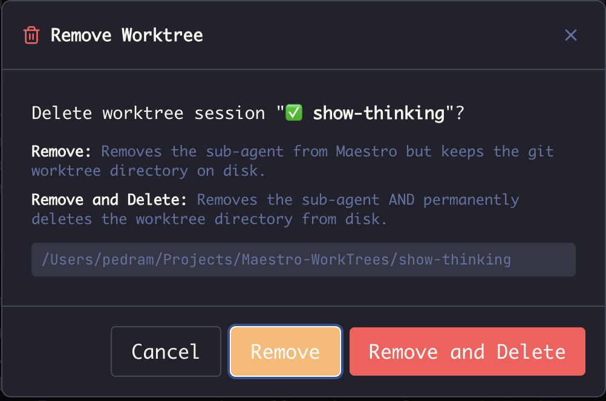

Maestro integrates deeply with Git, providing visual tools for exploring repository history and enabling parallel development with worktree sub-agents.

## The Git Menu

Every agent whose working directory is a git repository has a git menu, reachable three ways:

- **Header branch pill** - hover the pill showing the current branch name (clicking works too).
- **Left Bar right-click** - right-click the agent in the agent list.
- **Command palette** (`Cmd+K` / `Ctrl+K`) - every action is searchable by name.

All three offer the same actions: **View Git Log**, **View Git Diff**, **Git Pull**, **Git Push**, **Change Branch**, and **Create Pull Request**. Pull and Push are badged with how many commits you're behind and ahead. The header menu additionally shows the current branch and origin (each with a copy button, and the origin clickable to open the repo in your browser) and a **Configure Worktrees** entry.

The header pill and the command palette act on the agent you're looking at; the right-click menu acts on the agent you right-clicked, so you can pull or check the log of a background agent without switching to it.

See [Git Actions](./general-usage#git-actions) for the full walkthrough, including the live pull/push output and the fuzzy branch picker.

## Git Log Viewer

Browse your commit history directly in Maestro:



The log viewer shows:

- **Commit history** with messages, authors, and timestamps
- **Branch visualization** with merge points
- **Quick navigation** to any commit

Access via the git menu (branch pill or right-click) → **View Git Log**, **Command Palette** (`Cmd+K` / `Ctrl+K`) → "Git Log", or `Cmd+Shift+G` / `Ctrl+Shift+G`.

## Diff Viewer

Review file changes with syntax-highlighted diffs:



The diff viewer displays:

- **Side-by-side comparison** of file versions
- **Syntax highlighting** matched to file type
- **Line-by-line changes** with additions and deletions clearly marked

Access the working-tree diff from the git menu (branch pill or right-click) → **View Git Diff**, **Command Palette** (`Cmd+K` / `Ctrl+K`) → "Git Diff", or `Cmd+Shift+D` / `Ctrl+Shift+D`. Clicking any commit in the git log viewer opens that commit's diff instead.

---

## Git Worktrees

Git worktrees enable true parallel development by letting you run multiple AI agents on separate branches simultaneously. Each worktree operates in its own isolated directory, so there's no risk of conflicts between parallel work streams.

### Managing Worktrees

Worktree sub-agents appear nested under their parent agent in the Left Bar:



- **Nested Display** - Worktree sub-agents appear in a drawer below their parent agent, styled with a subtle accent background
- **Branch Icon** - Worktree children show a `GitBranch` icon next to their name
- **Collapse/Expand** - Click the worktree count band below the parent session to show/hide worktree children (e.g., "2 worktrees ▾")
- **Independent Operation** - Each worktree agent has its own working directory, conversation history, and state

### Creating a Worktree Sub-Agent

There are three ways to access worktree configuration:

**From the Header (Main Panel):**

1. Select an agent that's in a git repository
2. Hover the **branch pill** in the header (shows the current branch name, e.g., "main")
3. In the menu, click **"Configure Worktrees"**

**From the Context Menu (Left Bar):**

1. Right-click an agent in the session list
2. Select **"Configure Worktrees"** (only shown for git repositories)

**From the Command Palette:**

1. Press `Cmd+K` / `Ctrl+K`
2. Search for **"Configure Worktrees"**

In the configuration modal:



| Option                      | Description                                                                                                                                        |
| --------------------------- | -------------------------------------------------------------------------------------------------------------------------------------------------- |
| **Worktree Directory**      | Base folder where worktrees are created (should be outside the main repo). You can browse to select it (local sessions) or type the path directly. |
| **Watch for new worktrees** | Auto-detect worktrees created outside Maestro (e.g., via command line)                                                                             |
| **Setup Script**            | Shell command run inside every newly created worktree (see below). Leave blank to disable.                                                         |
| **Create New Worktree**     | Enter a branch name and click **Create** to instantly create a new worktree sub-agent                                                              |

**Tip:** Configure the worktree directory to be outside your main repository (e.g., `~/Projects/Maestro-WorkTrees/`). This keeps worktrees organized and prevents them from appearing in your main repo's file tree.

**Note:** Once configured, you can quickly create additional worktrees by right-clicking the parent session and selecting **"Create Worktree"** (bypasses the full configuration modal).

### Setup Scripts

A fresh worktree only contains what git tracks, so anything gitignored (a `.env.local`, generated config, `node_modules`) is missing until you put it there. The **Setup Script** field runs a shell command inside each newly created worktree so that bootstrap happens automatically.

The script runs:

- With the new worktree as its working directory
- Only when Maestro actually creates the worktree (not when it reuses or re-attaches an existing one)
- Before the worktree's agent starts working, so generated files exist for the first prompt
- On the remote host when the parent agent is configured for SSH remote execution

These environment variables are available to the script:

| Variable                  | Value                                                      |
| ------------------------- | ---------------------------------------------------------- |
| `MAESTRO_WORKTREE_PATH`   | Absolute path of the new worktree (also the script's cwd)  |
| `MAESTRO_WORKTREE_BRANCH` | Branch checked out in the new worktree                     |
| `MAESTRO_MAIN_REPO_PATH`  | Absolute path of the main repository                       |
| `MAESTRO_BASE_BRANCH`     | Branch the new branch was based on, when one was specified |

Examples:

```bash
# Copy gitignored env files in from the main repo
cp "$MAESTRO_MAIN_REPO_PATH/.env.local" .

# Copy env files, then run the project's own bootstrap script
cp "$MAESTRO_MAIN_REPO_PATH/.env.local" . && ./scripts/setup.sh

# Install dependencies in a subproject
cd functions && npm install
```

On Windows the command runs through `cmd.exe`, so reference the variables as `%MAESTRO_MAIN_REPO_PATH%`:

```bat
copy "%MAESTRO_MAIN_REPO_PATH%\.env.local" . && npm install
```

Keep the platform-specific logic in a checked-in script and point the field at it - that way the setup steps live with the repo and the field stays a one-liner. Match the script to the shell that will run it: `./scripts/setup.sh` on macOS and Linux, `scripts\setup.cmd` on Windows, since `cmd.exe` cannot execute a `.sh` file directly. To keep one script for every platform, invoke the interpreter explicitly:

```bat
bash scripts/setup.sh
```

**Notes:**

- The script is capped at 10 minutes. A script that waits for input will hit that cap and be killed.
- A failing script raises a toast with the error but does not block the worktree or its agent; the worktree is already usable.
- The setup script is stored per parent agent, so different repos can have different bootstrap steps.

### Worktree Actions

Right-click any worktree sub-agent to access management options:



| Action                  | Description                                                                |
| ----------------------- | -------------------------------------------------------------------------- |
| **Rename**              | Change the display name of the worktree agent                              |
| **Edit Agent...**       | Modify agent configuration                                                 |
| **Duplicate...**        | Create a new agent with the same configuration                             |
| **Git actions**         | View Git Log, View Git Diff, Git Pull, Git Push, Change Branch (see above) |
| **Create Pull Request** | Open a PR from this worktree's branch                                      |
| **Remove Worktree**     | Delete the worktree agent (see below)                                      |

### Creating Pull Requests

When you're done with work in a worktree:

1. **Right-click** the worktree agent → **Create Pull Request**, or
2. Hover the header **branch pill** → **Create Pull Request**, or
3. Press `Cmd+K` / `Ctrl+K` with the worktree active → search "Create Pull Request"

This isn't limited to worktrees: any agent sitting on a git branch can open a PR the same way. The entry is hidden only when Maestro can't determine a branch to open the PR from.

The PR modal shows:

- Source branch (your worktree branch)
- Target branch (configurable)
- Auto-generated title and description based on your work

**Requirements:** GitHub CLI (`gh`) must be installed and authenticated. Maestro will detect if it's missing and show installation instructions.

Opening a PR can take a while, and you don't have to sit and watch it. Once you
press **Create PR**, the **Cancel** button becomes **Run in Background**: close
the form (or press Escape) and the request keeps going. While it does, the
**Create Pull Request** entry in the right-click menu, the branch pill menu and
`Cmd+K` shows a **Creating** spinner - click it to bring the form back and see
where the request got to. When it lands you get a toast with a link to the new
PR, and if it fails, the error waits for you both in a toast and in the form.

### Removing Worktrees

When removing a worktree, you have two options:



| Option                | What It Does                                                                    |
| --------------------- | ------------------------------------------------------------------------------- |
| **Remove**            | Removes the sub-agent from Maestro but keeps the git worktree directory on disk |
| **Remove and Delete** | Removes the sub-agent AND permanently deletes the worktree directory from disk  |

The confirmation dialog shows the full path to the worktree directory so you know exactly what will be affected.

## Use Cases

| Scenario                 | How Worktrees Help                                                         |
| ------------------------ | -------------------------------------------------------------------------- |
| **Background Auto Run**  | Run Auto Run in a worktree while working interactively in the main repo    |
| **Feature Branches**     | Spin up a sub-agent for each feature branch                                |
| **Code Review**          | Create a worktree to review and iterate on a PR without switching branches |
| **Parallel Experiments** | Try different approaches simultaneously without git stash/pop              |

**Auto Run integration:** You can dispatch an Auto Run directly into a new worktree from the run configuration modal - no need to create the worktree first. See [Run in Worktree](./autorun-playbooks#run-in-worktree) for details.

**CLI integration:** The same worktree-backed Auto Run is also reachable from the command line via `maestro-cli auto-run --worktree --branch <name> --worktree-path <path> --launch` (add `--create-pr` to open a PR on completion). See [CLI - Configuring Auto-Run](./cli#configuring-auto-run).

## Tips

- **Name branches descriptively** - The branch name becomes the worktree directory name
- **Use a dedicated worktree folder** - Keep all worktrees in one place outside the main repo
- **Clean up when done** - Remove worktree agents after merging PRs to avoid clutter
- **Watch for Changes** - Enable file watching to keep the file tree in sync with worktree activity
- **Run multiple dev instances** - Use `VITE_PORT` environment variable to run Maestro in multiple worktrees simultaneously:

  ```bash
  # In main worktree
  npm run dev

  # In worktree 2 (different terminal/directory)
  VITE_PORT=5174 npm run dev
  ```
