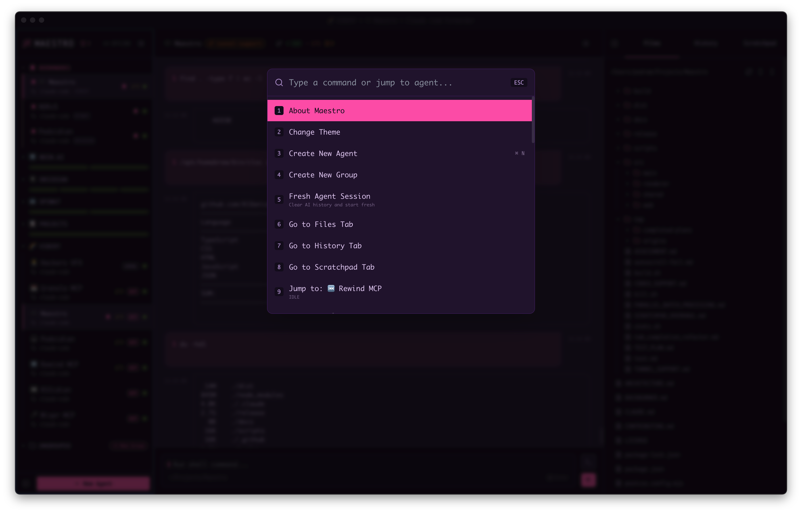
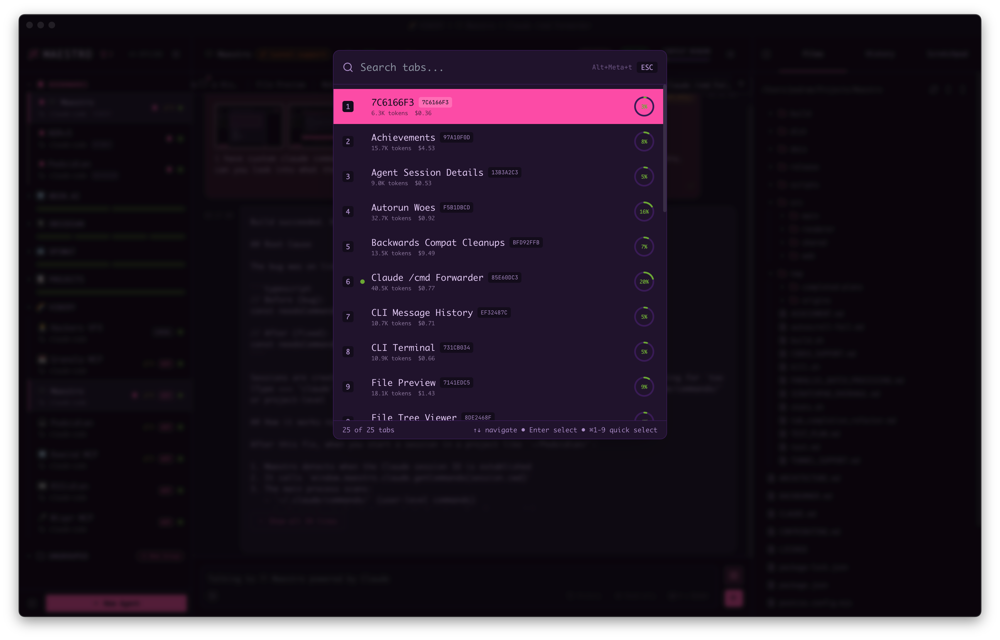
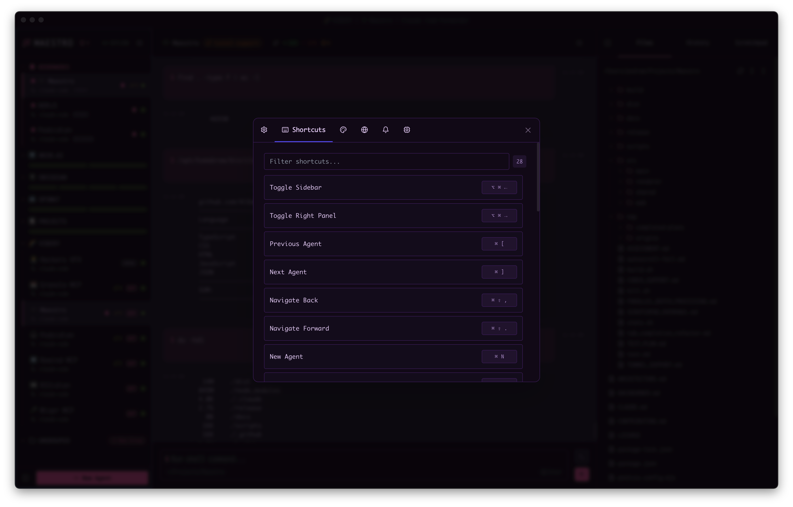
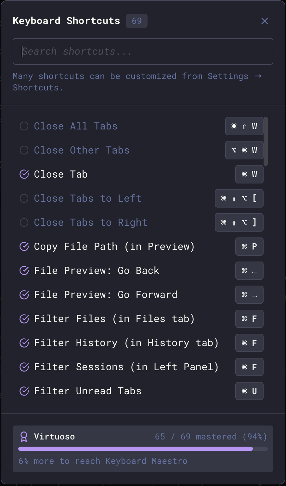

## Quick Actions (Cmd+K)

The command palette is your gateway to nearly every action in Maestro. Press `Cmd+K` (Mac) or `Ctrl+K` (Windows/Linux) to open it.

## System-Wide Hotkey (Summon Maestro)

Configure a single OS-level hotkey that summons Maestro - bringing the window to the foreground and focusing it - from any application on macOS, Windows, or Linux. This is the only shortcut in Maestro that fires while the app is in the background; every other shortcut on this page is in-app.

**To configure:**

1. Open **Settings** (`Cmd+,` / `Ctrl+,`) → **General** tab
2. Find **Global Hotkey to Show Maestro**
3. Click the key capture button and press your desired combo
4. Leave it blank to disable the binding

Tips and gotchas:

- Pick a combo with two modifiers (e.g. `Cmd+Shift+M` / `Win+Shift+M`) to avoid clashing with app shortcuts.
- If the OS or another app already owns the combo, Maestro will surface a registration failure - pick a different binding.
- `Meta` maps to **Cmd** on macOS and **Win** (Super) on Windows/Linux automatically.
- The hotkey works even when Maestro is hidden, minimized, or behind other windows.

## Global Shortcuts

| Action                      | macOS                 | Windows/Linux          |
| --------------------------- | --------------------- | ---------------------- |
| Quick Actions               | `Cmd+K`               | `Ctrl+K`               |
| Agent Switcher              | `Cmd+O`               | `Ctrl+O`               |
| Toggle Left Panel           | `Opt+Cmd+Left`        | `Alt+Ctrl+Left`        |
| Toggle Right Panel          | `Opt+Cmd+Right`       | `Alt+Ctrl+Right`       |
| New Agent                   | `Cmd+N`               | `Ctrl+N`               |
| New Agent Wizard            | `Cmd+Shift+N`         | `Ctrl+Shift+N`         |
| New Group Chat              | `Opt+Cmd+C`           | `Alt+Ctrl+C`           |
| Remove Agent                | `Cmd+Shift+Backspace` | `Ctrl+Shift+Backspace` |
| Move Agent to Group         | `Opt+Cmd+M`           | `Alt+Ctrl+M`           |
| Open Memory Viewer          | `Cmd+Shift+M`         | `Ctrl+Shift+M`         |
| Previous Agent              | `Cmd+[`               | `Ctrl+[`               |
| Next Agent                  | `Cmd+]`               | `Ctrl+]`               |
| Navigate Back               | `Cmd+Shift+,`         | `Ctrl+Shift+,`         |
| Navigate Forward            | `Cmd+Shift+.`         | `Ctrl+Shift+.`         |
| Jump to Agent (1-9, 0=10th) | `Opt+Cmd+NUMBER`      | `Alt+Ctrl+NUMBER`      |
| New Terminal Tab            | `Cmd+J`               | `Ctrl+J`               |
| Toggle Input/Output Focus   | `Cmd+.`               | `Ctrl+.`               |
| Focus Left Panel            | `Cmd+Shift+A`         | `Ctrl+Shift+A`         |
| Show Shortcuts Help         | `Cmd+/`               | `Ctrl+/`               |
| Open Settings               | `Cmd+,`               | `Ctrl+,`               |
| Open Agent Settings         | `Opt+Cmd+,`           | `Alt+Ctrl+,`           |
| View Agent Sessions         | `Cmd+Shift+L`         | `Ctrl+Shift+L`         |
| System Log Viewer           | `Opt+Cmd+L`           | `Alt+Ctrl+L`           |
| System Process Monitor      | `Opt+Cmd+P`           | `Alt+Ctrl+P`           |
| Usage Dashboard             | `Opt+Cmd+U`           | `Alt+Ctrl+U`           |
| View Execution Queue        | `Cmd+Shift+X`         | `Ctrl+Shift+X`         |
| Jump to Nearest Terminal    | `Opt+Cmd+J`           | `Alt+Ctrl+J`           |
| Jump to Bottom              | `Opt+J`               | `Alt+J`                |
| Toggle Bookmark             | `Cmd+Shift+B`         | `Ctrl+Shift+B`         |
| Maestro Symphony            | `Opt+Cmd+Y`           | `Alt+Ctrl+Y`           |
| Director's Notes            | `Cmd+Shift+O`         | `Ctrl+Shift+O`         |
| Maestro Cue                 | `Opt+Q`               | `Alt+Q`                |
| Edit Image from Clipboard   | `Opt+Cmd+E`           | `Alt+Ctrl+E`           |
| Forced Parallel Send        | `Cmd+Shift+Enter`     | `Ctrl+Shift+Enter`     |
| Cycle Focus Areas           | `Tab`                 | `Tab`                  |
| Cycle Focus Backwards       | `Shift+Tab`           | `Shift+Tab`            |

The full-window surfaces in that table (Settings, Usage Dashboard, Director's
Notes, Symphony, Cue, Process Monitor, System Logs, Agent Sessions, Memory)
replace each other rather than stacking, and their hotkeys stay live while one
of them is up. Press `Opt+Cmd+U` from Director's Notes to land on the Usage
Dashboard, then `Cmd+Shift+O` to go straight back. This holds for a rebound
surface too, so a chord you chose yourself behaves the same as the default.

## Panel Shortcuts

| Action                         | macOS                 | Windows/Linux         |
| ------------------------------ | --------------------- | --------------------- |
| Go to Files Tab                | `Cmd+Shift+F`         | `Ctrl+Shift+F`        |
| Go to History Tab              | `Cmd+Shift+H`         | `Ctrl+Shift+H`        |
| Go to Auto Run Tab             | `Cmd+Shift+1`         | `Ctrl+Shift+1`        |
| Toggle Edit/Preview (Markdown) | `Cmd+E`               | `Ctrl+E`              |
| Run Auto Run                   | `Cmd+Shift+2`         | `Ctrl+Shift+2`        |
| Auto Run Expanded Preview      | `Cmd+Shift+3`         | `Ctrl+Shift+3`        |
| Insert Checkbox (Auto Run)     | `Cmd+L`               | `Ctrl+L`              |
| Git: View Diff                 | `Cmd+Shift+D`         | `Ctrl+Shift+D`        |
| Git: View Log                  | `Cmd+Shift+G`         | `Ctrl+Shift+G`        |
| Git: Pull                      | unassigned by default | unassigned by default |
| Git: Push                      | unassigned by default | unassigned by default |
| Git: Change Branch             | unassigned by default | unassigned by default |
| Git: Create Pull Request       | unassigned by default | unassigned by default |
| Refresh Files, Git, History    | `Opt+Cmd+R`           | `Alt+Ctrl+R`          |
| Fuzzy File Search              | `Cmd+G`               | `Ctrl+G`              |

`Cmd+E` toggles edit and preview on a markdown File Preview, in the Memories
viewer (`Cmd+Shift+M`), where the pane opens on the rendered document, and on
the Maestro Prompts tab in Settings, where it opens on the source. Inside the
Memories viewer, `Cmd+G` graphs the memories and `Cmd+U` toggles the unlinked
filter, in place of their usual meanings.

**Git: Pull**, **Git: Push**, **Git: Change Branch**, and **Git: Create Pull Request** ship
unbound. They run against the active agent's repository, exactly as the branch
pill's dropdown and the command palette (`Cmd+K`) do, and two of them write to a
remote, so Maestro does not claim four chords for them out of the box. Bind any
of them in **Settings** -> **Shortcuts** and the chord appears on the matching
branch-pill row and palette entry.

`Opt+Cmd+R` reloads the file tree, git status, worktree list, and history for
the active agent in one press. When a File Preview is open it re-reads that file
from disk too, so everything on screen comes back fresh in one chord. A file you
have unsaved edits in is left alone: the reload would discard them without
asking, and the on-disk-change banner is where that question belongs. Plain
`Cmd+R` is reserved: Maestro blocks it so the window can never reload out from
under a running agent.

## Group Chat

A group chat has no tab strip, so the tab-cycle chord switches the right panel instead.

Team Chat / Moderator Only switches how much of the room you read. Moderator Only hides the delegations the moderator sends to agents and the replies they send back, in both the transcript and the History tab, leaving just your own conversation with the moderator. Nothing stops or is deleted: the agents keep working and every message is still logged, so switching back shows the full record.

| Action                       | macOS                          | Windows/Linux                    |
| ---------------------------- | ------------------------------ | -------------------------------- |
| Team Chat / Moderator Only   | `Opt+Cmd+G`                    | `Alt+Ctrl+G`                     |
| Cycle Participants / History | `Cmd+Shift+[` or `Cmd+Shift+]` | `Ctrl+Shift+[` or `Ctrl+Shift+]` |
| Go to Participants Tab       | `Cmd+Shift+F`                  | `Ctrl+Shift+F`                   |
| Go to History Tab            | `Cmd+Shift+H`                  | `Ctrl+Shift+H`                   |
| Move Through History Entries | `Up` / `Down`                  | `Up` / `Down`                    |
| Jump to the Selected Entry   | `Enter`                        | `Enter`                          |
| Filter History               | `Cmd+F`                        | `Ctrl+F`                         |

Cycling to History gives the list keyboard focus, so `Up` / `Down` walk the entries
right away and the list scrolls to keep the selected entry on screen.

## AI Tab Shortcuts

These shortcuts work in AI Terminal mode and affect the current tab:

| Action                      | macOS                 | Windows/Linux         |
| --------------------------- | --------------------- | --------------------- |
| Toggle Save to History      | `Cmd+S`               | `Ctrl+S`              |
| Toggle Read-Only Mode       | `Cmd+R`               | `Ctrl+R`              |
| Toggle Show Thinking        | `Cmd+Shift+K`         | `Ctrl+Shift+K`        |
| Toggle Tab Star             | `Cmd+Shift+S`         | `Ctrl+Shift+S`        |
| Toggle Tab Unread           | `Cmd+Shift+U`         | `Ctrl+Shift+U`        |
| Filter Unread Agents        | `Opt+U`               | `Alt+U`               |
| Filter Unread Tabs          | `Cmd+U`               | `Ctrl+U`              |
| Unread Only (Agents + Tabs) | unassigned by default | unassigned by default |
| Next Unread/Draft Tab       | `Opt+Cmd+Down`        | `Alt+Ctrl+Down`       |
| Previous Unread/Draft Tab   | `Opt+Cmd+Up` (twice)  | `Alt+Ctrl+Up` (twice) |
| Open Image Carousel         | `Cmd+Y`               | `Ctrl+Y`              |
| Open Image Organizer        | `Cmd+Shift+Y`         | `Ctrl+Shift+Y`        |
| Open Prompt Composer        | `Cmd+Shift+P`         | `Ctrl+Shift+P`        |

Toggle states are saved per-tab. See [Input Toggles](./general-usage#input-toggles) for details on configuring defaults.

### Walking Unread and Draft Tabs

`Opt+Cmd+Down` walks forward through every tab that is unread, holds an unsent draft, or has an unfinished inline wizard. It prefers a tab in the agent you are already on, then moves to the next agent in the sidebar's visible order, wrapping around at the end.

Walking backward is on the second press of `Opt+Cmd+Up`. The first press brings the current tab into focus in the tab bar and centers it. Once it is centered and focused, that press has nothing left to do, so pressing it again walks backward instead: the tab nearest the left of the strip, then the previous agent, wrapping around at the start. It is the exact mirror of `Opt+Cmd+Down`, so pressing one and then the other returns you to where you started.

If you scroll the tab strip away while the tab header still holds focus, the next press re-centers it rather than jumping, so you never lose the "show me where I am" behavior.

**Previous Unread/Draft Tab** is also its own entry in the command palette (`Cmd+K`) and in **Settings** → **Shortcuts**, where you can give it a dedicated chord if you would rather not press `Opt+Cmd+Up` twice. It ships unbound because the second press already reaches it.

## Tab Management Shortcuts

| Action                    | macOS                   | Windows/Linux             |
| ------------------------- | ----------------------- | ------------------------- |
| New Tab                   | `Cmd+T`                 | `Ctrl+T`                  |
| New Browser Tab           | `Cmd+B`                 | `Ctrl+B`                  |
| New File Tab              | `Opt+N`                 | `Alt+N`                   |
| New Terminal Tab          | `Ctrl+Shift+` + `` ` `` | `Ctrl+Shift+` + `` ` ``   |
| Focus Browser Address Bar | `Cmd+L`                 | `Ctrl+L`                  |
| Find in Browser Tab       | `Cmd+F`                 | `Ctrl+F`                  |
| Focus Active Tab          | `Opt+Cmd+Up`            | `Alt+Ctrl+Up`             |
| Snooze Tab                | `Opt+Cmd+S`             | `Alt+Ctrl+S`              |
| Show Snoozed Tabs         | unassigned by default   | unassigned by default     |
| Move Tab to First         | `Cmd+Opt+[`             | `Ctrl+Alt+[`              |
| Move Tab to Last          | `Cmd+Opt+]`             | `Ctrl+Alt+]`              |
| Close Tab                 | `Cmd+W`                 | `Ctrl+W`                  |
| Close All Tabs            | `Cmd+Shift+W`           | `Ctrl+Shift+W`            |
| Close Other Tabs          | `Opt+Cmd+W`             | `Alt+Ctrl+W`              |
| Close Tabs to Left        | `Cmd+Shift+Opt+[`       | `Ctrl+Shift+Alt+[`        |
| Close Tabs to Right       | `Cmd+Shift+Opt+]`       | `Ctrl+Shift+Alt+]`        |
| Reopen Closed Tab         | `Cmd+Shift+T`           | `Ctrl+Shift+T`            |
| Previous Tab              | `Cmd+Shift+[`           | `Ctrl+Shift+[`            |
| Next Tab                  | `Cmd+Shift+]`           | `Ctrl+Shift+]`            |
| Tab Switcher              | `Opt+Cmd+T`             | `Alt+Ctrl+T`              |
| Rename Tab                | `Cmd+Shift+R`           | `Ctrl+Shift+R`            |
| Go to Tab 1-9             | `Cmd+1` through `Cmd+9` | `Ctrl+1` through `Ctrl+9` |
| Go to Last Tab            | `Cmd+0`                 | `Ctrl+0`                  |

**Focus Active Tab** presses twice: the first press centers and focuses the current tab header, the second walks backward through unread and draft tabs. See [Walking Unread and Draft Tabs](#walking-unread-and-draft-tabs).

### Tab Switcher

The Tab Switcher provides fuzzy search across all open tabs with quick navigation:

- **Search** - Type to filter tabs by name or session ID
- **Quick select** - Press `1-9` to jump directly to a numbered tab
- **Navigate** - Use `Up/Down Arrow` to move through results
- **Select** - Press `Enter` to switch to the highlighted tab
- **Context info** - Each tab shows token count, cost, and context usage

The bulk close operations (Close All, Close Others, Close Left, Close Right) are also available via the [Tab Menu](./context-management#tab-close-operations) hover overlay and Quick Actions (`Cmd+K`).

In the **Snooze Tab** dialog, `Cmd+Enter` (`Ctrl+Enter` on Windows/Linux) sets the snooze from anywhere in the dialog - including the note field, where plain `Enter` stays a newline.

## Input & Output

| Action                   | Key                                               |
| ------------------------ | ------------------------------------------------- |
| Send Message             | `Enter` or `Cmd+Enter` (configurable in Settings) |
| Multiline Input          | `Shift+Enter`                                     |
| Edit Last Queued Message | `Cmd+Shift+E` / `Ctrl+Shift+E`                    |
| Navigate Command History | `Up Arrow` while in input                         |
| Slash Commands           | Type `/` to open autocomplete                     |
| Focus Output             | `Esc` while in input                              |
| Focus Input              | `Esc` while in output                             |
| Open Output Search       | `Cmd+F` while in output                           |
| Search All Open Tabs     | `Opt+Cmd+F` / `Alt+Ctrl+F`                        |
| Scroll Output            | `Up/Down Arrow` while in output                   |
| Prev/Next Message        | `Shift+Up/Down Arrow` while in output             |
| Page Up/Down             | `Alt+Up/Down Arrow` while in output               |
| Jump to Top/Bottom       | `Cmd+Up/Down Arrow` while in output               |

## Font Size

| Action             | macOS         | Windows/Linux  |
| ------------------ | ------------- | -------------- |
| Increase Font Size | `Cmd+=`       | `Ctrl+=`       |
| Decrease Font Size | `Cmd+-`       | `Ctrl+-`       |
| Reset Font Size    | `Cmd+Shift+0` | `Ctrl+Shift+0` |

## Command Terminal

| Action         | macOS         | Windows/Linux  |
| -------------- | ------------- | -------------- |
| Clear Terminal | `Cmd+Shift+K` | `Ctrl+Shift+K` |

### Tab Completion

The Command Terminal - and the AI chat while in [command mode](./general-usage#command-mode) - provides intelligent tab completion for faster command entry:

| Action                 | Key                                            |
| ---------------------- | ---------------------------------------------- |
| Open Tab Completion    | `Tab` (when there's input text)                |
| Navigate Suggestions   | `Up/Down Arrow`                                |
| Select Suggestion      | `Enter`                                        |
| Cycle Filter Types     | `Tab` (while dropdown is open, git repos only) |
| Cycle Filter Backwards | `Shift+Tab` (while dropdown is open)           |
| Close Dropdown         | `Esc`                                          |

**Completion Sources:**

- **History** - Previous shell commands from your session. In command mode this is your prior command-mode commands, so `Tab` on an empty line lists what you have run before
- **Files/Folders** - Files and directories in your current working directory. In command mode this is the agent's working directory, which is where the command actually runs
- **Git Branches** - Local and remote branches (git repos only)
- **Git Tags** - Available tags (git repos only)

In git repositories, filter buttons appear in the dropdown header allowing you to filter by type (All, History, Branches, Tags, Files). Use `Tab`/`Shift+Tab` to cycle through filters or click directly.

## Command Mode (AI Terminal)

`!` in an empty AI composer climbs one rung of the [command mode](./general-usage#command-mode) ladder; `Esc` climbs back down. The composer never loses focus.

| Action                         | Key                                       |
| ------------------------------ | ----------------------------------------- |
| Enter command mode             | `!` (empty composer)                      |
| Enter AI command mode          | `!` again (empty command line)            |
| Step back one rung             | `Esc` or `Backspace` (empty command line) |
| Run the command / ask for one  | `Enter`                                   |
| Send a message starting with ! | `\!` (the backslash is removed on send)   |

When AI command mode proposes a command, the card owns the keyboard until you answer it:

| Action             | Key                |
| ------------------ | ------------------ |
| Run the command    | `Y`                |
| Decline it         | `N` or `Esc`       |
| Move Run / Cancel  | `Left/Right Arrow` |
| Take the selection | `Enter`            |

## @ File Mentions (AI Terminal)

In AI mode, use `@` to reference files in your prompts:

| Action               | Key                                |
| -------------------- | ---------------------------------- |
| Open File Picker     | Type `@` followed by a search term |
| Navigate Suggestions | `Up/Down Arrow`                    |
| Select File          | `Tab` or `Enter`                   |
| Close Dropdown       | `Esc`                              |

**Example**: Type `@readme` to see matching files, then select to insert the file reference into your prompt. The AI will have context about the referenced file.

## Navigation & Search

| Action                           | macOS                              | Windows/Linux                      |
| -------------------------------- | ---------------------------------- | ---------------------------------- |
| Navigate Agents                  | `Up/Down Arrow` while in sidebar   | `Up/Down Arrow` while in sidebar   |
| Select Agent                     | `Enter` while in sidebar           | `Enter` while in sidebar           |
| Filter Agents (in Left Panel)    | `Cmd+F`                            | `Ctrl+F`                           |
| Navigate Files                   | `Up/Down Arrow` while in file tree | `Up/Down Arrow` while in file tree |
| Preview Fonts (Settings)         | `Up/Down Arrow` on a font picker   | `Up/Down Arrow` on a font picker   |
| Extend File Selection            | `Shift+Up/Down Arrow` in file tree | `Shift+Up/Down Arrow` in file tree |
| Multi-select Files               | `Cmd+Click` / `Shift+Click`        | `Ctrl+Click` / `Shift+Click`       |
| Filter Files (in Files tab)      | `Cmd+F`                            | `Ctrl+F`                           |
| Filter History (in History tab)  | `Cmd+F`                            | `Ctrl+F`                           |
| Jump to Entry Session (History)  | `Cmd+Enter` on selected entry      | `Ctrl+Enter` on selected entry     |
| Search Output (in Main Window)   | `Cmd+F`                            | `Ctrl+F`                           |
| Search Messages (All Agent Tabs) | `Opt+Cmd+F`                        | `Alt+Ctrl+F`                       |
| Search System Logs               | `Cmd+F`                            | `Ctrl+F`                           |
| Search Director's Notes          | `Cmd+F`                            | `Ctrl+F`                           |
| Open File Preview                | `Enter` on selected file           | `Enter` on selected file           |
| Navigate Queued Messages         | `Up/Down Arrow` in Execution Queue | `Up/Down Arrow` in Execution Queue |
| Queued Message Actions           | `Enter` in Execution Queue         | `Enter` in Execution Queue         |
| Close Preview/Filter/Modal       | `Esc`                              | `Esc`                              |

### Searching Message History

Two searches cover your conversations, both reachable from the magnifying-glass
menu in the tab bar and both supporting plain text or regex:

| Search           | Shortcut                   | Scope                               |
| ---------------- | -------------------------- | ----------------------------------- |
| Find bar         | `Cmd+F` / `Ctrl+F`         | The tab you're currently viewing    |
| Cross-tab search | `Opt+Cmd+F` / `Alt+Ctrl+F` | Every open tab in the current agent |

The Find bar highlights matches inline; `Enter` and `Shift+Enter` step through
them. Cross-tab search opens a modal listing hits grouped by tab. Choosing one
switches to that tab, scrolls to the message, flashes it, and seeds that tab's
Find bar with the same query positioned on the match you picked. It is also in
the command palette as "Search: Messages (All Agent Tabs)".

See [Searching Message History](./general-usage#searching-message-history) for
the full walkthrough.

## File Preview

| Action                              | macOS           | Windows/Linux   |
| ----------------------------------- | --------------- | --------------- |
| Copy File Path                      | `Cmd+P`         | `Ctrl+P`        |
| Open Search                         | `Cmd+F`         | `Ctrl+F`        |
| Toggle Table of Contents (Markdown) | `Cmd+\`         | `Ctrl+\`        |
| Jump to Heading (Markdown)          | `#`             | `#`             |
| Go Back                             | `Cmd+Left`      | `Ctrl+Left`     |
| Go Forward                          | `Cmd+Right`     | `Ctrl+Right`    |
| Scroll                              | `Up/Down Arrow` | `Up/Down Arrow` |
| Zoom Preview Text In                | `+` or `=`      | `+` or `=`      |
| Zoom Preview Text Out               | `-` or `_`      | `-` or `_`      |
| Reset Preview Zoom                  | `0`             | `0`             |
| Close                               | `Esc`           | `Esc`           |

`#` opens the heading palette: every heading in the document, in the order it
appears, with a fuzzy filter on top. Type a few characters of a section name,
move with `Up`/`Down` (`PgUp`/`PgDn` to skip further), and press `Enter` to jump
there. It reads the same list as the Table of Contents, so use whichever suits
the moment - the ToC to browse, the palette to go straight to a section by name.
Like the zoom keys below it is bare, so it never fires while you are typing in
the find bar or editing the document. The same list is in the command palette as
**Jump to Heading**, offered only while a markdown file is open in preview.

The three zoom keys are bare - no modifier - and are distinct from the app-wide
`Cmd+=` / `Cmd+-` in [Font Size](#font-size), which resizes the whole interface.
They apply only where the zoom moves type (markdown, code, and text views), and
they never fire while you are typing, so the find bar and the markdown editor
keep those keys. The same steps are available from the zoom pill that rests in
the top-right corner of the preview.

### CSV Row Detail

Available while previewing a `.csv` or `.tsv` file. See
[CSV and TSV Tables](./general-usage#csv-and-tsv-tables) for the full
walkthrough.

The field list is focused on open, so these work without clicking first.

| Action               | macOS                 | Windows/Linux         |
| -------------------- | --------------------- | --------------------- |
| Open row detail view | `Double-click`        | `Double-click`        |
| Previous / next row  | `Left/Right Arrow`    | `Left/Right Arrow`    |
| Scroll fields        | `Up/Down Arrow`       | `Up/Down Arrow`       |
| Scroll by screen     | `PageUp` / `PageDown` | `PageUp` / `PageDown` |
| Jump to top / bottom | `Home` / `End`        | `Home` / `End`        |
| Focus the filter     | `/`                   | `/`                   |
| Leave the filter     | `Enter`               | `Enter`               |
| Close row detail     | `Esc`                 | `Esc`                 |

## Staged Images Organizer

Opened with the expand button (⤢) beside the staged-image strip, with two or
more images attached. See
[Staged Images](./general-usage#the-staged-images-organizer).

| Action              | macOS      | Windows/Linux |
| ------------------- | ---------- | ------------- |
| Zoom thumbnails in  | `+` or `=` | `+` or `=`    |
| Zoom thumbnails out | `-` or `_` | `-` or `_`    |
| Reset zoom to 100%  | `0`        | `0`           |
| Close               | `Esc`      | `Esc`         |

The zoom keys are bare, like the ones in [File Preview](#file-preview), so the
app-wide `Cmd+=` / `Cmd+-` in [Font Size](#font-size) keeps working while the
organizer is open. They stop firing while the lightbox or the annotator is open
on top of it.

## Usage Dashboard

The Agents and Groups tabs draw one tile per agent or group. The tile size is
yours to set, and it is remembered across restarts. See
[Usage Dashboard](./usage-dashboard).

| Action                   | macOS      | Windows/Linux |
| ------------------------ | ---------- | ------------- |
| Bigger tiles             | `+` or `=` | `+` or `=`    |
| Smaller tiles            | `-` or `_` | `-` or `_`    |
| Back to the default size | `0`        | `0`           |

The two tabs keep separate sizes, so widening the agent tiles leaves the group
tiles alone. The buttons beside the sort pills do the same thing.

Like the other bare zoom keys in this document, they leave `Cmd+=` / `Cmd+-`
alone, and they stop firing while an agent or group detail view is open on top
of the grid.

## Memories Viewer

The file list is focused when the viewer opens, so these work right away. See
[Memories](./memories) for the full walkthrough.

| Action                     | macOS                | Windows/Linux        |
| -------------------------- | -------------------- | -------------------- |
| Previous / next memory     | `Up/Down Arrow`      | `Up/Down Arrow`      |
| Delete the selected memory | `Backspace` or `Del` | `Backspace` or `Del` |
| Jump to the filter box     | `/` or `Cmd+F`       | `/` or `Ctrl+F`      |
| Toggle Preview / Edit      | `Cmd+E`              | `Ctrl+E`             |
| Step back out              | `Esc`                | `Esc`                |

`/` only jumps to the filter when you are not already typing, so a slash typed
into a memory stays a slash. `Cmd+F` works from anywhere, including the editor.

`Esc` climbs back out one rung at a time rather than closing straight away:
from the filter box it returns you to the list **keeping your query**, so you
can filter and then arrow through the hits; pressing it again clears the
filter, and once more closes the viewer.

## Maestro Prompts (Settings)

Settings -> Maestro Prompts edits the system prompts Maestro sends to agents.
The prompt list is focused when the tab opens, so these work right away.

| Action                 | macOS           | Windows/Linux   |
| ---------------------- | --------------- | --------------- |
| Previous / next prompt | `Up/Down Arrow` | `Up/Down Arrow` |
| Jump to the filter box | `/`             | `/`             |
| Toggle Preview / Edit  | `Cmd+E`         | `Ctrl+E`        |
| Step back out          | `Esc`           | `Esc`           |

The filter searches each prompt's name, description, and body, so you can find
a prompt by a phrase you remember from inside it. `/` only jumps to the filter
when you are not already typing, so a slash typed into a prompt stays a slash.
`Cmd+F` is not rebound here: it stays on the Settings search box.

Preview renders the prompt as markdown **with its template variables resolved**
against the active agent, so it shows what the agent actually receives.

`Esc` climbs back out one rung at a time: it dismisses the template-variable
popup, then returns you from the filter box to the list **keeping your query**,
then clears the filter, then closes the help panel or the expanded editor, and
only then closes Settings.

## Agent Sessions Browser

Opened with `Cmd+Shift+L`. The list view walks sessions; the detail view adds a
one-key resume.

| Action                           | macOS             | Windows/Linux      |
| -------------------------------- | ----------------- | ------------------ |
| Previous / next session (list)   | `Up/Down`         | `Up/Down`          |
| Open the selected session (list) | `Enter`           | `Enter`            |
| Search sessions (list)           | `Cmd+F`           | `Ctrl+F`           |
| Rename the session in focus      | `Cmd+E`           | `Ctrl+E`           |
| Resume the open session (detail) | `Cmd+R` / `Enter` | `Ctrl+R` / `Enter` |
| Back to the list / close         | `Esc`             | `Esc`              |

`Cmd+E` renames the highlighted row in the list, or the session you are viewing
in the detail pane. `Esc` while renaming exits the name field and leaves the
browser where it was; press it again to go back or close.

`Cmd+R` is off while you are renaming a session, so it cannot discard a name
you are half-way through typing.

## Document Graph

| Action                             | Key          |
| ---------------------------------- | ------------ |
| Navigate to connected nodes        | `Arrow Keys` |
| Preview document in-graph          | `Enter`      |
| Open URL (external link)           | `Enter`      |
| Re-center the graph on a node      | `Space`      |
| Open document in File Preview      | `O`          |
| Focus the search box               | `Cmd+F`      |
| Cycle layout                       | `L`          |
| Widen neighbor depth               | `D`          |
| Cycle preview length               | `P`          |
| Fit the whole graph on screen      | `F`          |
| Switch scroll between zoom and pan | `S`          |
| Snapshot the graph                 | `C`          |
| Increase / decrease node spacing   | `+` / `-`    |
| Close the preview, then the graph  | `Esc`        |

`P` walks the node preview length through Off, 50, 100, 200, 350, and 500
characters. At **Off** each document is drawn as a filename pill with no body
box, which is the densest way to read the shape of a large graph.

`L` walks the six layouts: **Mind Map** (tree columns), **Radial** (concentric
rings), **Hierarchical** (top-down rows), **Force** (physics simulation),
**Lobes** (documents grouped by which other documents they link to), and
**Timeline** (one column per day, oldest on the left, captioned with the date).

`F` re-frames the whole graph in the window. The graph also fits itself when it
opens and whenever the layout or preview length changes.

`S` switches what the scroll wheel does. In **Zoom** (the default) the wheel
zooms toward the cursor and `Shift`+scroll pans; in **Pan** the wheel pans in
both directions and `Shift`+scroll zooms. Pan is what you want once the framing
is right and you are reading across a wide graph, where every scroll otherwise
changes the zoom you just set. The mode is also a toolbar pill and an inline
toggle in the Help panel, and it is remembered between visits.

`C` opens the screenshot chooser: copy the graph to the clipboard, or write
it to disk as a PNG. The shot is the graph area exactly as it is painted, so
frame it first.

## Customizing Shortcuts

Most shortcuts can be remapped to fit your workflow:

1. Open **Settings** (`Cmd+,` / `Ctrl+,`) → **Shortcuts** tab
2. Find the action you want to remap. The search box matches on the action name, and names are written so that the obvious word finds the whole family: type `git` for every git action, `tab` for the tab commands, `agent` for the agent ones, `unread`, `font`, `image`, `media`. Related actions share a `Family: Action` name (`Git: Pull`, `Media: Next Track`), which also keeps them together in the list instead of scattered alphabetically. The same names and the same search work in the command palette (`Cmd+K`) and the shortcuts sheet (`Cmd+/`)
3. Click the current key binding (shows the shortcut like `⌘ K` or `Ctrl+K`)
4. Press your desired key combination
5. The new binding is saved immediately

**Tips:**

- Press `Esc` while recording to cancel without changing the shortcut
- To unset a shortcut, click the **×** next to its binding, or press `Backspace` / `Delete` while recording. The action shows **Unassigned** until you bind it again
- Modifier keys alone (Cmd, Ctrl, Alt, Shift) won't register - you need a final key
- Some shortcuts are fixed and cannot be remapped (like `Esc` to close modals)
- A combination that another action already uses is refused, and the recorder tells you which action holds it. Clear that one first if you want the combination

**Finding a shortcut by pressing it:** Both the Shortcuts tab and the Shortcuts Help panel (`Cmd+/` / `Ctrl+/`) have a **By Key** button. Click it and press a combination to see what it is bound to. It keeps listening after each press, so you can run through one key after another to explore what your keyboard already does. Press `Esc` or click away to stop. If nothing is bound to what you pressed, the panel says so by name rather than showing a bare "no results".

### Combinations Maestro Will Not Take

`Cmd+Shift+Arrow` (`Ctrl+Shift+Arrow` on Windows and Linux) belongs to the operating system inside a text field: it extends your selection to the top, bottom, start of the line, or end of the line. Maestro refuses to bind these, because a Maestro binding on one of them wins everywhere in the app, so you would lose select-to-end in every input and get an agent jump instead - which looks exactly like a broken text box.

The recorder refuses these with an explanation. If you had one of them bound in an earlier version, Maestro clears it on the next launch and puts that action back on its default combination, so the action keeps working. You'll find it under its default binding in the Shortcuts tab.

**Resetting shortcuts:** There's currently no "reset to default" button - if you need to restore defaults, you can find the original bindings in this documentation or delete the shortcuts from your settings file.

### Changed Default Bindings

When a default binding has to move to free a combo for a new action, Maestro migrates it for you on the next launch - but only if you were still on the old default. If you had personally rebound that action, your binding is left untouched and you may need to move it yourself.

| Action                    | Was           | Now           | Freed for                        |
| ------------------------- | ------------- | ------------- | -------------------------------- |
| Focus Active Tab          | `Opt+Cmd+F`   | `Opt+Cmd+Up`  | Search Messages (All Agent Tabs) |
| Move Agent to Group       | `Cmd+Shift+M` | `Opt+Cmd+M`   | Open Memory Viewer               |
| Auto Run Expanded Preview | `Cmd+Shift+E` | `Cmd+Shift+3` | Edit Last Queued Message         |

If `Opt+Cmd+F` still focuses the active tab instead of opening cross-tab search, you had a custom binding on it: open **Settings** → **Shortcuts**, clear it from **Focus Active Tab**, and the new default takes over.

## Keyboard Mastery

Maestro tracks your keyboard shortcut usage and rewards you for becoming a power user. As you discover and use more shortcuts, you'll level up through 5 mastery levels:

| Level | Title                | Threshold |
| :---: | -------------------- | --------- |
|   0   | **Beginner**         | 0%        |
|   1   | **Student**          | 25%       |
|   2   | **Performer**        | 50%       |
|   3   | **Virtuoso**         | 75%       |
|   4   | **Keyboard Maestro** | 100%      |

**Tracking your progress:**

- Open the **Shortcuts Help** panel (`Cmd+/` / `Ctrl+/`) to see your mastery percentage and current level
- Each shortcut displays a checkmark once you've used it
- A progress bar shows how many shortcuts you've mastered out of the total
- When you reach a new level, you'll see a celebration with confetti

Only shortcuts that have a chord bound count toward mastery. Actions listed as
**Unassigned**, and any shortcut whose keys you clear in **Settings** -> **Shortcuts**,
sit outside the total, so 100% stays reachable. Give an unassigned action a chord and it
joins the count.

The modal shows all available shortcuts with checkmarks indicating which you've mastered. Use the search bar to find specific shortcuts quickly.

**Why keyboard shortcuts matter:** Using shortcuts keeps you in flow state, reduces context switching, and dramatically speeds up your workflow. Maestro is designed for keyboard-first operation - the less you reach for the mouse, the faster you'll work.

Keyboard Mastery is separate from [Conductor Ranks](./achievements), which track cumulative Auto Run time. Both systems reward you for mastering different aspects of Maestro.
