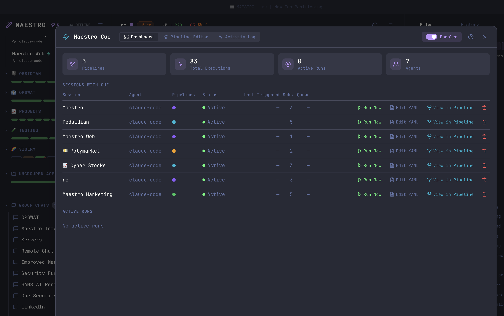
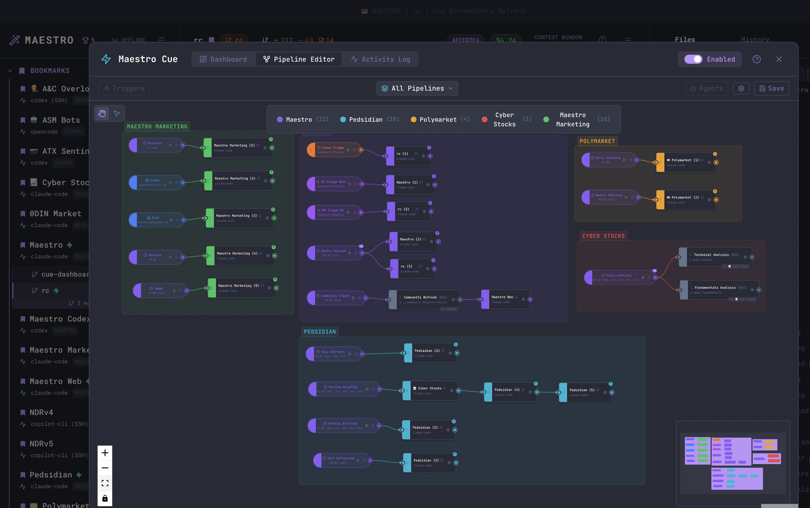
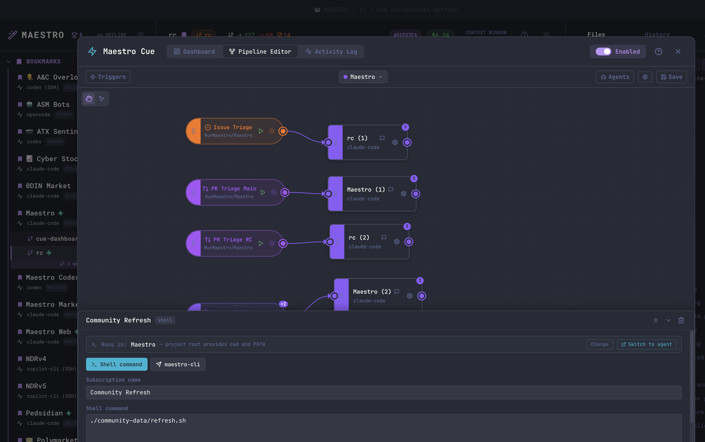
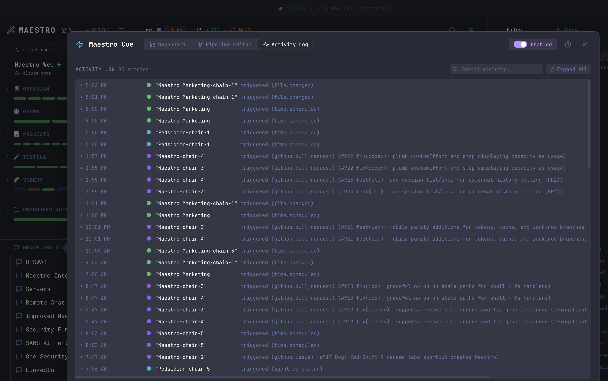
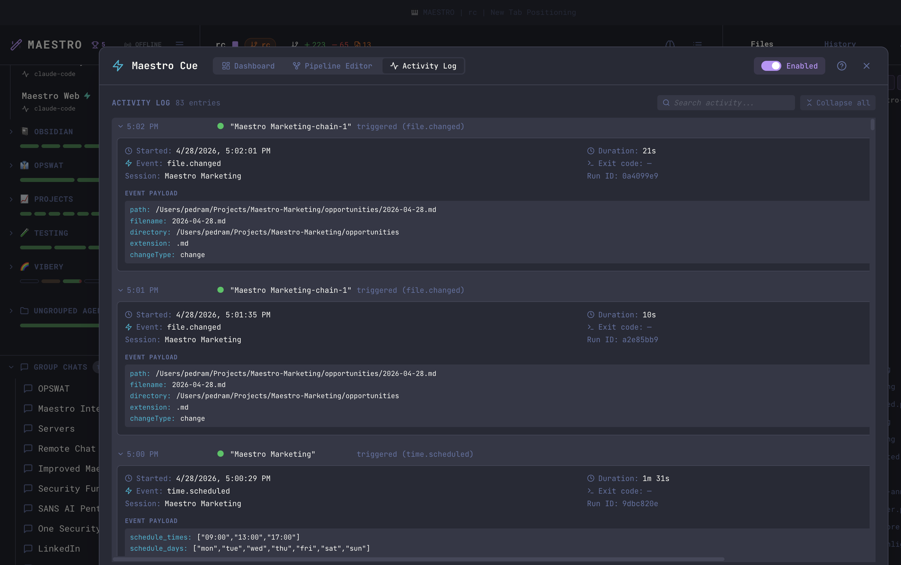
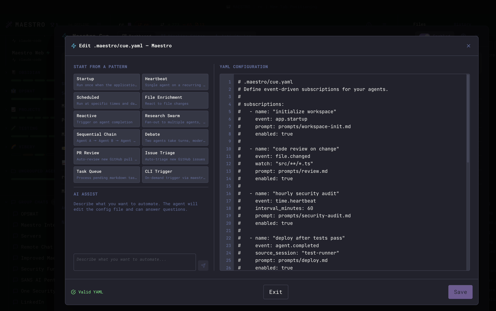
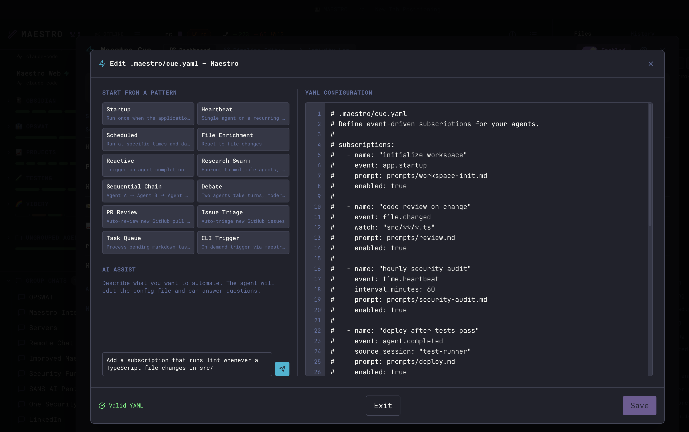
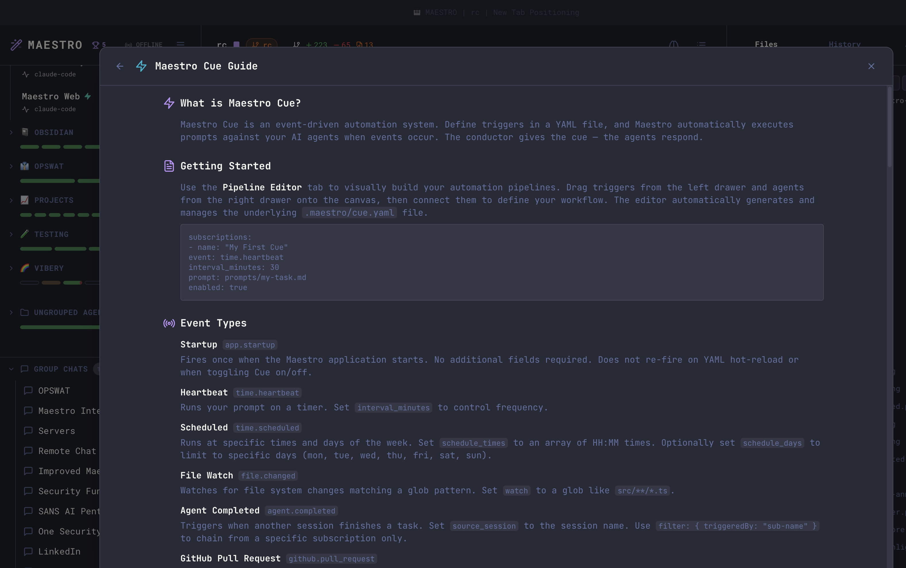

Maestro Cue is an event-driven automation engine that watches for things happening in your projects and automatically sends prompts to your agents in response. Instead of manually kicking off tasks, you define **subscriptions** - trigger-prompt pairings - in a YAML file, and Cue handles the rest.

<Note>
Maestro Cue is an **Encore Feature** - it's on by default. Turn it off in **Settings > Encore Features** to hide the shortcut, modal, and automation engine.
</Note>

## What Can Cue Do?

A few examples of what you can automate with Cue:

- **Run linting whenever TypeScript files change** - watch `src/**/*.ts` and prompt an agent to lint on every save
- **Generate a morning standup** - schedule at 9:00 AM on weekdays to scan recent git activity and draft a report
- **Chain agents together** - when your build agent finishes, automatically trigger a test agent, then a deploy agent
- **Triage new GitHub PRs** - poll for new pull requests and prompt an agent to review the diff
- **Track TODO progress** - scan markdown files for unchecked tasks and prompt an agent to work on the next one
- **Fan out deployments** - when a build completes, trigger multiple deploy agents simultaneously
- **Trigger from the CLI** - run `maestro-cli cue trigger` to fire a subscription on demand from scripts, CI/CD, or other agents

## Turning Cue On and Off

Cue is on out of the box. Maestro automatically scans all your active agents for `.maestro/cue.yaml` files in their project roots, and the Cue engine starts as soon as it finds one - no restart required. An agent with no `.maestro/cue.yaml` runs nothing.

To turn Cue off entirely:

1. Open **Settings** (`Cmd+,` / `Ctrl+,`)
2. Navigate to the **Encore Features** tab
3. Toggle **Maestro Cue** off

## Quick Start

Create a file called `.maestro/cue.yaml` in your project (inside the `.maestro/` directory at the project root):

```yaml
subscriptions:
  - name: lint-on-save
    event: file.changed
    watch: 'src/**/*.ts'
    prompt: |
      The file {{CUE_FILE_PATH}} was just modified.
      Please run the linter and fix any issues.
```

That's it. Whenever a `.ts` file in `src/` changes, Cue sends that prompt to the agent with the file path filled in automatically.

## The Cue Modal

Open the Cue modal to monitor and manage all automation activity.

**Keyboard shortcut:**

- macOS: `Option+Q`
- Windows/Linux: `Alt+Q`

**From Quick Actions:**

- Press `Cmd+K` / `Ctrl+K` and search for "Maestro Cue"

The modal has six tabs - **Dashboard**, **Scheduled Tasks**, **Pipeline Graph**, **Pipeline List**, **Activity Log**, and **Backup** - plus a **Help** button and an **Enabled** master toggle in the header that starts and stops the engine globally.

**From an agent:** ask any Maestro agent to open it and it will run `maestro-cli open cue`, optionally on a tab (`maestro-cli open cue --tab scheduled`). See [Opening a surface from the CLI](./cli-reference#maestro-cli-open).

## Dashboard

The Dashboard tab summarizes engine state at the top (Pipelines, Total Executions, Active Runs, Agents) and lists every agent that has a Cue configuration:



| Column             | Description                                                  |
| ------------------ | ------------------------------------------------------------ |
| **Session**        | Agent name                                                   |
| **Agent**          | Provider type (Claude Code, Codex, OpenCode, etc.)           |
| **Pipelines**      | One color-coded dot per pipeline the agent owns (see below)  |
| **Status**         | Green = active, yellow = paused, "No Config" = no YAML found |
| **Last Triggered** | How long ago the most recent event fired                     |
| **Subs**           | Number of subscriptions in the YAML                          |
| **Queue**          | Events waiting to be processed                               |

Each row has three action buttons:

- **Run Now** - Manually trigger a subscription on demand, bypassing its normal event conditions. Useful for testing new subscriptions or re-running a failed automation without waiting for the next event.
- **Edit YAML** - Open the inline YAML editor for that agent.
- **View in Graph** - Jump to the Pipeline Graph tab, scoped to that agent.

An agent "owns" a pipeline in either of two senses, and both count for the
**Pipelines** dots and for **View in Graph**:

- It appears in the pipeline, as an agent node bound to it or as a command node
  that runs in its project root.
- The pipeline is declared in that agent's own `cue.yaml`, even when nothing in
  the pipeline points back at the agent. A fan-out that only dispatches to other
  agents is the usual case, as is an `action: command` pipeline that is nothing
  but a trigger and a shell step.

**View in Graph** then does one of three things:

| The agent owns... | What you get                                                                                                    |
| ----------------- | --------------------------------------------------------------------------------------------------------------- |
| One pipeline      | That pipeline, selected and fitted                                                                              |
| Several           | The All Pipelines view narrowed to just that agent's, with a chip in the toolbar naming the agent and the count |
| None              | The unfiltered All Pipelines view                                                                               |

Click the `x` on the chip, or pick any pipeline from the selector, to widen back
out to every pipeline. The scope only changes what the canvas draws - it never
edits a pipeline, and the All Pipelines view stays read-only either way.

Below the sessions table, the **Active Runs** section lists subscriptions that are currently executing, with a **Stop** button for each.

## Scheduled Tasks

The Scheduled Tasks tab is the clock-driven slice of Cue in one list: every task that fires at a time rather than in response to a file change, a PR, or another agent. Three kinds live here:

| Kind             | YAML event       | Fires                                                     |
| ---------------- | ---------------- | --------------------------------------------------------- |
| **Once**         | `time.once`      | A single time, then the task removes itself from the YAML |
| **At set times** | `time.scheduled` | At chosen `HH:MM` times, optionally only on chosen days   |
| **Interval**     | `time.heartbeat` | Every N minutes                                           |

Each row shows the task label, the subscription name and its pipeline, the agent that runs it, its schedule, and a countdown to the next fire. The pipeline is omitted when it just repeats the agent name. A paused task is dimmed and marked `paused`.

**Sorting.** Click any column header to sort by it; click the active header again to reverse it. Switching columns starts that column in its own natural order rather than inheriting the previous one. The default is **Next**, soonest first. Tasks with no projected next fire (a repeating interval, whose phase lives in engine run state rather than in the YAML) always sort last, in both directions. **Schedule** groups by recurrence first (one-offs, then set times, then intervals) and orders within each group by when it actually fires.

**Filtering.** Two filters, and they stack:

- The **text box** narrows the list as you type. The task label, subscription name, and agent are matched fuzzily, so `wspr` finds "Wispr Sync". The pipeline, schedule text, and action are matched as plain substrings, so `18:00` or `command` pull up exactly what you would expect.
- The **All / Once / At set times / Interval** buttons narrow by recurrence, which is the fast way to separate one-off reminders from standing jobs.

A live count shows how many of the total are showing whenever either filter is narrowing the list, and `Esc` clears the text filter before it closes the modal.

**Reading the schedule.** Day sets are written as compactly as they can be read: all seven days is `Every day`, Monday through Friday is `Weekdays`, Saturday and Sunday is `Weekends`, and anything else uses one- or two-letter days (`M`, `T`, `W`, `Th`, `F`, `Sa`, `Su`) with runs of three or more collapsed into a range. So `06:05 · Every day`, `15:30 · Weekdays`, `08:00 · Su`, `09:00 · M-W, Sa`. A one-off shows its fire time in your own timezone rather than the UTC timestamp stored in the YAML. The icon at the left of the cell is the recurrence, matching the filter buttons above.

Three buttons per row:

- **Pause / Resume** - Flips `enabled` in the YAML. The task stays on disk, it just stops firing. Use this instead of deleting a task you will want back.
- **Edit** - Change when the task fires, its prompt, its notification, or its label. The agent and the recurrence kind are fixed once a task exists: both are identity on disk, so switching either means cancelling and creating a new task.
- **Cancel** - Deletes the task from the agent's `cue.yaml`. This asks for confirmation and cannot be undone.

**New Task** opens a form: pick the agent, pick how it repeats, set the time (a one-shot offers `15m` / `1h` / `4h` / `1d` quick picks), and give it a prompt, a toast notification, or both. A notification can be made sticky so it waits for you to dismiss it.

Tasks created here and tasks created with `maestro-cli cue schedule` are the same objects in the same file - both surfaces read and write through one module, so the list is always the whole truth. That also means an agent can schedule work for you and you can see, re-time, or cancel it here:

```bash
maestro-cli cue schedule --in 20m --agent "Cyber Stocks" --prompt "Check the deploy status."
maestro-cli cue schedule --daily-at 09:00 --days mon,tue,wed,thu,fri --agent Pedsidian --prompt "Draft the standup notes."
maestro-cli cue schedule --list
```

## Pipeline Graph

The Pipeline Graph tab visualizes your Cue subscriptions as a node graph - triggers on the left, agents on the right, with edges showing how events flow through your automation.



Each pipeline is color-coded and labeled. Trigger nodes show the event type and configuration (glob patterns, schedule times, etc.), while agent nodes show the provider type. Pipelines from all agents are displayed together so you can see cross-agent relationships at a glance.

A pipeline can contain **multiple trigger lines** - for example, a daily scan and a weekly review grouped under a single "Monitoring" pipeline. Use the `# Pipeline:` comment and `-chain-N` naming convention in your YAML to group subscriptions. See [Pipelines](./maestro-cue-configuration#pipelines) in the Configuration Reference for details.

### Inspecting a Pipeline

Pick a pipeline from the **All Pipelines** dropdown in the top bar, or click any node, to drill into a single pipeline. The **Triggers** drawer (left) and **Agents** drawer (right) toggle from the toolbar and show full configuration details. Selecting a node reveals its details inline at the bottom - including the prompt text for an agent node.



The Triggers drawer lists all event types with their configurations (filter patterns, poll intervals, etc.). The Agents drawer shows all available agents grouped by project with status indicators.

Use the **Switch to Agent** link to jump directly to that agent's workspace.

Two layout buttons in the top-right corner clean up a messy canvas. Both snap nodes onto left-to-right columns by data-flow depth:

- **Tidy** keeps each column's current top-to-bottom order, so it only aligns what you already have and leaves any crossing edges as-is.
- **Arrange** additionally reorders nodes within each column to untangle crossing edges. Reach for it after importing a pipeline or whenever the wiring looks tangled.

In the **All Pipelines** view there are no edges between pipeline cards to cross, so only **Arrange** appears there and it packs the cards into a balanced grid. Either button previews as a confirmation first, and the result can be undone with **Discard** before you save.

## Pipeline List

The Pipeline List tab is the same pipelines read as text rather than drawn as a graph. Once you have more than a handful, a canvas is good at showing how one pipeline is wired and bad at answering "what do all of these do, and is anything broken?" That is what this tab is for.

Each row collapses to a one-line overview:

- **What it does** - a small pipeline shows its literal flow: `Scheduled (09:00) → rc → Maestro`, following the edges rather than the order nodes happen to sit in the file. A pipeline with many triggers or steps shows counts instead: `39 triggers (Scheduled, File Change) → 39 agents`. That is not just brevity - a pipeline like that is usually 39 _independent_ chains grouped under one name, so chaining their names with arrows would describe a sequence that does not exist.
- **How it is doing** - a health badge, the outcome and age of the last run, how many recent runs there were and how many of those failed, and the number of steps.
- **What is wrong** - any configuration problems, spelled out verbatim (a trigger with no schedule, an agent with no prompt, a node pointing at an agent that no longer exists). These stay visible while collapsed; a broken pipeline should not need a click to admit it.

Click a row (or focus it and press `Enter` / `Space`) to expand it into two columns: every **Trigger** with its configuration and underlying subscription name, and every **Step** with its agent name or command body. Several rows can be open at once, which is the point - expanding two pipelines side by side is the usual reason to expand at all.

**Prompts.** Each step shows the prompt it receives on one clipped line beneath its name, and hovering reveals the full text with its original line breaks. This is usually the only thing that tells two steps apart: a fan-out pipeline renders the same agent name six times, and the prompt is what says which of the six does what. The inline line is clipped by the column width rather than cut to a fixed word count, so a wider window simply shows more of it. A step fed by several different prompts (an agent wired to more than one trigger) carries an `×N` badge, and the hover card says how many others there are.

Prompts are searchable, so `unusual volume` finds the pipeline containing that instruction even when every agent in it shares a name. Prompts written with `prompt_file` show their resolved file contents, not the filename.

The prompt appears on the step rather than the trigger on purpose: a trigger's outgoing edge and its target's incoming edge are the same edge, so showing it in both columns would print everything twice, and a fan-out trigger has one prompt per target rather than one of its own.

Health is derived, not stored. The badge is one of:

| Badge               | Meaning                                                                          |
| ------------------- | -------------------------------------------------------------------------------- |
| **Running**         | A run for this pipeline is in flight right now                                   |
| **Needs attention** | The configuration is broken, or a node references an agent that no longer exists |
| **Disabled**        | Every subscription behind this pipeline is switched off in `cue.yaml`            |
| **Failing**         | The most recent finished run failed, timed out, or was stopped                   |
| **Healthy**         | The most recent finished run completed                                           |
| **No recent runs**  | Nothing for this pipeline in the recent activity window                          |

"No recent runs" is deliberately not "never run" - the activity log is a bounded window, so a pipeline that ran successfully a long time ago lands here too.

### Searching, filtering, and sorting

The toolbar narrows the list three ways. All three combine.

**Search** matches the pipeline name, the trigger labels and their configuration, every agent and command name, and the health label - so `09:00`, `rc`, and `failing` are all valid queries.

**Filter** by health:

| Filter        | Shows                                                   |
| ------------- | ------------------------------------------------------- |
| **All**       | Every pipeline (default)                                |
| **Attention** | Needs attention or Failing - the rows that want a human |
| **Running**   | Pipelines with a run in flight right now                |
| **Quiet**     | Disabled, or nothing in the recent activity window      |

**Sort** by:

| Sort         | Orders by                                                                         |
| ------------ | --------------------------------------------------------------------------------- |
| **Health**   | Worst first: Needs attention, Failing, Running, No recent runs, Disabled, Healthy |
| **Name**     | Alphabetical, ignoring any leading emoji                                          |
| **Last run** | Most recently finished first; pipelines that have not run land at the bottom      |

Health is the default so anything needing a human sits at the top rather than being buried under a couple dozen working pipelines.

### Row actions

**Run now** fires the pipeline on demand. It appears only when the pipeline has exactly one trigger subscription. With several triggers the button would be ambiguous (which event is being simulated? each trigger carries its own prompt) and dangerous - a 39-trigger pipeline would dispatch 39 agent runs on one click. Multi-trigger pipelines instead get a **Run** button next to each trigger in the expanded detail, so you fire exactly the one you meant.

**Graph** jumps to the Pipeline Graph tab with that pipeline selected.

**Rename** is the pencil beside the pipeline name. Click it (or the name's pencil on hover), type, and press `Enter` to commit or `Escape` to cancel; clicking away also commits, since clicking away from text you just typed reads as "keep it". While a rename is open, `Escape` cancels it rather than closing the Cue modal - a second `Escape` closes the modal as usual. A blank name, or one another pipeline already uses, is refused in the field rather than after a round-trip, so your text stays put and you can fix it. Changing only the capitalization of the current name is allowed.

A rename rewrites `pipeline_name` on every subscription in the pipeline, across every `cue.yaml` it spans - a cross-agent pipeline is physically several files and all of them are updated together. What it deliberately does not touch:

- **Subscription names** stay exactly as they were. They are stable identities: saved node positions and `source_sub` chain references point at them, and renaming them would strand both. This means a pipeline renamed from `Old` to `New` keeps subscriptions called `Old`, `Old-chain-2`, and so on. That is correct, not a bug - `pipeline_name` is what determines pipeline membership.
- **Prompt files** under `.maestro/prompts/` are keyed by subscription name, so their paths stay valid.

Two side effects worth knowing. Saved node positions move with the pipeline automatically. And because past runs recorded the name they ran under, the renamed pipeline's **recent run history reads as empty** until it next runs - the old runs are still in the Activity Log under the previous name.

Apart from the rename, the list is read-only. Editing the wiring stays on the graph.

## Activity Log

The Activity Log tab is a chronological record of every completed, failed, timed-out, or stopped run. The header offers a search box and an **Expand all / Collapse all** toggle.



Each entry shows:

- Timestamp (just the time for today's runs, full date for older)
- Pipeline color dot and subscription name
- Trigger type (e.g. `(file.changed)`, `(github.pull_request)`)
- Status (completed in N seconds, failed, timeout, stopped) with a duration

Click any row - or use **Expand all** - to reveal the full event data: payload fields, run ID, exit code, and any captured stdout/stderr. The search box matches against subscription name, pipeline, file paths, PR titles, and the body of run output.



For `file.changed` events the payload includes the path, filename, directory, extension, and change type. For GitHub triggers it includes the PR/issue number, title, author, URL, and body.

## YAML Editor

Click **Edit YAML** on any Dashboard row to open the inline editor. The left column offers **pattern templates** (Startup, Heartbeat, Scheduled, Reactive, Sequential Chain, PR Review, Issue Triage, Task Queue, and more) - click one to insert a pre-configured subscription block. An **AI Assist** panel below lets you describe what you want in plain English and have the agent edit the config for you.



The right side shows your YAML with real-time validation - a green **Valid YAML** indicator appears at the bottom when the config parses correctly. Click **Save** to write the file; the engine hot-reloads automatically.

### AI Assist

Type a plain-English description of the subscription you want to add or change, and the agent edits the YAML for you. Useful for quickly scaffolding a new trigger without remembering field names.



## Help

The header **?** button opens a built-in quick-reference guide covering Cue's purpose, getting started, the full event type list, template variables, and advanced patterns. Use it as an in-app cheat sheet; for the full schema and examples, see [Configuration Reference](./maestro-cue-configuration), [Event Types](./maestro-cue-events), and [Advanced Patterns](./maestro-cue-advanced).



## Configuration File

Cue is configured via a `.maestro/cue.yaml` file placed inside the `.maestro/` directory at your project root. Each agent has its **own** cue.yaml under its **own** project root - the engine reads only that file (no parent-directory walk, no shared workspace file). For pipelines that span agents at different roots, see [Multi-root pipelines](./maestro-cue-configuration#multi-root-pipelines-agents-in-different-project-roots) in the Configuration Reference. See the [Configuration Reference](./maestro-cue-configuration) for the complete YAML schema.

## Event Types

Cue supports eleven event types that trigger subscriptions:

| Event Type            | Trigger                             | Key Fields                        |
| --------------------- | ----------------------------------- | --------------------------------- |
| `app.startup`         | Maestro launches                    | -                                 |
| `time.heartbeat`      | Periodic timer ("every N minutes")  | `interval_minutes`                |
| `time.scheduled`      | Specific times and days of the week | `schedule_times`, `schedule_days` |
| `file.changed`        | File created, modified, or deleted  | `watch` (glob pattern)            |
| `agent.completed`     | Another agent finishes a task       | `source_session`                  |
| `task.pending`        | Unchecked markdown tasks found      | `watch` (glob pattern)            |
| `github.pull_request` | New PR opened on GitHub             | `repo` (optional)                 |
| `github.issue`        | New issue opened on GitHub          | `repo` (optional)                 |
| `github.label`        | A label lands on a PR or issue      | `gh_label_target`, `gh_labels`    |
| `cli.trigger`         | Manual trigger via `maestro-cli`    | -                                 |

See [Event Types](./maestro-cue-events) for detailed documentation and examples for each type.

## Template Variables

Prompts support `{{VARIABLE}}` syntax for injecting event data. When Cue fires a subscription, it replaces template variables with the actual event payload before sending the prompt to the agent.

```yaml
prompt: |
  A new PR was opened: {{CUE_GH_TITLE}} (#{{CUE_GH_NUMBER}})
  Author: {{CUE_GH_AUTHOR}}
  Branch: {{CUE_GH_BRANCH}} -> {{CUE_GH_BASE_BRANCH}}
  URL: {{CUE_GH_URL}}

  Please review this PR and provide feedback.
```

See [Advanced Patterns](./maestro-cue-advanced) for the complete template variable reference.

## Advanced Features

Cue supports sophisticated automation patterns beyond simple trigger-prompt pairings:

- **[Fan-out](./maestro-cue-advanced#fan-out)** - One trigger fires against multiple target agents simultaneously
- **[Fan-in](./maestro-cue-advanced#fan-in)** - Wait for multiple agents to complete before triggering
- **[Payload filtering](./maestro-cue-advanced#filtering)** - Conditionally trigger based on event data (glob matching, comparisons, negation)
- **[Agent chaining](./maestro-cue-advanced#agent-chaining)** - Build multi-step pipelines where each agent's output feeds the next
- **[Concurrency control](./maestro-cue-advanced#concurrency-control)** - Limit simultaneous runs and queue overflow events

See [Advanced Patterns](./maestro-cue-advanced) for full documentation.

## Keyboard Shortcuts

| Shortcut             | Action         |
| -------------------- | -------------- |
| `Option+Q` / `Alt+Q` | Open Cue Modal |
| `Esc`                | Close modal    |

## History Integration

Cue-triggered runs appear in the History panel with a teal **CUE** badge. Each entry records:

- The subscription name that triggered it
- The event type
- The source session (for agent completion chains)

Filter by CUE entries in the History panel or in Director's Notes (when both Encore Features are enabled) to isolate automated activity from manual work.

## Requirements

- **GitHub CLI (`gh`)** - Required only for `github.pull_request` and `github.issue` events. Must be installed and authenticated (`gh auth login`).
- **File watching** - `file.changed` and `task.pending` events use filesystem watchers. No additional dependencies required.
- **CLI triggers** - `cli.trigger` events require `maestro-cli` to be installed. See the [CLI documentation](./cli#cue-automation) for setup.

## Tips

- **Start simple** - Begin with a single `file.changed` or `time.heartbeat` subscription before building complex chains
- **Use the YAML editor** - The inline editor validates your config in real-time, catching errors before they reach the engine
- **Check the Activity Log** - If a subscription isn't firing, the activity log shows failures with error details
- **Prompt files vs inline** - For complex prompts, point the `prompt` field at a `.md` file instead of inlining YAML
- **Hot reload** - The engine watches `.maestro/cue.yaml` for changes and reloads automatically - no need to restart Maestro
- **Template variables** - Use `{{CUE_TRIGGER_NAME}}` in prompts so the agent knows which automation triggered it
