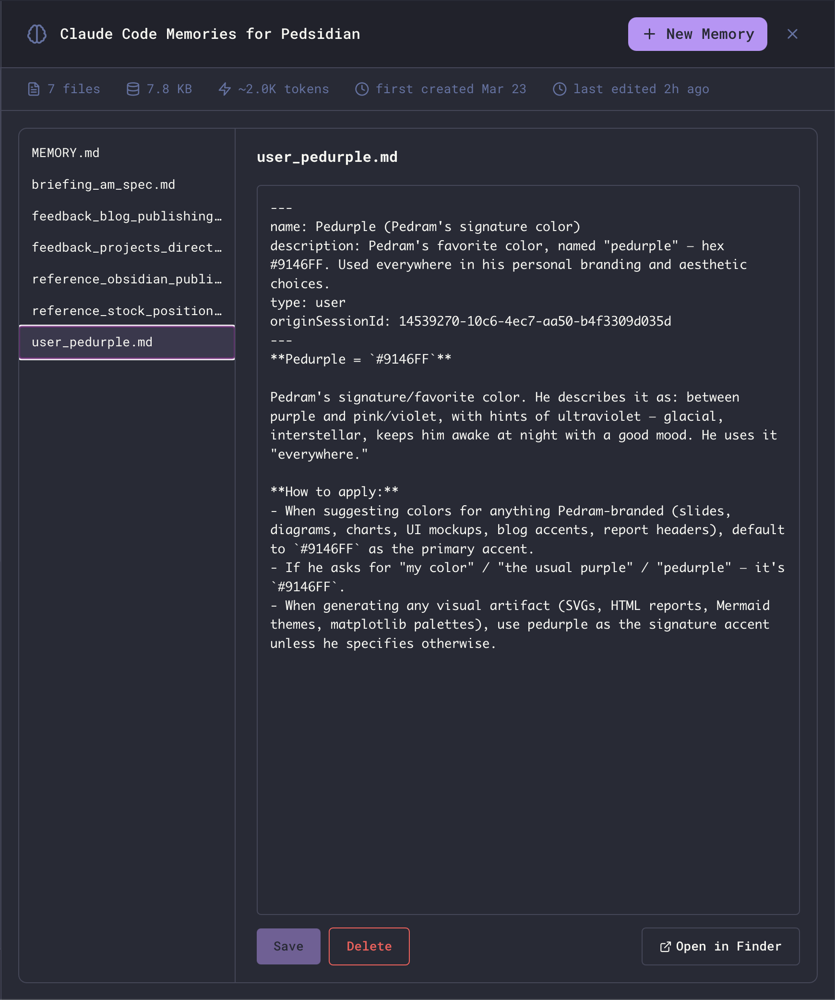

The Memories view exposes Claude Code's per-project persistent memory - the small markdown files Claude writes about you, your preferences, the project, and external references - as a first-class panel inside Maestro. Open it, read what's been remembered, edit anything that's wrong, add new entries by hand, or delete what's stale.



## Opening the Viewer

Click the **brain icon** in the main header to open the full-panel Memories overlay. Press `Esc` to close it.

The button appears only when the active agent supports per-project memory. **Today that's Claude Code only.** Other agents (Codex, OpenCode, Factory Droid, etc.) don't expose this surface - the button will be hidden for them.

## What You're Looking At

Claude Code stores memory per project as a directory of small markdown files. The viewer mirrors that one-to-one:

- **Toolbar** - the filter box, the unlinked count, the **Graph** button, and the **Preview / Edit** switch on the right.
- **Left pane** - list of every `.md` file in the project's memory directory, each row annotated with an estimated token count so you can see at a glance which entries are paying for themselves. `MEMORY.md` is always pinned to the top; everything else is alphabetical.
- **Right pane** - the selected file, rendered or editable depending on the switch. A live token estimate sits next to the filename in the editor header and updates as you type.
- **Stats footer** - file count, total bytes on disk, an estimated token cost (~4 bytes/token), and the first-created and last-edited timestamps.

The **Open in Finder** button (bottom right) reveals the underlying directory on disk if you want to inspect or back it up manually.

## Reading and Editing

The right pane opens in **Preview**: the memory rendered as markdown, with headings, tables, task lists, and links the way you would read any other document in Maestro. That is the default because reading is the usual reason to open this panel.

Switch to **Edit** for the source, in the same syntax-coloured editor the File Preview uses - line numbers, soft wrap, and markdown highlighting. Press `Cmd+E` (`Ctrl+E` on Windows/Linux) to flip between them from anywhere in the viewer; it is the same key that toggles edit and preview on a file, so there is one chord to remember. The caret lands in the editor as soon as it appears, and returns to the file list when you switch back.

Your edits survive the flip either way - switching to Preview shows what you have typed, not the last saved version, so it doubles as a way to check your formatting before pressing **Save**.

## Finding a Memory

The filter box at the left of the toolbar narrows the list as you type. It matches **both the filename and the text inside every memory**, so you can find an entry you only half-remember the contents of - type `worktree` and you get every file that mentions worktrees, whatever it happens to be called.

Hits are highlighted as you type: in the file list the matching part of each filename is marked, and every occurrence in the open memory is marked too, in both Preview and Edit.

The counter beside the box reads `matches/total`. Hovering a result row shows the line that matched. If the file you were reading is not among the matches, the viewer moves you to the top hit - unless you have unsaved edits, in which case it leaves you where you are.

Press `/` or `Cmd+F` (`Ctrl+F` on Windows/Linux) to jump straight to the box from anywhere in the viewer. `/` steps aside while you are typing, so a slash inside a memory stays a slash; `Cmd+F` works even from the editor.

`Esc` walks back out one step at a time. From the filter box it returns you to the list **with your query intact**, which is the point: filter down, `Esc`, then arrow through the hits. Press it again to clear the filter, and once more to close the viewer. (If your filter matched nothing there is no row to return to, so that first `Esc` clears instead.) The `x` in the box clears it at any time.

## Graphing Your Memories

The **Graph** button in the toolbar - or `Cmd+G` (`Ctrl+G` on Windows/Linux) -
opens the Document Graph over the memory directory, showing how the entries link
to each other. It is titled **Memory Graph** when opened this way, so it is
obvious which set of files you are looking at. `MEMORY.md` sits in the middle,
since it is the index every other entry hangs off.

Memories that link to nothing appear in the **Unlinked** band at the bottom -
the same set the toolbar's chip narrows to, seen as a picture instead of a
list. The viewer closes when the graph opens; both are full-window views.

Two of the graph's [layouts](./document-graph#layout) are worth reaching for
here, both on `L`. **Lobes** groups the memories by which other memories they
link to, so you can see which subjects have grown into clusters and which
entries stand alone. **Timeline** lays them out by when each was last written,
oldest on the left, which is the quickest way to spot advice that has gone
stale.

**`Esc` brings you back here.** A graph opened this way skips the usual "close
the Memory Graph?" prompt, because there is nothing to lose: you land back in
the viewer, and `Cmd+G` puts you straight back in the graph. (You can turn that
prompt off everywhere in **Settings → Display → Document Graph**.)

## Unlinked Memories

Claude reads `MEMORY.md` to decide which entries to load. A memory the index
does not list, and no other memory links to, is therefore **never recalled** -
it costs disk and reads as remembered while being, in practice, forgotten.

When any exist, an **N unlinked** button appears in the toolbar, beside the
filter box. Click it, or press `Cmd+U` (`Ctrl+U`), to narrow the list to exactly
those entries; the same key restores the full list. The row tooltip says
`unlinked - nothing points at this`. It composes with the filter box rather than
replacing it, so "unlinked memories mentioning worktrees" is one question you
can ask.

A memory counts as linked when another entry points at it by `[[wiki link]]` or
by a `[markdown](link.md)`, matching either its **filename** or its frontmatter
**`name:` slug** - both spellings are in active use. Hyphens and underscores are
treated as the same character, because `[[my-note]]` and `[[my_note]]` are one
character apart, the difference is invisible in rendered markdown, and treating
them as different targets is exactly how a correct-looking index ends up
pointing nowhere.

`MEMORY.md` is never listed as unlinked - it is the index, so nothing is
expected to point at it.

## Keyboard

The viewer opens with the file list already focused, so the keys below work
immediately - no click needed. (If you go straight for the filter box, the caret
stays there.)

| Action                     | Key                  |
| -------------------------- | -------------------- |
| Previous / next memory     | `Up/Down Arrow`      |
| Delete the selected memory | `Backspace` or `Del` |
| Jump to the filter box     | `/` or `Cmd+F`       |
| Toggle Preview / Edit      | `Cmd+E`              |
| Graph these memories       | `Cmd+G`              |
| Toggle the unlinked filter | `Cmd+U`              |
| Step back out              | `Esc`                |

This is the fast path for an audit pass: filter down to what you suspect is stale, then arrow through the results and press `Backspace` on the ones that should go.

## How Memory is Organized

Each Claude Code project has two flavors of memory file:

### MEMORY.md (the index)

`MEMORY.md` is a one-line-per-entry pointer file. Each entry is short (under ~150 chars) and links to the actual memory:

```markdown
# Memory index

Pointers to individual memory files. One line per entry, under ~150 chars:

- [Workflow preferences](feedback_workflow.md) - testing, linting, code reuse, PR preferences
- [Auto Run Docs location](reference_autorun_docs.md) - Path to implementation plans directory
```

Claude reads `MEMORY.md` on every turn to decide which entries are relevant, then loads only those entries into context. Keep it tight - long index files defeat the purpose.

### Entry files (the actual memories)

Each entry is its own markdown file with YAML frontmatter classifying it:

```markdown
---
name: Pedurple (Pedram's signature color)
description: Pedram's favorite color, named "pedurple" - hex #9146FF.
type: user
---

**Pedurple = `#9146FF`**

Pedram's signature/favorite color. He describes it as: between purple and pink/violet…
```

The `type` field is one of:

| Type            | Purpose                                                                                |
| --------------- | -------------------------------------------------------------------------------------- |
| **`user`**      | Facts about who you are - role, expertise, responsibilities, preferences               |
| **`feedback`**  | Corrections and validations - "do this", "don't do that", with the reasoning behind it |
| **`project`**   | Time-sensitive context about the work - deadlines, owners, motivations                 |
| **`reference`** | Pointers to external systems - Linear projects, dashboards, channels, paths            |

The viewer doesn't enforce these types; they're a convention Claude uses when reading and writing memory.

## Editing Memory

Click any file in the left pane to load it into the editor. Edits are local until you press **Save** - switching files (or closing the viewer) with unsaved changes prompts a discard confirmation.

The list shows a modified marker next to the selected file when there are unsaved changes, and the stats bar refreshes after every save so file size and timestamps stay accurate.

## Creating a New Memory

Click **+ New Memory** in the header. The first file you create in an empty project is suggested as `MEMORY.md` (the index); subsequent files default to `new-memory.md`, `new-memory-2.md`, and so on.

The `.md` extension is added automatically if you omit it. Filenames must be unique within the project.

New files are pre-populated with starter content:

- **`MEMORY.md`** - a starter index template with one example pointer line.
- **Any other file** - a starter entry with empty `name`, `description`, and `type: user` frontmatter ready to fill in.

Edit and **Save** as usual.

## Deleting a Memory

With an entry selected, click **Delete** (bottom right) or press `Backspace`/`Delete` with a list row focused. Either way you get a confirmation dialog before the file is removed.

After a delete the selection moves **down** to the next memory rather than back to the index, so a cleanup pass keeps moving in one direction: filter, arrow, `Backspace`, confirm, repeat.

`MEMORY.md` is the index and cannot be deleted from the viewer - if you really need to wipe it, use **Open in Finder** and delete it manually. Removing it from disk effectively resets Claude's memory for the project, since the index is what tells it which entries exist.

## Storage Location

Memory lives outside your project directory, under your Claude Code config:

- **macOS**: `~/.claude/projects/<encoded-path>/memory/`
- **Linux**: `~/.claude/projects/<encoded-path>/memory/`
- **Windows**: `%USERPROFILE%\.claude\projects\<encoded-path>\memory\`

`<encoded-path>` is your project's absolute path with every non-alphanumeric character replaced by `-`. For example, `/Users/you/Projects/Maestro` becomes `-Users-you-Projects-Maestro`.

Because storage is keyed off the project path, **opening the same project from a different absolute path (e.g., a git worktree under a different directory) yields a separate memory store.** This is by design - worktrees are independent workspaces.

## How Claude Uses Memory

Claude Code is instructed to:

1. **Read** `MEMORY.md` whenever it might be relevant - to decide which entries to load.
2. **Save** new memories when it learns something durable about you, your preferences, or the project - without being asked.
3. **Update or remove** stale entries when it discovers they're wrong or out of date.
4. **Skip** anything already derivable from the code, git history, or `CLAUDE.md` - memory is for things that can't be re-derived.

You can prompt Claude directly: "remember that I prefer X" or "forget the entry about Y" both work. The viewer is for the cases where you want to inspect, audit, or hand-edit what's been written without going through the agent.

## Related

- [Context Management](/context-management) - how Maestro shapes what reaches the agent each turn
- [Prompt Customization](/prompt-customization) - editing the system prompts that govern memory behavior
