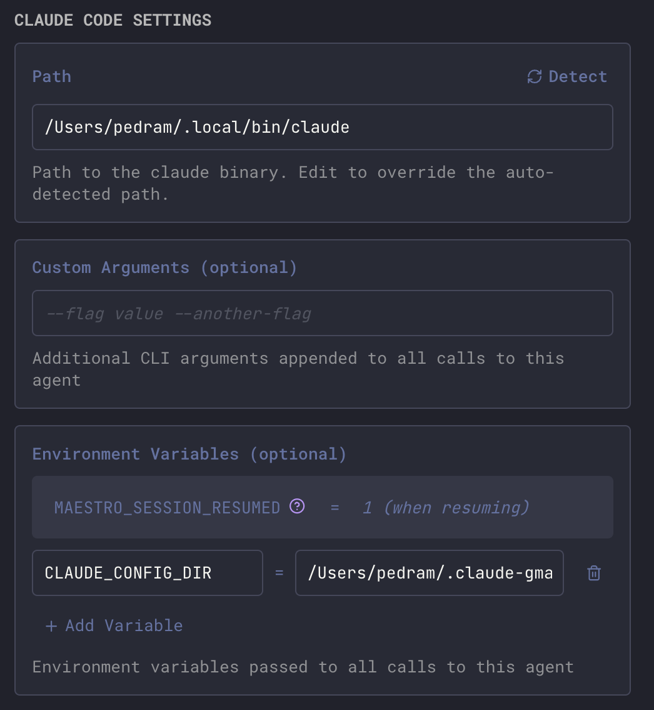

Each AI provider has unique capabilities and limitations. Maestro adapts its UI based on what each provider supports.

## Custom Configuration

All providers support custom command-line arguments and environment variables. Configure these in **Settings → Providers** for each agent type.

<Frame>
  
</Frame>

### Custom Arguments

Additional CLI arguments are appended to every call to the agent. Common use cases:

- **Claude Code**: `--model claude-sonnet-4-20250514` to specify a particular model
- **Codex**: `-m o3` to use a specific OpenAI model
- **OpenCode**: `--model anthropic/claude-sonnet-4-20250514` to configure the model

### Environment Variables

Environment variables are passed to the agent process. Use these for:

- API keys and authentication tokens
- Configuration overrides (e.g., `CLAUDE_CONFIG_DIR` for [multiple Claude accounts](/multi-claude))
- Provider-specific settings

<Note>
The `MAESTRO_SESSION_RESUMED` variable is automatically set to `1` when resuming sessions - you don't need to configure this manually.
</Note>

## Claude Code

| Feature            | Support                                                                        |
| ------------------ | ------------------------------------------------------------------------------ |
| Image attachments  | ✅ New and resumed sessions                                                    |
| Session resume     | ✅ `--resume` flag                                                             |
| Read-only mode     | ✅ `--permission-mode plan`                                                    |
| Slash commands     | ⚠️ Batch-mode commands only ([details](/slash-commands#agent-native-commands)) |
| Cost tracking      | ✅ Full cost breakdown                                                         |
| Model selection    | ❌ Configured via Anthropic account                                            |
| Context operations | ✅ Merge, export, and transfer                                                 |
| Thinking display   | ✅ Streaming assistant messages                                                |
| Mid-turn input     | ❌ Batch mode only ([details](#mid-turn-input))                                |

**Notes**:

- Claude Code's TUI supports injecting user messages mid-turn (between tool calls in its agentic loop), but this is not available in batch mode (`--print`). Maestro uses batch mode, so new messages are queued and sent after the current turn completes via `--resume`. This is a limitation of the CLI's batch interface, not Maestro.
- Maestro sets `CLAUDE_CODE_DISABLE_BACKGROUND_TASKS=1` by default for every Claude Code spawn (desktop UI, CLI batch, `--live`, SSH). This disables Claude Code's `Bash run_in_background` + `Monitor` feature, which is incompatible with Maestro for two reasons: (1) short-lived CLI batch sessions exit before background tasks finish, silently losing results; and (2) the polling wrapper Claude Code generates around each background task can deadlock on a self-matching `pgrep -f` predicate when the watched command regex appears verbatim in the wrapper's own argv, leaving long-running desktop tabs stuck on a zsh `until` loop that can never satisfy its exit condition. Maestro's multi-tab terminals cover the same use cases (watch a dev server, tail a log) more reliably. To re-enable, export `CLAUDE_CODE_DISABLE_BACKGROUND_TASKS=0` from your shell, or set it per-agent under **Settings → Providers → Claude Code → Environment Variables**.

### Token Source: Max plan vs. API

Claude Code agents can bill against either your Anthropic API credit or your Claude Max plan quota. Pick the source per-agent under **Settings → Providers → Claude Code** (or in the New Agent / Edit Agent dialog), and Maestro can show a matching pill on each captured turn.

| Mode                   | Pill          | Behavior                                                                                 |
| ---------------------- | ------------- | ---------------------------------------------------------------------------------------- |
| API (`claude -p`)      | `claude -p`   | Always uses `claude --print` and bills per-token API credit.                             |
| TUI Wrapper (Max plan) | `TUI Wrapper` | Always drives the Claude interactive TUI against your Max plan quota.                    |
| Dynamic                | `Dynamic ...` | Starts on the Max plan TUI, then auto-switches to API when the quota is near exhaustion. |

The pill is off by default. Turn it on under **Settings → Display → Provider Mode Pill** to show it under chat responses and on History entries.

When a window does run dry, [Agent Resilience](/agent-resilience) takes the turn over: it reads the reset moment out of Claude's own banner (`resets 11:40am (America/Chicago)`) and resends your prompt then, instead of leaving you to notice and retype it.

The TUI Wrapper and Dynamic modes are powered by **maestro-p**, a small standalone helper that drives Claude Code's interactive TUI (the mode that draws on your Max plan quota rather than per-token API credit). It ships bundled with the desktop app, so local agents work out of the box.

<Note>
For [SSH remote agents](/ssh-remote-execution), maestro-p must be installed on the **remote host's** PATH, since the TUI runs there rather than on your machine. If it is missing, Maestro disables the Max plan options and falls back to API. Install it from the [maestro-p install page](https://runmaestro.ai/maestro-p/), then click **Re-check** in the agent's Claude Token Source panel.
</Note>

## Codex (OpenAI)

| Feature            | Support                                               |
| ------------------ | ----------------------------------------------------- |
| Image attachments  | ⚠️ New sessions only (not on resume)                  |
| Session resume     | ✅ `exec resume <id>`                                 |
| Read-only mode     | ✅ `--sandbox read-only`                              |
| Slash commands     | ✅ Custom skills and prompts (built-ins are TUI only) |
| Cost tracking      | ❌ Token counts only (no pricing)                     |
| Model selection    | ✅ `-m, --model` flag                                 |
| Context operations | ✅ Merge, export, and transfer                        |
| Thinking display   | ✅ Reasoning tokens (o3/o4-mini)                      |

**Notes**:

- Codex's `resume` subcommand doesn't accept the `-i/--image` flag. Images can only be attached when starting a new session. Maestro hides the attach image button when resuming Codex sessions.
- Your **custom** Codex commands appear in Maestro's `/` autocomplete. Maestro reads them straight off disk from `<CODEX_HOME>/skills/<name>/SKILL.md` and `.codex/skills/` (plus `<CODEX_HOME>/prompts/*.md` on older Codex builds), so no extra setup is needed. `CODEX_HOME` is honoured, and a project-local command shadows a global one with the same name. A skill marked `user-invocable: false` is skipped, matching Codex's own picker.
- Because Maestro drives Codex through `codex exec`, the CLI never expands the slash itself. Maestro substitutes the command's file contents before sending, so the agent receives the fully expanded prompt.
- Codex's **built-in** [slash commands](https://developers.openai.com/codex/cli/slash-commands) (`/compact`, `/diff`, `/model`, etc.) are still unavailable: they are implemented inside the interactive TUI and have no on-disk prompt to expand.
- Codex commands on an SSH remote agent are not discovered yet, since the skills live on the remote host.

## OpenCode

| Feature            | Support                        |
| ------------------ | ------------------------------ |
| Image attachments  | ✅ New and resumed sessions    |
| Session resume     | ✅ `--session` flag            |
| Read-only mode     | ✅ `--agent plan`              |
| Slash commands     | ❌ Not supported               |
| Cost tracking      | ✅ Per-step costs              |
| Model selection    | ✅ `--model provider/model`    |
| Agent selection    | ✅ `--agent <name>`            |
| Context operations | ✅ Merge, export, and transfer |
| Thinking display   | ✅ Streaming text chunks       |

**Notes**:

- OpenCode uses the `run` subcommand which auto-approves all permissions (similar to Codex's YOLO mode). Maestro enables this via the `OPENCODE_CONFIG_CONTENT` environment variable.
- **OpenCode Agent** (in an agent's settings) picks the primary OpenCode agent for that Maestro agent, running it as `opencode run --agent <name>`. Use it to keep an agent pinned to a specific persona, model, and instruction set: point one Maestro agent at `build`, another at a plugin-provided agent, then group chat across them. Plugin agents (for example the ones oh-my-opencode registers) work even though `opencode agent list` doesn't print them, since OpenCode resolves the name at run time. The value is stored in that agent's Custom Arguments, so it is per-agent rather than shared across every OpenCode agent. Plan mode still forces `--agent plan` and ignores the selection for that turn.
