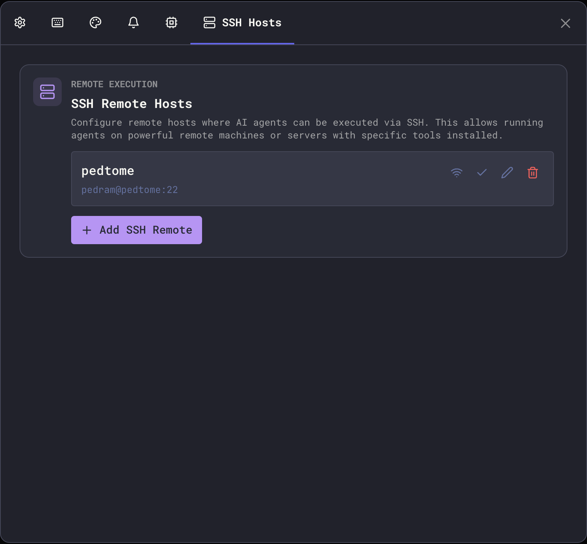
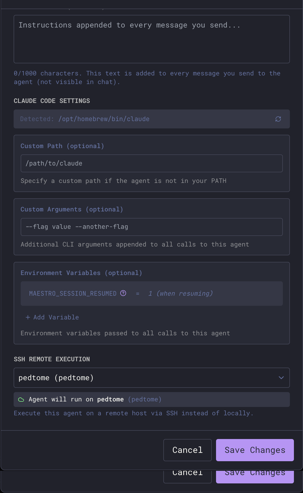
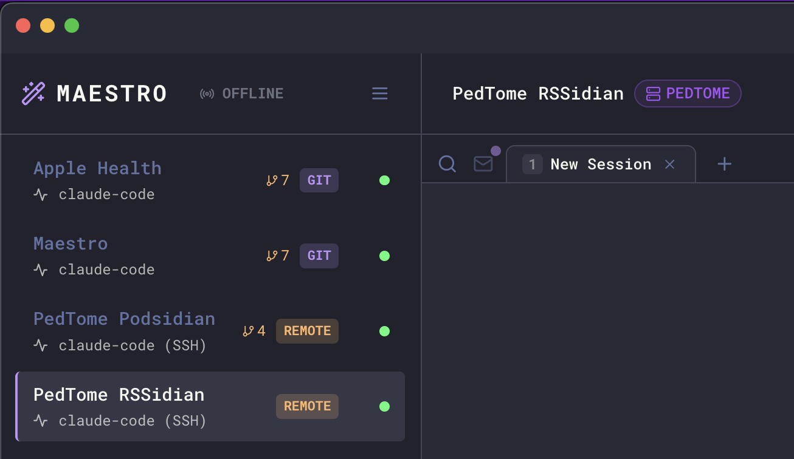
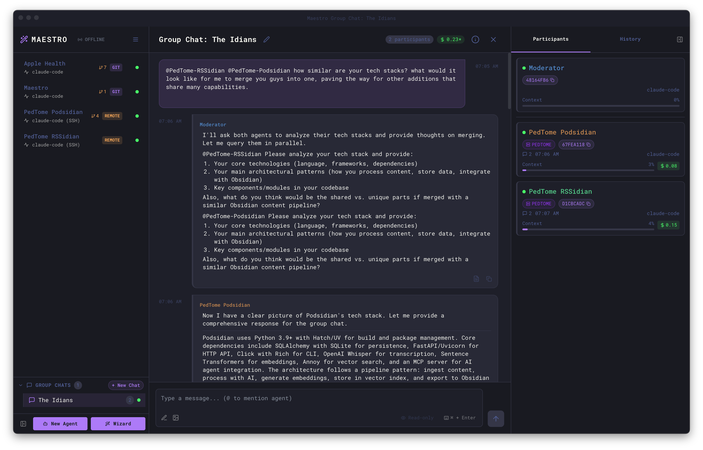

Run AI agents on remote machines via SSH instead of locally. This enables you to leverage powerful remote servers, access tools not installed on your local machine, or work with projects that must run in specific environments.

## Overview

SSH Remote Execution wraps agent commands in SSH, executing them on a configured remote host while streaming output back to Maestro. Your local Maestro instance remains the control center, but the AI agent runs remotely.

**Use cases:**

- Run agents on a powerful cloud VM with more CPU/RAM
- Access tools or SDKs installed only on specific servers
- Work with codebases that require particular OS or architecture
- Execute agents in secure/isolated environments
- Coordinate multiple agents across different machines in [Group Chat](/group-chat)
- Run Auto Run playbooks on remote projects

## Configuring SSH Remotes

### Adding a Remote Host

1. Open **Settings** (`Cmd+,` / `Ctrl+,`)
2. Navigate to the **SSH Hosts** tab
3. Click **Add SSH Remote**
4. Configure the connection:



| Field                        | Description                                                               |
| ---------------------------- | ------------------------------------------------------------------------- |
| **Name**                     | Display name for this remote (e.g., "Dev Server", "GPU Box")              |
| **Host**                     | Hostname or IP address (or SSH config Host pattern when using SSH config) |
| **Port**                     | SSH port (default: 22)                                                    |
| **Username**                 | SSH username for authentication (optional when using SSH config)          |
| **Private Key Path**         | Path to your SSH private key (optional when using SSH config)             |
| **Remote Working Directory** | Optional default working directory on the remote host                     |
| **Environment Variables**    | Optional key-value pairs to set on the remote                             |
| **Enabled**                  | Toggle to temporarily disable without deleting                            |

5. Click **Test Connection** to verify connectivity
6. Click **Save** to store the configuration

### Using SSH Config File

Maestro can import connection settings from your `~/.ssh/config` file, making setup faster and more consistent with your existing SSH workflow.

#### Importing from SSH Config

When adding a new remote, Maestro automatically detects hosts defined in your SSH config:

1. Click **Add SSH Remote**
2. If SSH config hosts are detected, you'll see an **Import from SSH Config** dropdown
3. Select a host to auto-fill settings from your config
4. The form shows "Using SSH Config" indicator when importing

#### How It Works

When using SSH config mode:

- **Host** becomes the SSH config Host pattern (e.g., `dev-server` instead of `192.168.1.100`)
- **Username** and **Private Key Path** become optional - SSH inherits them from your config
- **Port** defaults to your config's value (only sent to SSH if overriding a non-default port)
- You can still override any field to customize the connection

Example `~/.ssh/config`:

```
Host dev-server
    HostName 192.168.1.100
    User developer
    IdentityFile ~/.ssh/dev_key
    Port 2222

Host gpu-box
    HostName gpu.example.com
    User admin
    IdentityFile ~/.ssh/gpu_key
    ProxyJump bastion
```

With the above config, you can:

1. Select "dev-server" from the dropdown
2. Leave username/key fields empty (inherited from config)
3. Optionally override specific settings
4. Benefit from advanced features like `ProxyJump` for bastion hosts

#### Field Labels

When using SSH config mode, field labels indicate which values are optional:

- **Username (optional)** - leave empty to use SSH config's `User`
- **Private Key Path (optional)** - leave empty to use SSH config's `IdentityFile`

#### Clearing SSH Config Mode

To switch back to manual configuration:

1. Click the **×** button next to "Using SSH Config" indicator
2. Fill in all required fields manually

### Connection Testing

Before saving, you can test your SSH configuration:

- **Basic test**: Verifies SSH connectivity and authentication
- **Agent test**: Checks if the AI agent command is available on the remote host

A successful test shows the remote hostname. Failed tests display specific error messages to help diagnose issues.

When the cause is something you can fix with one command, the test says so and
offers the command to copy. The most common case is a Windows host answering
SSH with PowerShell or cmd.exe - see [Windows Remote Hosts](#windows-remote-hosts).

### Setting a Global Default

Click the checkmark icon next to any remote to set it as the **global default**. When set:

- The "Default" badge appears next to the remote name
- The default remote is highlighted in selection dropdowns
- New sessions still require explicit selection - the default serves as a visual indicator of your preferred remote

Click the checkmark again to clear the default.

<Note>
The global default is a convenience marker, not an automatic setting. Each session must explicitly select an SSH remote via the "SSH Remote Execution" dropdown in the New Agent dialog or session configuration.
</Note>

## Per-Session Configuration

Each session can have its own SSH remote setting configured when creating the session or editing its configuration.

### Configuring a Session

1. When creating a new agent session (via New Agent dialog or the wizard), find the **SSH Remote Execution** dropdown
2. Select an option:



| Option              | Behavior                                        |
| ------------------- | ----------------------------------------------- |
| **Local Execution** | Runs the agent on your local machine (default)  |
| **[Remote Name]**   | Runs the agent on the specified SSH remote host |

### How It Works

SSH remote execution is configured at the **session level**:

- When you create a new session, you choose whether it runs locally or on a specific remote
- The configuration is saved with the session and persists across restarts
- Each session maintains its own SSH setting independently
- Changing a session's SSH remote requires editing the session configuration

## Status Visibility

When a session is running via SSH remote, you can easily identify it:



- **REMOTE pill** - Appears in the Left Bar next to the session, indicating it's configured for remote execution
- **Host name badge** - Displayed in the Main Panel header showing which SSH host the agent is running on (e.g., "PEDTOME")
- **Agent type indicator** - Shows "claude-code (SSH)" to clarify the execution mode
- Connection state reflects SSH connectivity
- Errors are detected and displayed with SSH-specific context

## Full Remote Capabilities

Remote agents support all the features you'd expect from local agents:

### Remote File System Access

The File Explorer works seamlessly with remote agents:

- Browse files and directories on the remote host
- Open and edit files directly
- Use `@` file mentions to reference remote files in prompts
- Compress a folder into a `.zip` on the remote host (requires `zip` there)

### Remote Auto Run

Run Auto Run playbooks on remote projects:

- Auto Run documents can reference files on the remote host
- Task execution happens on the remote machine
- Progress and results stream back to Maestro in real-time

### Remote Git Worktrees

Create and manage git worktrees on remote repositories:

- Worktree sub-agents run on the same remote host
- Branch isolation works just like local worktrees
- PR creation connects to the remote repository

### Remote Command Terminal

The Command Terminal executes commands on the remote host:

- Full PTY support for interactive commands
- Tab completion works with remote file paths
- Command history is preserved per-session

### Claude Max Plan on Remote Hosts

Running a Claude Code agent against your Max plan quota (the TUI Wrapper and Dynamic [token sources](/provider-notes#token-source-max-plan-vs-api)) relies on the **maestro-p** helper. It ships bundled with the desktop app for local agents, but over SSH the Claude TUI runs on the remote machine, so maestro-p must be on the **remote host's** PATH. If it is missing, Maestro disables the Max plan options for that agent and falls back to the per-token API source.

To enable Max plan billing on a remote host, install maestro-p from the [maestro-p install page](https://runmaestro.ai/maestro-p/) on that host, then click **Re-check** in the agent's Claude Token Source panel.

### Group Chat with Remote Agents

Remote agents can participate in Group Chat alongside local agents. This enables powerful cross-machine collaboration:



- Mix local and remote agents in the same conversation
- The moderator can be local or remote
- Each agent works in their own environment (local or remote)
- Synthesize information across different machines and codebases

This is especially useful for:

- Comparing implementations across different environments
- Coordinating changes that span multiple servers
- Getting perspectives from agents with access to different resources

## Windows Remote Hosts

Maestro drives a remote agent by piping a POSIX shell script into `/bin/bash`
on the remote: a PATH bootstrap, `export VAR=...`, then `cd <dir> && exec
<agent>`. That means **the remote's default SSH shell must be a POSIX shell**.
It does not have to be a Linux or macOS host; a Windows machine works fine once
it answers SSH with bash instead of PowerShell or cmd.exe.

Out of the box it does not. Windows OpenSSH ships with `cmd.exe` as its
`DefaultShell`, and most setup guides switch it to Windows PowerShell. Neither
can run the script Maestro sends, so every turn fails:

| Remote default shell   | What you see                                                                                                                         |
| ---------------------- | ------------------------------------------------------------------------------------------------------------------------------------ |
| Windows PowerShell 5.1 | `The token '&&' is not a valid statement separator in this version.` PowerShell 5.1 has no `&&` operator; it arrived in PowerShell 7 |
| cmd.exe                | `'/bin/bash' is not recognized as an internal or external command`                                                                   |

Maestro recognizes both. **Test Connection** reports `Remote SSH shell is
Windows PowerShell` (or `cmd.exe`) with the fix command attached, rather than a
raw parser dump, and a turn that hits this fails with the same guidance instead
of a generic crash.

<Note>
Being able to `ssh` into the host by hand does not mean Maestro can use it. An
interactive login and a piped non-interactive command are two different paths;
`DefaultShell` governs both, but only the second one needs POSIX.
</Note>

### Pointing OpenSSH at a POSIX shell

Install [Git for Windows](https://gitforwindows.org/) (which brings Git Bash),
then run this in an **elevated PowerShell on the remote**:

```powershell
New-ItemProperty -Path "HKLM:\SOFTWARE\OpenSSH" -Name DefaultShell -Value "C:\Program Files\Git\bin\bash.exe" -PropertyType String -Force
```

To use a WSL distribution instead, point at `bash.exe` in System32:

```powershell
New-ItemProperty -Path "HKLM:\SOFTWARE\OpenSSH" -Name DefaultShell -Value "C:\Windows\System32\bash.exe" -PropertyType String -Force
```

Restart the SSH service so new connections pick up the change:

```powershell
Restart-Service sshd
```

Verify from your Mac or Linux box before returning to Maestro:

```bash
ssh windows-host 'echo "SSH_OK" && uname -s'
```

Git Bash answers `SSH_OK` then `MINGW64_NT-10.0`; WSL answers `SSH_OK` then
`Linux`. Either is good. A PowerShell parser error means the registry change
did not take effect - check that you ran it elevated and restarted `sshd`.

### Git Bash or WSL?

|                                                           | Git Bash                                 | WSL                                                                                      |
| --------------------------------------------------------- | ---------------------------------------- | ---------------------------------------------------------------------------------------- |
| Filesystem the agent sees                                 | The real Windows drives (`/c/Users/...`) | The distro's Linux filesystem, with Windows drives under `/mnt/c` (slow for large repos) |
| Windows tooling (MSBuild, Visual Studio, `.exe` binaries) | Available                                | Needs interop, often awkward                                                             |
| Node and agent CLIs                                       | Install the Windows builds               | Install the Linux builds inside the distro                                               |
| Working directory you configure in Maestro                | `/c/Users/you/project`                   | `/home/you/project`                                                                      |

Pick Git Bash when the project is a Windows project. Pick WSL when the project
is a Linux project that happens to live on a Windows machine. Do not mix: the
agent's working directory must be reachable from whichever shell `DefaultShell`
names.

### After the shell is fixed

The rest of the setup is the same as any other remote:

- Install the agent CLI so it is on the PATH of the shell you chose. Maestro
  probes the usual Node version-manager locations (nvm, fnm, volta, mise, asdf,
  n) but cannot find a binary that is only on the PowerShell PATH.
- Use forward-slash paths for the working directory (`/c/Users/you/project`,
  not `C:\Users\you\project`).
- Run **Test Connection** with the agent command filled in - it reports whether
  the agent binary was found, not just whether SSH works.

## Collaborating over SSH

When multiple people (or the same person from multiple machines) work on a shared project via SSH, Maestro can synchronize history entries across all participants. This gives everyone visibility into what work has been done - regardless of which machine initiated it.

### How Shared History Works

Each Maestro instance writes a per-hostname history file to the project's `.maestro/history/` directory on the remote host:

```
project/
  .maestro/
    history/
      history-pedbook.jsonl       # entries from pedbook
      history-pedopswat.jsonl     # entries from pedopswat
      history-stephan.jsonl       # entries from stephan
```

- Each machine writes **only its own file** - no conflicts between writers
- When loading history, Maestro merges entries from all other hosts' files
- Entries are deduplicated by ID and sorted by timestamp
- Remote entries appear with a **☁ Remote** pill and the originating **hostname** in the History panel

### Enabling Shared History

Shared history is enabled per-session via the **Sync history to remote** toggle, which appears in the SSH Remote Execution dropdown when an SSH host is selected:

1. Create or edit an agent session
2. Select an SSH remote from the dropdown
3. The **Sync history to remote** checkbox appears below the status indicator (disabled by default)
4. When enabled, every history entry is written to both your local Maestro store and the remote project's `.maestro/history/` directory

### Use Case: Same User, Multiple Machines

You have Maestro on your laptop (`pedbook`) and desktop (`pedopswat`). Both machines have an agent pointed at the same project on `pedopswat`:

- **pedopswat** runs the agent locally - history writes to its local store and `.maestro/history/history-pedopswat.jsonl`
- **pedbook** runs the agent via SSH to pedopswat - history writes to its local store and `.maestro/history/history-pedbook.jsonl` on pedopswat
- Both machines see each other's entries when loading the History panel

### Use Case: Team Collaboration on a Shared Server

Multiple team members (`pedbook`, `stephan`, `mattj`) each have Maestro installed locally and SSH into a shared VPS where the project lives. No Maestro is installed on the VPS - just the agent CLI:

- Each person's Maestro writes to their own `history-<hostname>.jsonl` on the VPS
- Each person sees entries from all other team members
- Entries display the originating hostname so you can tell who did what

### Entry Limits

Shared history files respect the **Maximum Log Buffer** setting (Settings → Display). Each hostname's file retains up to this many entries (default: 5,000). When reading another host's file, Maestro reads only the most recent entries up to your own buffer limit.

### Notes

- Shared history files use JSONL format (one JSON object per line) for safe concurrent appending
- Malformed lines are skipped gracefully - a partial write won't corrupt the file
- If the SSH connection is unavailable when reading, local history is shown without remote entries (no error displayed)
- The `.maestro/history/` directory is created automatically on first write
- Consider adding `.maestro/history/` to your `.gitignore` - history is operational data, not source code

## Troubleshooting

### Authentication Errors

| Error                           | Solution                                                                          |
| ------------------------------- | --------------------------------------------------------------------------------- |
| "Permission denied (publickey)" | Ensure your SSH key is added to the remote's `~/.ssh/authorized_keys`             |
| "Host key verification failed"  | Add the host to known_hosts: `ssh-keyscan hostname >> ~/.ssh/known_hosts`         |
| "Enter passphrase for key"      | Use a key without a passphrase, or add it to ssh-agent: `ssh-add ~/.ssh/your_key` |

### Connection Errors

| Error                        | Solution                                        |
| ---------------------------- | ----------------------------------------------- |
| "Connection refused"         | Verify SSH server is running on the remote host |
| "Connection timed out"       | Check network connectivity and firewall rules   |
| "Could not resolve hostname" | Verify the hostname/IP is correct               |
| "No route to host"           | Check network path to the remote host           |

### Remote Shell Errors

| Error                                                      | Solution                                                                                                                                      |
| ---------------------------------------------------------- | --------------------------------------------------------------------------------------------------------------------------------------------- |
| "Remote SSH shell is Windows PowerShell" / "...is cmd.exe" | The host answers SSH with a Windows shell, which cannot run the POSIX script Maestro sends. See [Windows Remote Hosts](#windows-remote-hosts) |
| "The token '&&' is not a valid statement separator"        | Same cause, seen raw: PowerShell 5.1 has no `&&`. Repoint `DefaultShell` at Git Bash or WSL bash                                              |
| "'/bin/bash' is not recognized"                            | Same cause, from cmd.exe or PowerShell during a turn rather than a test                                                                       |
| "Shell profile syntax error on remote host"                | A `.bashrc` or `.zshrc` on the remote has a syntax error. Fix it there; Maestro sources login profiles to find the agent binary               |

### Agent Errors

| Error                                         | Solution                                                                                                                                                                                             |
| --------------------------------------------- | ---------------------------------------------------------------------------------------------------------------------------------------------------------------------------------------------------- |
| "Command not found"                           | Install the AI agent on the remote host                                                                                                                                                              |
| "Agent binary not found"                      | Ensure the agent is in the remote's PATH                                                                                                                                                             |
| "the configured remote could not be resolved" | The agent has SSH switched on but points at a remote that no longer exists or is disabled. Re-pick the remote in Edit Agent. Maestro stops rather than quietly running the turn on your own machine. |

### Tips

- **Import from SSH config** - Use the dropdown when adding remotes to import from `~/.ssh/config`; saves time and keeps configuration consistent
- **Bastion hosts** - Use `ProxyJump` in your SSH config for multi-hop connections; Maestro inherits this automatically
- **Key management** - Use `ssh-agent` to avoid passphrase prompts
- **Connection multiplexing** - Maestro respects `ControlMaster`, `ControlPath`, and `ControlPersist` from your `~/.ssh/config`. This is highly recommended if you use hardware security keys (e.g., YubiKey) to avoid repeated touches per connection. Example config:
  ```
  Host dev-server
      ControlMaster auto
      ControlPath ~/.ssh/sockets/%r@%h-%p
      ControlPersist 600
  ```
  Make sure the socket directory exists (`mkdir -p ~/.ssh/sockets`). Use `%h`, `%p`, and `%r` tokens in `ControlPath` to keep sockets unique per host/port/user.
- **Keep-alive** - Configure `ServerAliveInterval` in SSH config for long sessions
- **Test manually first** - Verify `ssh host 'claude --version'` works before configuring in Maestro

## Security Considerations

- SSH keys should have appropriate permissions (`chmod 600`)
- Use dedicated keys for Maestro if desired
- Remote working directories should have appropriate access controls
- Environment variables may contain sensitive data; they're passed via SSH command line

## Limitations

- Network latency affects perceived responsiveness
- The remote host must have the agent CLI installed and configured
- Some shell initialization files (`.bashrc`, `.zshrc`) may not be fully sourced - agent commands use `$SHELL -lc` to ensure PATH availability from login profiles
- The remote's default SSH shell must be POSIX. A Windows host works, but only after its OpenSSH `DefaultShell` points at Git Bash or WSL bash - see [Windows Remote Hosts](#windows-remote-hosts)
