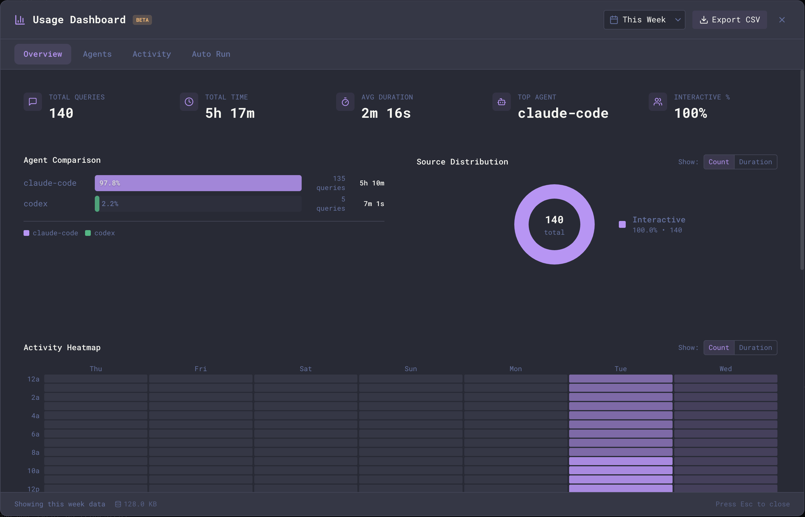

The Usage Dashboard provides comprehensive analytics for tracking your AI usage patterns across all sessions. View aggregated statistics, compare agent performance, and explore activity patterns over time.

<Note>
The Usage Dashboard only tracks activity from within Maestro. It does not include historical data from before you started using Maestro, nor does it capture usage from agents run outside of Maestro (e.g., directly from the command line).
</Note>

## Opening the Dashboard

**Keyboard shortcut:**

- macOS: `Opt+Cmd+U`
- Windows/Linux: `Alt+Ctrl+U`

**From the menu:**

1. Click the hamburger menu (☰) in the top-left corner
2. Select **Usage Dashboard**

**From Quick Actions:**

- Press `Cmd+K` / `Ctrl+K` and search for "Usage Dashboard"

## Dashboard Tabs

The dashboard is organized into tabs, each providing different insights into your usage. The core tabs are described below; additional tabs (Tokens, Cue, Shortcuts, and the per-provider usage tabs) appear when the matching Encore Feature is enabled.

### Overview

The Overview tab gives you a high-level summary of your AI usage:

**Summary Cards:**

- **Sessions** - Total number of registered sessions
- **Total Queries** - Number of messages sent to AI agents
- **Total Time** - Cumulative time spent waiting for AI responses
- **Avg Duration** - Average response time per query
- **Top Agent** - Your most-used AI agent
- **Interactive %** - Percentage of queries from interactive (non-Auto Run) sessions

**Agent Comparison:**
A horizontal bar chart showing usage distribution across your AI agents. See at a glance which agents you use most, with query counts and time spent per agent.

**Source Distribution:**
A donut chart breaking down your queries by source:

- **Interactive** - Manual queries from AI Terminal conversations
- **Auto Run** - Automated queries from playbook execution

Toggle between **Count** (number of queries) and **Duration** (time spent) views.

**Location Distribution:**
A donut chart showing the breakdown between local and remote (SSH) queries. Useful for understanding how much work is done locally versus on remote machines.

**Peak Hours:**
A 24-hour bar chart showing when you're most active. Each bar represents an hour of the day (0-23), with height indicating query count or duration. The peak hour is highlighted. Toggle between Count and Duration views.

**Activity Heatmap:**
A GitHub-style heatmap showing your activity patterns throughout the week. Each cell represents an hour of the day, with color intensity indicating activity level. Toggle between Count and Duration views to see different perspectives.

**Duration Trends:**
A line chart showing how your query durations vary over time. Useful for spotting performance trends or changes in workload.

### Agents

The Agents tab shows one card per agent, so you can scan your whole fleet at once. Each card carries the agent name, a live status dot, its age, and three stats: **Queries**, **Tabs**, and **Auto %** (the share of that agent's queries that came from Auto Run or Cue), plus a 7-day activity sparkline. Worktree agents render with a dashed border, a **WT** badge, and their checked-out branch.

**Filtering:** the filter box above the grid narrows the cards as you type. Matching is fuzzy, so `cbst` finds "Cyber Stocks", and it searches the agent name (with or without its leading emoji) as well as a worktree's branch name. A count next to the box shows how many of your agents match. Press `Esc` or click the **ESC** pill to clear the filter; clearing it is what `Esc` does first, so the dashboard stays open.

**Provider accounts:** when your agents are split across more than one provider account, an **All providers** dropdown appears beside the filter box, listing each account with the number of agents behind it (`Claude Code - smash (7)`, `Codex - Default account (3)`, `OpenCode (2)`). Pick one to narrow the grid to those agents. Every card is also badged with its account name, so you can read the split without touching the filter. A plain `~/.claude` or `~/.codex` has no name of its own, so those cards badge the provider instead (`CLAUDE CODE DEFAULT`, `CODEX DEFAULT`) rather than a bare "default account" that would read the same on both. An account is whichever `CLAUDE_CONFIG_DIR` or `CODEX_HOME` that agent runs against; providers that keep one credential store show up as a single entry named after the provider.

The **N agents** chip on each row of the Anthropic Usage and OpenAI Usage tabs is a shortcut into this: click it and Maestro opens the Agents tab already narrowed to that account, so you can see which agents are burning the plan you are looking at. Agents that run over SSH are marked **remote**: on the remote host that directory holds the host's own login, which can be a different account from the one the row measures. A row the last refresh could not update shows a **stale** chip with the time its bars were read.

An account keeps its row after you move every agent off it, which is what you normally do the moment that plan hits its limit. The row holds the last reading Maestro took, badged **stale** with its age, so you can watch for the reset without keeping an agent parked on a capped account. Maestro remembers an account because it sampled it for a real agent, not because a directory looks like one, and it forgets the row only when that account directory is gone from disk.

**Sorting:** the **Sort by** control orders the grid by Name, Created, Queries, Tabs, Auto %, or Provider (which groups the fleet one account at a time). The stat being sorted on is highlighted on every card, so it is obvious what the order means. When a filter is active, the default Name sort ranks the best match first; any other sort keeps the order you chose.

**Tile size:** `+` and `-` resize the tiles, and `0` returns them to the default. The buttons beside the **Sort by** control do the same. A wider tile shows more of a long agent name before it truncates; a narrower one fits more agents on screen at once. Maestro remembers the size you picked, and the Groups tab keeps its own separate size.

**Per-agent details:** click any card to open a detail view for that agent, covering total queries, total and average duration, active days, a full-window daily activity chart, duration distribution (min / median / p95 / max), the user-vs-auto query split, and Auto Run totals.

Two actions in the detail view's header take you out of the numbers and onto the agent itself:

- **Jump to Agent** switches to that agent and lands on its AI transcript, even if you last left it on a terminal, file, or browser tab, and expands whichever Left Bar section it is hiding in.
- **Agent Settings** opens the Edit Agent dialog for it.

Both close the dashboard on the way, since it covers the whole window and you would otherwise land behind it. Stats outlive the agents that produced them, so an agent you have since deleted still has a card here: **Jump to Agent** tells you it is gone rather than appearing to do nothing.

#### Tab breakdown

The detail view also breaks the agent's activity down by AI tab, as a grid of tab tiles. Each tile shows the tab name, **Queries**, **Time** (total agent time in that tab, with the per-query average on hover), **Auto %**, when it was last active, and a 14-day sparkline. The tab currently in focus is badged **Active**, snoozed tabs are badged **Snoozed**, and closed tabs render with a dashed border.

- **Show** picks how far back to look: **Open** (the default, tabs currently open on that agent), **Last 10**, **Last 25**, or **All**.
- **Sort by** orders the tiles by Recent, Queries, Time, or Name.

**Paging:** an agent with a long history can have hundreds or thousands of tabs, so **All** is shown 32 tiles at a time. Page arrows appear next to the tile count whenever the list overflows one page, and you can also page with the Left and Right arrow keys once they have focus. The narrower filters always fit on a single page, so the arrows only show up when they are actually needed. Changing the filter or the sort returns you to the first page.

The detail view is resizable: drag any edge or corner to resize it, and double-click a resize handle to return to the default size. Maestro remembers the size you chose and reuses it the next time you open an agent's details.

<Note>
Maestro records which tab issued each query, but tab *names* live with the tab itself. A tab that is open, snoozed, or was closed during this app session is shown by name; older closed tabs can only be identified by a short ID (e.g. `DEADBEEF`). This is why **Open** is the default view - a long-running agent accumulates many retired tabs that can no longer be named.
</Note>

### Activity

The Activity tab shows your usage patterns over time:

- Duration trends chart showing how your usage varies
- Time-based filtering to spot patterns
- Useful for understanding your productivity cycles

### Auto Run

The Auto Run tab focuses specifically on automated playbook execution:

**Metric Cards:**

- **Total Sessions** - Number of Auto Run sessions
- **Tasks Done** - Total tasks completed (with attempted count)
- **Avg Tasks/Session** - Average tasks completed per Auto Run session
- **Success Rate** - Percentage of tasks that completed successfully
- **Avg Session** - Average duration of an Auto Run session
- **Avg Task** - Average duration per individual task

**Tasks Completed Over Time:**
A mini bar chart showing task completions by date (last 14 days). Hover over bars to see exact counts and success percentages for each day.

**How a run's duration is measured:** wall-clock time from start to finish, minus any time the machine spent asleep. Whether the Maestro window was on screen makes no difference - the agent runs in its own process and keeps working while you do something else, so a run you walked away from is timed the same as one you watched.

Older builds also subtracted time the window was hidden, which on macOS includes being minimized or fully covered by another app. That under-recorded exactly the unattended overnight runs whose length matters most, and recorded some as zero. If your history predates the fix, `scripts/repair-autorun-durations.mjs` rebuilds each affected run's duration from its own task timestamps (dry run by default; `--apply` writes, after a backup). Runs with no recorded tasks cannot be reconstructed and are left as they are.

## Time Range Filtering

Use the time range dropdown in the top-right corner to filter all dashboard data:

| Range          | Description                                |
| -------------- | ------------------------------------------ |
| **Today**      | Current day only                           |
| **This Week**  | Current week (default)                     |
| **This Month** | Current calendar month                     |
| **This Year**  | Current calendar year                      |
| **All Time**   | Everything since you started using Maestro |

The selected time range applies to all tabs and charts. Your preferred time range is saved and restored between sessions.

## Keyboard Navigation

| Shortcut                       | Action                          |
| ------------------------------ | ------------------------------- |
| `Cmd+Shift+[` / `Ctrl+Shift+[` | Previous tab                    |
| `Cmd+Shift+]` / `Ctrl+Shift+]` | Next tab                        |
| `Arrow Up/Down`                | Navigate between chart sections |
| `Home`                         | Jump to first section           |
| `End`                          | Jump to last section            |
| `Esc`                          | Close dashboard                 |

## Exporting Data

Click **Export CSV** in the top-right corner to download your usage data as a CSV file. The export includes:

- Query timestamps
- Agent information
- Duration metrics
- Source categorization (interactive vs. Auto Run)

Use exported data for further analysis in spreadsheet applications or to share usage reports.

## Data Collection

### What's Tracked

The Usage Dashboard collects:

- **Query events** - Each message sent to an AI agent, including duration and which agent handled it
- **Auto Run sessions** - Start/end times of automated playbook runs
- **Auto Run tasks** - Individual task completions within playbooks

### What's NOT Tracked

- Message content (your prompts and AI responses)
- File contents or paths
- Token counts or costs (tracked per-session in the main UI, not aggregated in the dashboard)
- Activity outside of Maestro

### Enabling/Disabling Collection

Stats collection is enabled by default. To disable:

1. Open **Settings** (`Cmd+,` / `Ctrl+,`)
2. Go to the **General** tab
3. Find **Usage Dashboard** section (marked with Beta badge)
4. Toggle off **Enable stats collection**

You can also set your **Default dashboard time range** here (Today, This Week, This Month, This Year, or All Time).

Disabling collection stops new data from being recorded but preserves existing data in the dashboard.

## Accessibility

The Usage Dashboard adopts Maestro's colorblind-friendly chart palette (Wong, _Nature Methods_ 2011) when **Color Blind Mode** is enabled in **Settings → Display → Accessibility**. Agent and source distinctions switch to a high-contrast set tested against protanopia, deuteranopia, and tritanopia.

See [Configuration → Accessibility](./configuration#accessibility) for everything the toggle changes across the rest of the app.

## Additional Features

**Real-time Updates:**
The dashboard automatically refreshes when new queries are recorded. An "Updated" indicator briefly appears when new data arrives.

**Database Size:**
The footer displays the current size of the stats database, helping you monitor storage usage over time.

**Footer Summary:**
The middle of the footer states what the tab in front of you is actually
showing, and it changes with the tab: `24 of 84 agents` once you narrow the
Agents grid, `126 runs · 12 pipelines · 8 failed` on Cue, `3 accounts · peak
window 87%` on a plan quota tab. It reflects the filters you set, not just the
time range, so it is the fastest way to confirm a filter is on when the grid
looks emptier than you expected. A tab with nothing to say yet (still loading,
or an empty range) leaves the slot blank rather than showing a row of zeroes.

## Tips

- **Check the Activity Heatmap** to understand your most productive hours
- **Use Peak Hours** to identify your most productive time of day
- **Compare agents** to see if one consistently performs faster than others
- **Monitor Auto Run vs. Interactive** ratio to understand your automation level
- **Export regularly** if you want to track long-term trends externally
- **Use time filtering** to focus on recent activity or see the big picture
